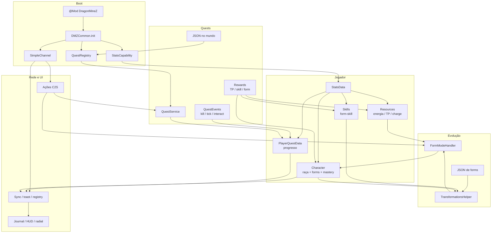

# Overview — o que reaproveitar do Dragon Mine Z

## Estado da implementação Bleach — 10/09/2026

O MVP Bleach inclui status (K), seleção radial de formas (Z), categorias de pontos e comandos de desenvolvimento. Mantém zumbis; não implementa as demais raças e sistemas do original.

Consulte o [manual atual](../jogador/manual-do-jogador.md) e o [relatório de implementação](../planejamento/relatorio-implementacao-mvp-2026-09-10.md). As seções seguintes preservam a referência do Dragon Mine Z e não devem ser interpretadas como funcionalidades já entregues no Bleach.

## O que o mod original faz

Dragon Mine Z (Forge 1.20.1, v2.1.3) é um mod de progressão inspirado em Dragon Ball. O jogador cria um personagem de uma das seis raças, distribui stats com Training Points, transforma-se em forms com custo de ki e mastery, e atravessa sagas/sidequests definidas em JSON no mundo. Por cima disso há combate, dimensões, dragon balls, técnicas editáveis e worldgen — conteúdo temático que **não** entra no fork.

O que torna o original útil para um Bleach é a espinha: **uma capability de jogador**, **quests data-driven com progresso persistido**, e **evolução em estágios data-driven** (raça → grupo → form) ligada a skills e a rewards de quest. Esse trio é o suficiente para um segundo time recriar o MVP Shinigami sem reabrir o clone, desde que consulte `/Docs/arquitetura` e, nos poucos algoritmos sutis, `/reference-code`.

## O que será reaproveitado vs. o que não será

### Reaproveitar (mecânica)

| Mecânica | Documento | Notas |
|---|---|---|
| Capability única do jogador + NBT parcial | `02`, `07` | Base de tudo |
| Quests JSON (schema, objetivos, rewards, sagas) | `03` | Recriar conteúdo Bleach; manter o schema |
| Progresso, claim, fail em wipe, party merge | `03` | Party é opcional no MVP |
| Evolução por estágios JSON + mastery + form-skill | `04` | Mapear para sealed/shikai/bankai |
| Skills como gate de progressão | `05` | Sem editor de técnicas |
| Packets de ação + sync por subset | `06` | Channel **novo**, lista curta |
| HUD de recurso + journal + toast | `08` | Visual novo; contrato funcional igual |
| Eventos Forge + eventos custom canceláveis | `09` | |

### Não reaproveitar (só menção)

- Tema Dragon Ball (raças, sagas, itens, NPCs, diálogos)
- Assets (modelos, texturas, sons, shaders, hair)
- Dimensões, TerraBlender, dragon balls, wishes
- Técnicas de ki criadas pelo jogador, beam clash, flight combat
- Storage MariaDB/JSON
- Mixins de título/tooltip/first-person
- Daily/Event quests (enum sem implementação)
- Objetivo `DRAGON_SUMMON`

## Como os sistemas se conectam

Leitura em uma frase: o JSON descreve o que existe; a capability guarda o que o jogador fez; eventos mundanos incrementam quests; o jogador gasta TP e segura um botão para mudar de estágio; a rede espelha recortes do mesmo NBT para a UI.

## Ordem de leitura para quem for recriar

1. Este overview
2. `01-arquitetura-geral.md` e `10-build-dependencias.md` — plataforma
3. `02-capability-system.md` e `07-persistencia-nbt.md` — estado
4. `03-sistema-quests.md` — sistema nº 1
5. `04-sistema-evolucao.md` — sistema nº 2
6. `05` → `06` → `08` → `09` — satélites
7. `11-glossario.md` — nomes
8. `12-licenciamento-e-creditos.md` — antes de qualquer commit
9. `reference-code/README.md` — só quando a doc não fechar um algoritmo

## Mapeamento rápido Bleach (MVP)

| Original | Bleach |
|---|---|
| Race + form group + form | Shinigami + `zanpakuto` + sealed/shikai/bankai |
| Ki / energy | Reiatsu |
| Training Points | Pontos de habilidade / XP de reiatsu |
| Saga JSON | Arco (ex. Soul Society) |
| Sidequest | Missão de distrito / treino |
| TransformationReward | Despertar de Shikai/Bankai via quest |
| Radial de forms | Seletor de estágio (ou automático pós-quest no MVP) |

## Estado desta documentação

Gerada a partir do clone `dragonminez/` (upstream [DragonMineZ/dragonminez](https://github.com/DragonMineZ/dragonminez), tag/versão 2.1.3). Nenhum bloco de código do original foi colado nestes arquivos. Os poucos fontes preservados estão em `/reference-code` com aviso GPL-3.0.
