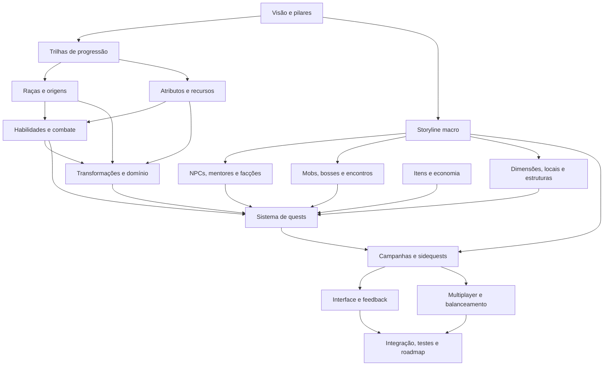

# Mapa modular do game design

## Propósito deste documento

Este documento organiza o planejamento do Bleach Mod em módulos independentes. Ele não especifica todos os sistemas e não declara nenhuma ideia como implementada. Sua função é definir:

- quais assuntos terão documentos próprios;
- o que pertence e o que não pertence a cada módulo;
- quais decisões precisam ser tomadas antes de outras;
- como impedir que storyline, quests, NPCs e progressão se tornem um único sistema acoplado;
- como avançar um módulo por vez sem perder a visão do jogo completo.

Os documentos de `Docs/arquitetura/` continuam descrevendo principalmente a engenharia reversa do Dragon Mine Z e a implementação técnica atual. Os documentos de `Docs/game-design/` descreverão a experiência desejada para o Bleach Mod.

## Regra central de trabalho

Cada etapa deve tratar apenas um módulo principal. Outros módulos podem ser citados como dependências, mas suas decisões não serão fechadas antecipadamente.

Exemplo: o documento de NPCs pode decidir que mentores oferecem treinamento e quests. Ele não deve definir todas as quests, fórmulas de atributos ou habilidades ensinadas. Esses detalhes pertencem aos módulos correspondentes.

## Estados permitidos

Cada documento de módulo deve mostrar um destes estados no início:

| Estado | Significado |
|---|---|
| `NÃO INICIADO` | O módulo está apenas listado neste mapa. |
| `IDEALIZADO` | Existem possibilidades e referências, mas as decisões continuam abertas. |
| `DECIDIDO` | As principais decisões de produto foram aceitas. |
| `ESPECIFICADO` | Regras, dados, integrações e critérios estão definidos para implementação. |
| `IMPLEMENTADO` | O código ou conteúdo correspondente existe. Não significa que foi testado. |
| `TESTADO` | Há evidência técnica de funcionamento nos cenários definidos. |
| `ACEITO` | O resultado foi avaliado e aprovado como experiência de jogo. |
| `PENDENTE` | Existe uma dependência ou decisão conhecida impedindo o próximo estado. |

Um módulo pode ter partes em estados diferentes. Nesse caso, o documento deve separar claramente cada parte. Implementação, teste e aceitação nunca avançam automaticamente juntos.

## Separação entre sistema e conteúdo

Para evitar acoplamento, cada domínio será analisado em duas camadas:

| Camada | Pergunta |
|---|---|
| Sistema | Quais regras e ferramentas permitem criar esse tipo de conteúdo? |
| Conteúdo | Quais personagens, inimigos, lugares, técnicas e missões existirão? |

Exemplos:

- O sistema de NPCs define diálogo, rotina, interação e treinamento. Rukia e Urahara são conteúdo de NPC.
- O sistema de mobs define IA, atributos, fases e recompensas. Hollow comum e Menos Grande são conteúdo de mob.
- O sistema de quests define objetivos, pré-requisitos e estados. “O Nome que Faltava” é conteúdo de campanha.
- O sistema de dimensões define viagem, geração e persistência. Soul Society e Hueco Mundo são conteúdo de mundo.
- O sistema de transformações define desbloqueio, ativação, custo e domínio. Shikai e Bankai são conteúdo Shinigami.

## Módulos de game design

### Fundação

| Ordem | Documento futuro | Responsabilidade | Não decide |
|---:|---|---|---|
| 01 | [`01-visao-e-pilares.md`](01-visao-e-pilares.md) | Fantasia do jogador, identidade do projeto e princípios de design | Números, quests ou catálogo de conteúdo |
| 02 | [`02-trilhas-de-progressao.md`](02-trilhas-de-progressao.md) | Todas as formas de progresso e a relação entre elas | Fórmulas detalhadas de cada sistema |
| 03 | [`03-storyline-macro.md`](03-storyline-macro.md) | Ordem dos grandes arcos e papel do personagem original no cânone | Quests individuais e diálogos completos |

### Personagem e poder

| Ordem | Documento futuro | Responsabilidade | Não decide |
|---:|---|---|---|
| 04 | [`04-racas-e-origens.md`](04-racas-e-origens.md) | Shinigami, Hollow, Quincy, Fullbringer, híbridos e origem do personagem | Todas as transformações de cada raça |
| 05 | `05-atributos-e-recursos.md` | Atributos, reiatsu, vida, stamina, crescimento e Battle Power | Técnicas e formas específicas |
| 06 | `06-habilidades-e-combate.md` | Zanjutsu, Hakuda, Hohō, Kidō, técnicas ativas, passivas e combate | Quando a storyline concede cada habilidade |
| 07 | `07-transformacoes-e-dominio.md` | Estágios, despertar, mastery, ativação, custo, manutenção e reversão | Campanhas completas de desbloqueio |

### Habitantes e ameaças

| Ordem | Documento futuro | Responsabilidade | Não decide |
|---:|---|---|---|
| 08 | `08-npcs-mentores-e-faccoes.md` | NPCs, diálogo, serviços, mentores, reputação, esquadrões e facções | Objetivos completos das campanhas |
| 09 | `09-mobs-bosses-e-encontros.md` | Famílias de inimigos, IA, tiers, bosses, fases e encontros | História de cada boss dentro da campanha |

### Mundo

| Ordem | Documento futuro | Responsabilidade | Não decide |
|---:|---|---|---|
| 10 | `10-dimensoes-locais-e-estruturas.md` | Mundo Humano, Soul Society, Hueco Mundo, Garganta, Senkaimon e estruturas | Lista completa de quests de exploração |
| 11 | `11-itens-e-economia.md` | Equipamentos, materiais, crafting, recompensas, moedas e recuperação de itens | Progressão narrativa e balanceamento final de combate |

### Orquestração da experiência

| Ordem | Documento futuro | Responsabilidade | Não decide |
|---:|---|---|---|
| 12 | `12-sistema-de-quests.md` | Tipos de objetivo, estados, falhas, grupos, NPCs, encontros e recompensas | Enredo e texto de campanhas específicas |
| 13 | `13-campanhas-e-sidequests.md` | Prólogo, Soul Society e demais campanhas transformadas em quests | Regras internas dos sistemas utilizados |
| 14 | `14-interface-e-feedback.md` | Diário, HUD, mapa, diálogos, tutoriais e comunicação de progresso | Autoridade do servidor e persistência técnica |
| 15 | `15-multiplayer-e-balanceamento.md` | Party, escala, propriedade de encontros, PvE/PvP e cooperação narrativa | Infraestrutura externa sem necessidade demonstrada |

### Entrega e evolução

| Ordem | Documento futuro | Responsabilidade | Não decide |
|---:|---|---|---|
| 16 | `16-integracao-testes-e-roadmap.md` | Dependências finais, fatias jogáveis, testes, migrações e ordem de implementação | Novas funcionalidades fora das decisões aprovadas |

## Relações entre os módulos

O diagrama representa dependências de decisão, não uma ordem rígida de programação. A storyline macro aparece cedo para dizer quais experiências serão necessárias. As campanhas detalhadas aparecem somente depois que os sistemas capazes de sustentá-las estiverem definidos.

## Contratos de fronteira

Estas regras devem permanecer válidas durante todo o planejamento:

1. **Storyline não concede poder diretamente.** Ela registra acontecimentos e autorizações; transformações e habilidades aplicam as regras de desbloqueio.
2. **Quests não calculam combate.** Elas observam eventos e pedem resultados ao sistema responsável.
3. **NPCs não alteram dados livremente.** Mentores solicitam operações aos serviços de progressão, habilidades e quests.
4. **Mobs não conhecem campanhas específicas.** Encontros aplicam configurações fornecidas pelo sistema de quests ou pelo mundo.
5. **Raça não é transformação.** Raça define natureza, compatibilidades e árvores disponíveis; cada transformação tem seu próprio contrato.
6. **Dimensão não é storyline.** Lugares podem existir fora de uma campanha; a storyline apenas controla quando e por que o jogador os acessa.
7. **Pontos não substituem conquistas narrativas.** Moeda melhora atributos e técnicas; marcos como Shikai e Bankai exigem descoberta e prova apropriadas.
8. **Mastery representa uso e domínio.** Não deve ser apenas outra moeda comprável.
9. **UI informa, não autoriza.** Regras decisivas continuam no servidor.
10. **Conteúdo canônico e adaptação Minecraft devem ser identificados.** Quando uma mecânica não vier diretamente da obra, o documento deverá marcá-la como adaptação de game design.

## Template obrigatório para cada módulo

Cada novo documento deverá usar esta estrutura:

1. **Estado do módulo** — estado atual, responsável pela decisão e última revisão.
2. **Objetivo** — qual problema do jogo este módulo resolve.
3. **Fantasia do jogador** — o que o jogador deve sentir e conseguir fazer.
4. **Base canônica** — conceitos de Bleach usados e fontes consultadas.
5. **Adaptação para Minecraft** — mudanças necessárias para funcionar como jogo aberto e multiplayer.
6. **Escopo** — o que pertence e não pertence ao módulo.
7. **Modelo conceitual** — entidades, estados e relações sem exigir código.
8. **Regras principais** — comportamentos e invariantes.
9. **Integrações** — entradas e saídas para outros módulos.
10. **Conteúdo inicial** — somente a menor amostra necessária para validar o sistema.
11. **Visão completa** — possibilidades futuras sem tratá-las como compromisso imediato.
12. **Decisões abertas** — alternativas, custos, riscos e recomendação.
13. **Critérios de aceitação** — como saber se a experiência ficou correta.
14. **Impacto técnico conhecido** — relação com o código e a documentação atuais.
15. **Próximos passos** — o que pode começar depois da aprovação.

## Método para trabalhar módulo por módulo

Para cada módulo:

1. Ler integralmente as fontes atuais relacionadas.
2. Pesquisar o material canônico relevante.
3. Registrar fatos, adaptações e ideias em seções separadas.
4. Apresentar as decisões que realmente mudam o produto.
5. Comparar alternativas e fazer uma recomendação explícita.
6. Obter a decisão antes de escrever uma especificação fechada.
7. Definir a menor fatia jogável do módulo.
8. Mapear dependências e riscos técnicos.
9. Só então autorizar implementação.
10. Manter implementação, teste e aceitação como gates separados.

## Ordem recomendada para começar

O primeiro módulo deve ser **Visão e pilares** (`01-visao-e-pilares.md`). Ele fechará a fantasia central do jogador, sua relação com os personagens canônicos e os princípios que diferenciam este projeto de uma coleção de conteúdo de Bleach.

Em seguida vem **Trilhas de progressão** (`02-trilhas-de-progressao.md`), porque NPCs e quests precisam saber o que ensinam, desbloqueiam e avaliam. Nenhum dos dois documentos definirá números finais, catálogo completo de NPCs ou campanhas inteiras.

Depois das trilhas, a sequência recomendada é:

1. Visão e pilares.
2. Trilhas de progressão.
3. Storyline macro, apenas no nível dos grandes arcos.
4. Raças e origens.
5. Atributos e recursos.
6. Habilidades e combate.
7. Transformações e domínio.
8. NPCs, mobs e dimensões, um documento por vez.
9. Sistema de quests.
10. Campanhas detalhadas.
11. Interface, multiplayer e roadmap de integração.

## Estado deste mapa

`DECIDIDO` quanto à divisão modular e ao método de trabalho. Os módulos [Visão e pilares](01-visao-e-pilares.md), [Trilhas de progressão](02-trilhas-de-progressao.md) e [Storyline macro](03-storyline-macro.md) também estão `DECIDIDOS`. [Raças e origens](04-racas-e-origens.md) está `IDEALIZADO`: identidade, transições, origens, convergência e guias já foram decididos; diferenças raciais, convivência, criação e continuidade continuam abertas. Os demais módulos permanecem `NÃO INICIADOS` até que seus documentos sejam produzidos e avaliados separadamente.
