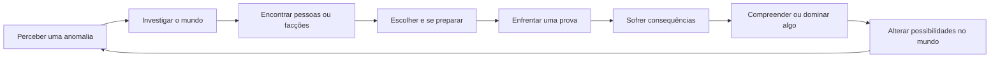

# Visão e pilares

## Estado do módulo

| Campo | Valor |
|---|---|
| Estado | `DECIDIDO` |
| Responsável pela decisão | Equipe do Bleach Mod |
| Última revisão | 11/09/2026 |
| Decisões aprovadas | D01–D06 e complemento da política de poderes canônicos em 11/09/2026 |
| Próximo uso | Orientar o módulo `02-trilhas-de-progressao.md` |

Este documento define a identidade decidida para o Bleach Mod. Ele não autoriza implementação: progressão, raças, atributos, transformações, NPCs e quests terão documentos próprios e ainda precisarão passar por decisão, especificação, implementação, teste e aceitação.

## Objetivo

Definir qual experiência o projeto quer entregar antes de aumentar o catálogo de conteúdo. A visão deve permitir que a equipe avalie qualquer ideia futura com perguntas simples:

- isso faz o jogador viver uma jornada própria dentro do universo de *Bleach*?
- isso transforma crescimento espiritual em experiência jogável, e não apenas em números?
- isso continua sendo Minecraft, com exploração, sobrevivência, construção e mundo persistente?
- isso funciona sem obrigar todos os jogadores a interpretar o mesmo personagem canônico?

O projeto não deve ser apenas uma coleção de armas, transformações e personagens de *Bleach*. A identidade proposta é a de um RPG de ação e progressão espiritual integrado ao mundo aberto de Minecraft.

## Visão do produto

> **Viver uma jornada original no universo de Bleach, na qual o jogador desperta para o mundo espiritual, encontra seu lugar entre raças e facções, conquista e domina poderes canônicos e assume o protagonismo jogável das grandes crises sem herdar a identidade ou a biografia dos protagonistas da obra.**

Essa visão preserva três promessas ao mesmo tempo:

1. **Fantasia Bleach:** espíritos, Hollows, Zanpakutō, facções, conflitos morais, mundos espirituais e poderes que expressam quem o personagem é.
2. **Progressão de RPG:** decisões, treinamento, domínio, relações e campanhas que transformam gradualmente o personagem.
3. **Liberdade Minecraft:** um mundo persistente que pode ser explorado, construído e vivido além da campanha principal.

## Fantasia do jogador

O jogador deve sentir que:

- começou como alguém pequeno diante de um mundo espiritual muito maior;
- descobriu sua natureza por acontecimentos vividos, não por uma escolha sem contexto em um menu;
- conquistou técnicas e transformações porque entendeu, treinou e provou algo;
- possui uma trajetória própria, mesmo quando utiliza um conjunto de poder baseado em Ichigo, Rukia, Byakuya ou outro personagem conhecido;
- pertence a uma raça, organização ou facção com deveres, aliados, rivais e consequências;
- pode voltar a locais, mentores e conflitos e perceber que sua jornada deixou marcas no mundo;
- ainda está jogando Minecraft: explorar, preparar recursos, construir abrigo e viajar continuam relevantes.

### Promessa resumida ao jogador

**Você cria seu próprio personagem, vive sua própria jornada e conquista poderes dos personagens reais de Bleach.**

### Política de poderes canônicos

Esta política complementa D01 sem transformar o jogador em Ichigo, Byakuya, Grimmjow ou qualquer outro integrante do elenco:

1. o jogador cria nome, aparência, raça, build, relações, afiliação e trajetória próprios;
2. Zanpakutō, habilidades Hollow e Arrancar, especializações Quincy, Schrift e Fullbrings disponíveis ao jogador vêm de um catálogo de personagens reais da obra;
3. a campanha padrão não gera poderes inéditos nem permite que o jogador monte livremente um poder original;
4. dois jogadores poderão escolher o mesmo conjunto canônico, inclusive em multiplayer;
5. o personagem canônico continua existindo na história mesmo quando um jogador utiliza seu conjunto de poder;
6. essa repetição é uma adaptação deliberada de gameplay e não uma afirmação de que esses poderes deixam de ser individuais no cânone;
7. progressão, pontos, treino e mastery continuam pertencendo ao personagem do jogador: escolher o conjunto não entrega todas as formas e técnicas imediatamente.

Essa decisão reduz a necessidade de inventar, modelar e balancear famílias ilimitadas de poder. Em contrapartida, o jogo aceita duplicações que a obra normalmente trata como identidades singulares. A interface e os textos não devem fingir que o jogador possui a biografia do dono original daquele poder.

## Base canônica

### Fatos usados como fundação

- O início de *Bleach* apresenta uma pessoa capaz de perceber espíritos, o encontro com uma Shinigami, a ameaça dos Hollows e a responsabilidade de proteger os vivos e ajudar os espíritos a encontrar paz. Essa estrutura oferece um bom vocabulário para introduzir o jogador ao mundo espiritual sem começar com uma guerra de escala máxima. Fonte primária de publicação: [VIZ — Bleach, Vol. 1](https://www.viz.com/manga-books/manga/bleach-volume-1-0/product/167).
- A história cresce do cotidiano no Mundo Humano para conflitos da Soul Society e, posteriormente, crises envolvendo diferentes povos, territórios e verdades ocultas. A apresentação oficial da Guerra Sangrenta dos Mil Anos confirma essa expansão de escala e a centralidade das relações entre Mundo Humano, Soul Society, Hollows e Quincies. Fonte oficial do anime: [BLEACH: Thousand-Year Blood War — Story](https://bleach-anime.com/en/story/story.html).
- Mentores e instituições importam para o crescimento dos personagens. O material oficial descreve Urahara como alguém que fornece recursos e apoia o desenvolvimento de Ichigo; também apresenta patentes, esquadrões, atribuições, lealdades e relações entre superiores e subordinados. Fonte oficial do anime: [BLEACH: Thousand-Year Blood War — Characters](https://bleach-anime.com/en/character/).
- A obra associa o desenvolvimento de uma Zanpakutō à descoberta de sua capacidade verdadeira e ao significado de seu nome. Mesmo utilizando conjuntos canônicos, o jogador ainda deve conquistar nome, liberação e domínio por progressão, não apenas por uma seleção de menu ou compra por pontos. Fonte oficial de publicação: [VIZ — Bleach: Can’t Fear Your Own World Finale](https://www.viz.com/blog/posts/bleach-can-t-fear-your-own-world-finale).

### Interpretação de design, não regra literal do cânone

Este projeto interpreta identidade, vínculo, dever e domínio como temas centrais de *Bleach*. Nem todo desbloqueio futuro precisará reproduzir exatamente uma cena do mangá. A adaptação poderá criar provas, treinamentos, quests e personagens originais, mas os poderes jogáveis seguirão o catálogo canônico decidido. Qualquer exceção às regras da obra, como poderes singulares repetidos entre jogadores, será registrada como adaptação de gameplay.

### Política canônica decidida

Esta política foi aprovada pela decisão D05:

1. O mangá principal será a espinha dorsal para regras de mundo e acontecimentos.
2. O anime oficial, especialmente *Thousand-Year Blood War*, poderá orientar apresentação visual, voz, ambientação e material que expande o mangá.
3. Novels oficialmente licenciadas poderão servir como referência complementar quando não contradisserem a base principal.
4. Arcos e elementos exclusivos do anime poderão aparecer como conteúdo opcional, identificados internamente como adaptação ou universo expandido; não deverão ser pré-requisitos da campanha canônica.
5. Toda criação da equipe será marcada nos documentos como **adaptação de game design** ou **conteúdo original**, evitando apresentá-la como fato canônico.

## Referência de Dragon Mine Z

Dragon Mine Z declara como proposta criar um personagem próprio, explorar outros mundos, evoluir atributos e habilidades e integrar estruturas, dimensões, itens e habitantes a uma experiência semelhante ao Minecraft base. Essa amplitude é uma referência válida para o nosso produto: [Dragon Mine Z — CurseForge](https://www.curseforge.com/minecraft/mc-mods/dragonminez).

O que queremos herdar como princípio:

- personagem original em vez de controlar o protagonista do anime;
- vários sistemas ligados por uma progressão compreensível;
- mundos, estruturas e habitantes com utilidade jogável;
- suporte real a singleplayer e multiplayer;
- conteúdo expansível sem reescrever o núcleo do mod.

O que não deve ser copiado automaticamente:

- ritmo de progressão pensado para *Dragon Ball*;
- equivalência direta entre poder e soma de atributos;
- transformações como principal resposta para todo avanço;
- estrutura narrativa ou economia sem adaptação aos temas de *Bleach*.

## Adaptação para Minecraft

### Campanha e mundo aberto devem coexistir

A storyline oferece direção, contexto e consequências, mas não deve transformar o mundo em um corredor de missões. O jogador poderá pausar a campanha para construir, explorar, treinar, ajudar uma facção ou jogar com amigos. Ao retornar, o diário e os NPCs devem deixar claro onde a jornada parou.

### Atividades de Minecraft devem ter sentido espiritual

Mineração, exploração, coleta e construção não precisam desaparecer, mas devem ganhar relações coerentes com o universo:

- exploração pode revelar distorções, espíritos, passagens e locais de treinamento;
- materiais podem participar de preparação, pesquisa, cura, selos e equipamentos, sem permitir fabricar casualmente marcos espirituais;
- bases podem funcionar como refúgio, posto de uma facção ou local de preparação;
- ciclos e acontecimentos do mundo podem influenciar aparições e ameaças.

Esses exemplos são direções, não especificações já aprovadas para itens, mobs ou dimensões.

### O mundo não deve depender de Ichigo para funcionar

Personagens canônicos poderão participar de campanhas, ensinar, investigar e reagir. Entretanto, o jogador precisa ter problemas, responsabilidades e conquistas próprias. A ausência de um personagem canônico em determinado momento não pode tornar toda a experiência sem sentido.

Nos confrontos canônicos transformados em quests, a adaptação poderá transferir a vitória jogável ao personagem do jogador ou à sua party. Os personagens da obra podem contextualizar o acontecimento antes ou depois da luta, mas não precisam aparecer como aliados controlados pelo jogo. Isso preserva o personagem original sem reduzi-lo a espectador: ele não se torna Ichigo nem herda sua biografia, embora possa utilizar um conjunto de poder canônico e ocupar o papel de combatente principal contra um inimigo conhecido.

### A adaptação deve ensinar Bleach jogando

Um jogador novo não deve precisar consultar uma wiki para entender alma, Hollow, reiatsu, Zanpakutō ou as facções. Diálogos, situações e feedback visual devem apresentar cada conceito no momento em que ele se torna relevante.

## Escopo

### Pertence a este módulo

- fantasia central do jogador;
- identidade do produto;
- relação entre personagem original e cânone;
- princípios usados para avaliar sistemas e conteúdo;
- limites do que o projeto não deve se tornar;
- posição geral sobre campanha, mundo aberto e multiplayer;
- critérios para reconhecer uma experiência autêntica de Bleach no Minecraft.

### Não pertence a este módulo

- fórmulas de atributos, dano, custos ou Battle Power;
- catálogo de raças, técnicas e transformações;
- ordem detalhada dos arcos;
- lista de NPCs, mobs, bosses, itens ou dimensões;
- objetivos e recompensas de quests específicas;
- cronograma ou ordem final de implementação;
- decisões técnicas sobre dados, rede, geração de mundo ou interface.

## Modelo conceitual

O núcleo da experiência pode ser representado assim:

O ciclo não determina tipos de quest. Ele descreve o significado esperado das ações: combate, exploração e treinamento devem produzir compreensão, relações ou consequências, e não apenas preencher uma barra.

## Pilares de design

### P1 — O jogador é protagonista da própria jornada

O personagem do jogador possui identidade, raça, build, relações e motivações próprias, mas utiliza um conjunto de poder retirado do catálogo canônico. Ele pode ajudar, contrariar ou aprender com personagens conhecidos e, nas batalhas adaptadas da campanha, derrotar sozinho ou em party inimigos enfrentados pelo elenco na obra. Isso não o transforma em uma cópia de Ichigo: o jogo não transfere sua biografia, seus vínculos nem todas as suas decisões.

**Teste do pilar:** retirar Ichigo de uma missão não deve eliminar a motivação pessoal do jogador.

### P2 — Poder é conquistado por significado e domínio

Marcos importantes exigem uma combinação apropriada de acontecimento, preparo, mentor, vínculo, prova, investimento em pontos e uso. Os pontos fazem parte da progressão e podem comprar ou melhorar o componente mecânico liberado, mas não substituem reconhecimento narrativo e domínio.

**Teste do pilar:** se a forma mais eficiente de obter uma transformação for matar inimigos genéricos até comprar um nível, o pilar foi violado.

### P3 — História e mecânica ensinam uma à outra

Uma missão deve existir porque ensina, testa ou transforma algo. Um sistema deve aparecer em uma situação que permita compreendê-lo. Tutorial, narrativa e progressão não são três experiências isoladas.

**Teste do pilar:** o jogador deve conseguir explicar por que aprendeu uma técnica e não apenas em qual botão clicou.

### P4 — O mundo espiritual é habitado e possui responsabilidades

NPCs não serão apenas lojas ou placas de quest. Facções, patentes, funções, territórios, relações e conflitos devem fazer o jogador sentir que entrou em sociedades que existiam antes dele.

**Teste do pilar:** cada mentor ou autoridade importante deve ter função no mundo além de entregar recompensa.

### P5 — Minecraft continua sendo parte da solução

Explorar, preparar, sobreviver, coletar, construir e cooperar devem continuar úteis. A campanha não pode reduzir o jogo a uma sequência de menus, arenas desconectadas e teletransportes entre bosses.

**Teste do pilar:** entre duas missões importantes, o jogador ainda deve ter razões relevantes para interagir com o mundo.

### P6 — Todo encontro importante tem propósito

Inimigos existem para expressar uma ameaça, ensinar leitura de combate, testar uma capacidade ou provocar uma consequência. Quantidade e dificuldade não substituem identidade e encenação.

**Teste do pilar:** trocar o inimigo por um zumbi com mais vida não deve preservar toda a experiência pretendida.

### P7 — Caminhos diferentes precisam ser completos e compatíveis

Shinigami não deve ser a única jornada plenamente desenvolvida enquanto outras raças funcionam como variações menores. Cada caminho aprovado precisará de fantasia, progressão, mentores, conflitos e endgame próprios, mantendo pontos de encontro para cooperação.

**Teste do pilar:** jogadores de raças diferentes devem ter motivos para jogar juntos sem abandonar suas identidades.

## Antipilares

O Bleach Mod não deve se tornar:

- um pacote de skins, espadas e partículas sem jornada;
- um boss rush desconectado de pessoas, lugares e consequências;
- uma sequência de objetivos genéricos de matar e coletar apenas com nomes de Bleach;
- um simulador de Ichigo no qual todos os jogadores repetem a mesma biografia;
- uma loja de transformações compradas apenas com pontos;
- uma disputa definida exclusivamente por quem possui o maior Battle Power;
- uma campanha que torna construção e exploração irrelevantes;
- uma promessa de “todo o universo” entregue de uma vez e sem profundidade.

## Regras principais

1. Todo marco de poder terá requisitos com significado e poderá exigir investimento em pontos; custo numérico, sozinho, não basta.
2. Personagens canônicos apoiam a jornada do jogador, mas não ocupam o lugar dele.
3. Quests, personagens auxiliares, encontros e outras criações da equipe respeitam as regras e o tom da obra e serão identificados como adaptação; poderes jogáveis permanecem canônicos.
4. O jogo apresentará conceitos no momento de uso, sem exigir conhecimento prévio de *Bleach*.
5. O mundo aberto permanece disponível entre marcos narrativos, salvo exceções justificadas por uma cena ou encontro.
6. Uma raça só será considerada pronta quando possuir um caminho jogável coerente, não apenas um modelo e multiplicadores.
7. Singleplayer não será tratado como modo inferior; multiplayer não duplicará identidades ou papéis narrativos canônicos, mas poderá repetir conjuntos de poder como adaptação de gameplay.
8. Grind pode apoiar preparo e domínio, mas não será o conteúdo principal de uma conquista narrativa.
9. O projeto completo é a direção de longo prazo; cada entrega precisa formar uma experiência menor, íntegra e honesta sobre o que ainda falta.

## Integrações com outros módulos

| Módulo futuro | Contrato fornecido por esta visão |
|---|---|
| Trilhas de progressão | Separar crescimento numérico, narrativo, social e de domínio. |
| Storyline macro | Dar protagonismo ao personagem original sem reescrever arbitrariamente o cânone. |
| Raças e origens | Oferecer jornadas completas e identidades próprias. |
| Atributos e recursos | Apoiar decisões de combate sem substituir conquistas narrativas. |
| Habilidades e transformações | Organizar conjuntos canônicos e vincular seus estágios a aprendizado, requisitos e domínio. |
| NPCs e facções | Criar habitantes com função, relação e autoridade coerentes. |
| Mobs e encontros | Dar propósito mecânico e narrativo a cada família de ameaça. |
| Dimensões e locais | Construir mundos habitáveis, não apenas arenas ou cenários. |
| Sistema de quests | Orquestrar experiências variadas, compreensíveis e com consequências. |
| Multiplayer | Preservar jornadas pessoais dentro de um mundo compartilhado. |

## Conteúdo inicial para validar a visão

A menor prova adequada não é liberar todo o caminho Shinigami. É uma **fatia de prólogo completa**, ainda a ser detalhada nos módulos corretos, que demonstre:

1. uma rotina reconhecível no Mundo Humano;
2. a percepção gradual de uma anomalia espiritual;
3. uma pessoa ou acontecimento que dê contexto à ameaça;
4. preparação que use o mundo de Minecraft;
5. um encontro com propósito além de matar por pontos;
6. uma consequência clara para o jogador ou para alguém ao redor;
7. o começo de um caminho espiritual, sem entregar imediatamente seu ápice.

Essa fatia deve provar a identidade do produto. Ela não precisa conter Bankai, Hueco Mundo, vários esquadrões ou todas as raças.

## Visão completa

No horizonte completo, o jogador poderá viver diferentes origens espirituais, visitar os principais mundos, conquistar e desenvolver conjuntos de poder canônicos, criar relações com facções, participar de campanhas inspiradas nos grandes arcos e continuar jogando depois delas. Essa visão admite quests, encontros e personagens auxiliares originais entre acontecimentos canônicos para acomodar personagens próprios e multiplayer.

“Completo” significa profundidade coerente entre os módulos, não simplesmente a presença nominal de todo personagem ou técnica da obra.

## Decisões aprovadas

### D01 — Quem é o jogador?

| Alternativa | Benefício | Custo ou risco |
|---|---|---|
| **A. Personagem original em paralelo ao cânone** | Personalização, multiplayer coerente e liberdade para criar progressão própria. | Exige escrever acontecimentos originais que convivam com a obra. |
| B. Jogador assume o papel de Ichigo | Reconhecimento imediato e reprodução direta de cenas famosas. | Vários “Ichigos” no multiplayer, pouca agência e incompatibilidade com outras raças. |
| C. Personagem original em sandbox separado | Grande liberdade e menor risco de alterar eventos conhecidos. | Perde força narrativa e participação nos grandes arcos. |

**Decisão aprovada:** alternativa A. Personagens canônicos continuam importantes, mas o jogador possui origem, relações e conquistas próprias. “Em paralelo ao cânone” descreve a identidade e a trajetória pessoal, não a autoria inédita do conjunto de poder nem uma obrigação de assistir às batalhas importantes de fora. O jogador usa poderes canônicos e pode assumir o protagonismo jogável dos confrontos adaptados sem assumir a biografia do dono original do poder.

### D02 — Como a jornada se relaciona com os acontecimentos canônicos?

| Alternativa | Benefício | Custo ou risco |
|---|---|---|
| **A. Macroeventos reconhecíveis, jornada pessoal variável e combates adaptados** | Mantém identidade de Bleach, permite enfrentar inimigos canônicos e abre espaço para escolhas e multiplayer. | Exige separar a continuidade da obra da autoria jogável das vitórias. |
| B. Jogador assume integralmente a trajetória de Ichigo | Mais simples de reconhecer e explicar. | Elimina a identidade original e entra em conflito com outras raças e com o multiplayer. |
| C. Cânone totalmente ramificado | Máxima liberdade narrativa. | Escopo explosivo, contradições e dificuldade de manter conteúdo futuro. |

**Decisão aprovada:** alternativa A. Grandes crises, inimigos e resultados necessários mantêm sua identidade; participação, relações, missões e consequências do jogador podem variar. Nas batalhas canônicas, a missão pode colocar o jogador ou a party contra o boss sem aliados canônicos em combate e registrar a vitória como conquista jogável do personagem.

### D03 — Qual é a estrutura principal do jogo?

| Alternativa | Benefício | Custo ou risco |
|---|---|---|
| **A. Campanha guiada dentro de mundo aberto** | Combina direção narrativa com liberdade Minecraft. | Requer retomada clara de quests e tratamento de conteúdo fora de ordem. |
| B. Campanha linear | Ritmo e encenação mais controláveis. | Enfraquece exploração, construção e rejogabilidade. |
| C. Sandbox sem campanha central | Alta liberdade e produção independente de conteúdo. | Não entrega a progressão de quests que motiva o projeto. |

**Decisão aprovada:** alternativa A. A campanha orienta, mas o mundo não fecha quando o jogador decide fazer outra coisa.

### D04 — Como os grandes poderes são conquistados?

| Alternativa | Benefício | Custo ou risco |
|---|---|---|
| **A. Autorização narrativa + aprendizado + prova + pontos + domínio** | Une significado narrativo, progressão de RPG e especialização mecânica. | Exige sistemas conectados, economia saudável e conteúdo próprio para cada grande marco. |
| B. Compra por pontos | Fácil de implementar, entender e balancear numericamente. | Transforma descobertas pessoais em uma loja e incentiva grind genérico. |
| C. Drop aleatório ou crafting | Usa loops comuns de Minecraft. | Faz poder espiritual parecer equipamento descartável e favorece sorte. |

**Decisão aprovada:** alternativa A com compra por pontos integrada ao caminho. Um grande poder seguirá este contrato conceitual:

1. a narrativa abre a possibilidade e dá contexto ao poder;
2. aprendizado ou relação com mentor, facção ou poder interior apresenta o caminho;
3. uma prova demonstra que o personagem está preparado;
4. pontos são investidos para adquirir ou consolidar o componente mecânico liberado;
5. uso e mastery desenvolvem o domínio posterior.

Os módulos de progressão e transformações decidirão quais etapas se aplicam a cada poder. Pontos são relevantes e podem ser obrigatórios, mas nunca concedem sozinhos Shikai, Bankai ou equivalentes.

### D05 — Qual material define o cânone do projeto?

| Alternativa | Benefício | Custo ou risco |
|---|---|---|
| **A. Mangá como base; anime e novels como complemento; fillers opcionais** | Fonte principal clara e espaço controlado para conteúdo adicional. | Exige rotular a procedência de decisões e resolver divergências. |
| B. Todo o anime como uma única continuidade obrigatória | Grande quantidade de conteúdo reconhecível. | Contradições, excesso de arcos e pré-requisitos narrativos frágeis. |
| C. Apenas mangá | Regra simples e foco máximo. | Abre mão de material visual, expansões e ideias queridas por parte do público. |

**Decisão aprovada:** alternativa A, seguindo a política canônica decidida neste documento.

### D06 — Como o multiplayer trata papéis únicos?

| Alternativa | Benefício | Custo ou risco |
|---|---|---|
| **A. Todos são personagens originais em um mundo compartilhado** | Party coerente, variedade racial e nenhuma duplicação obrigatória de protagonistas. | Algumas cenas canônicas precisarão tratar o grupo de maneira flexível. |
| B. Um jogador ocupa o papel principal e os demais o acompanham | Facilita cenas centradas em um protagonista. | Cria hierarquia indesejada e problemas quando esse jogador está ausente. |
| C. Cada jogador vive uma cópia isolada da campanha | Progresso pessoal simples. | Reduz a sensação de mundo compartilhado e dificulta cooperação real. |

**Decisão aprovada:** alternativa A. Progresso pessoal e estado compartilhado serão separados posteriormente no módulo de multiplayer.

## Pacote de decisões aprovado

As seis decisões formam a direção vigente do projeto:

1. jogador como personagem original;
2. macroeventos canônicos reconhecíveis, jornada pessoal variável e confrontos adaptados para o jogador;
3. campanha guiada dentro de mundo aberto;
4. grandes poderes conquistados por narrativa, aprendizado, prova, investimento em pontos e domínio;
5. mangá como base, materiais oficiais complementares e fillers opcionais;
6. multiplayer composto por personagens originais em mundo compartilhado.

**Complemento aprovado:** personagens originais usam conjuntos de poderes canônicos escolhidos do catálogo da obra; não existe criação livre de poderes inéditos na campanha padrão, e a repetição do mesmo conjunto entre jogadores é uma adaptação aceita de gameplay.

Esse pacote não decide raças disponíveis, arcos, fórmulas, NPCs, técnicas ou quests específicas.

## Critérios de aceitação

Este módulo poderá ser considerado `ACEITO` quando a equipe validar que:

- consegue explicar em uma frase quem o jogador é e qual experiência o mod promete;
- diferencia claramente inspiração estrutural de Dragon Mine Z e identidade própria de Bleach;
- possui uma política clara para cânone, adaptação e conteúdo original;
- consegue rejeitar ideias que violem os pilares, mesmo quando sejam visualmente atraentes;
- preserva agência de personagem original em singleplayer e multiplayer;
- mantém Minecraft relevante para a experiência, e não apenas como plataforma técnica;
- permite que os módulos seguintes tomem decisões sem contradizer a visão.

Critérios da futura fatia jogável, ainda não testados:

- um jogador novo entende quem é, qual ameaça encontrou e por que agiu;
- um fã reconhece os temas de Bleach sem precisar repetir a biografia de Ichigo;
- o primeiro crescimento importante possui causa narrativa e mecânica perceptível;
- explorar e se preparar no mundo melhora a experiência sem permitir pular seus marcos;
- dois jogadores podem participar sem disputar a identidade de um protagonista canônico, compartilhando quando apropriado o protagonismo do encontro como party.

## Impacto técnico conhecido

### Base atual aproveitável

O protótipo atual já contém fundações úteis para experiências futuras: raça Shinigami, Asauchi, reiatsu, atributos, habilidades, estágios, persistência, HUD e quests carregadas por dados. Essas implementações são ativos técnicos; este documento não altera seu estado de teste ou aceitação.

### Distância entre o protótipo e a visão

As quests atuais centradas em zumbis, esqueletos e coleta são adequadas como validação técnica dos objetivos `KILL` e `ITEM`, mas não devem ser tratadas como campanha final da Soul Society. Da mesma forma, liberar Shikai e Bankai muito cedo por requisitos predominantemente numéricos conflita com o pilar P2 caso seja mantido como experiência definitiva.

Isso não significa apagar ou refazer o código agora. Significa classificar o conteúdo atual como **conteúdo provisório de teste** e deixar seu redesenho para os módulos de progressão, transformações, quests e campanhas.

### Estado de verificação

- Nenhum código foi alterado por este módulo.
- Nenhum teste do jogo foi executado para produzir este documento.
- Resultados de build, regressões e GameTests citados em outros documentos permanecem evidência histórica dessas execuções, não uma nova verificação.
- Aceitação da experiência continua pendente de decisão da equipe e, futuramente, de uma fatia jogável.

## Próximos passos

1. Usar as decisões D01–D06 como entrada do próximo módulo.
2. Criar `02-trilhas-de-progressao.md` para separar progresso narrativo, pontos, atributos, habilidades, relações, vínculo e domínio.
3. Definir nesse módulo como o investimento em pontos participa dos desbloqueios sem substituir os demais requisitos.
4. Não detalhar storyline, raças ou campanhas antes de definir essas trilhas.
