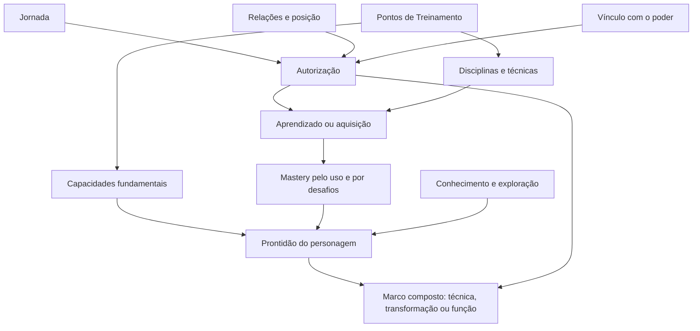

# Trilhas de progressão

## Estado do módulo

| Campo | Valor |
|---|---|
| Estado | `DECIDIDO` |
| Responsável pela decisão | Equipe do Bleach Mod |
| Última revisão | 11/09/2026 |
| Decisões herdadas | D01–D06 e complemento da política de poderes canônicos de `01-visao-e-pilares.md` |
| Decisões deste módulo | PRG-01–PRG-08 `DECIDIDAS` |
| Próximo estado possível | `ESPECIFICADO`, somente após os módulos dependentes detalharem seus contratos |

Este documento separa as formas de progresso do jogador e define a função conceitual de cada uma. Ele não fecha fórmulas, custos finais, catálogo de técnicas, transformações, reputações ou quests. Esses detalhes pertencem aos módulos posteriores.

### Registro parcial das decisões

| Decisão | Estado | Registro de 11/09/2026 |
|---|---|---|
| PRG-01 | `DECIDIDO` | Não haverá nível global: classificação racial, manifestação e posição são separadas, com compatibilidades declaradas por conteúdo. |
| PRG-02 | `DECIDIDO` | Sete trilhas separadas e apresentadas gradualmente. |
| PRG-03 | `DECIDIDO` | Uma moeda universal, diferenciada pelo contexto de obtenção, disponibilidade e trilhas não gastáveis. |
| PRG-04 | `DECIDIDO` | Pontos virão de quests, mentores, minigames, mobs próprios relevantes e espaços especiais de treinamento. |
| PRG-05 | `DECIDIDO` | Capacidades e disciplinas usam ranks comprados e experiência de prática obtida pelo uso. |
| PRG-06 | `DECIDIDO` | Contexto ou mentor disponibiliza, pontos adquirem e mastery desenvolve. |
| PRG-07 | `DECIDIDO` | Contrato sistêmico comum, com experiências e significados próprios por caminho. |
| PRG-08 | `DECIDIDO` | Reputação, posição institucional e afinidade com NPCs relevantes são registros distintos. |

## Objetivo

Evitar que todo crescimento seja reduzido a uma única barra, moeda ou nível. O jogador precisa compreender:

- o que avançou;
- por que avançou;
- o que aquele avanço permite;
- qual atividade desenvolve cada aspecto;
- por que ainda não consegue acessar determinado poder.

O sistema também precisa impedir duplicações. Pontos, atributos, skills, vínculo, mastery, reputação e storyline não podem ser nomes diferentes para o mesmo grind.

## Decisões herdadas da visão

Este módulo parte de contratos já `DECIDIDOS`:

1. O jogador é um personagem original em paralelo ao cânone e desenvolve um conjunto de poder de personagem canônico.
2. A campanha é guiada, mas acontece dentro de um mundo aberto.
3. Grandes poderes combinam narrativa, aprendizado, prova, investimento em pontos e domínio.
4. Pontos participam da aquisição e do aprimoramento, mas não concedem sozinhos Shikai, Bankai ou equivalentes.
5. Caminhos raciais diferentes precisam ser completos e compatíveis no multiplayer.
6. Grind pode apoiar preparação e domínio, mas não substitui conquistas narrativas.

Esses contratos não são reabertos aqui. As decisões abaixo definem como transformá-los em trilhas compreensíveis.

## Fantasia do jogador

O jogador deve perceber que seu personagem cresce em várias dimensões:

- **vive acontecimentos** e ganha acesso a novas responsabilidades;
- **treina suas capacidades básicas** e constrói uma build;
- **aprende disciplinas e técnicas** com pessoas e experiências adequadas;
- **compreende a própria fonte de poder**;
- **domina na prática** o que já conquistou;
- **constrói relações e posição** dentro de organizações;
- **conhece melhor os mundos espirituais** e aprende a navegar neles.

Nenhuma dessas dimensões, isoladamente, deve significar “o jogador ficou melhor em tudo”.

## Base canônica

### Fatos usados como fundação

- O começo de *Bleach* separa despertar, responsabilidade e experiência: receber poder coloca Ichigo diante de um mundo novo, mas não o torna imediatamente conhecedor ou mestre dele. Fonte primária de publicação: [VIZ — Bleach, Vol. 1](https://www.viz.com/manga-books/manga/bleach-volume-1-0/product/167).
- A apresentação oficial de Ichigo descreve aquisição de poder, participação em conflitos, conquista da confiança de outros Shinigami, reconhecimento de sua posição e confronto posterior com sua verdadeira herança. Isso sustenta trilhas distintas para poder, confiança, posição e identidade. Fonte oficial: [BLEACH: Thousand-Year Blood War — Characters](https://bleach-anime.com/en/character/).
- A mesma fonte apresenta personagens cuja patente e capacidade não formam uma escala única: Renji é tenente e domina Bankai; Ikkaku permanece como terceiro oficial apesar de possuir Bankai; Hitsugaya alcança o posto de capitão muito jovem. Portanto, patente institucional não deve ser tratada como sinônimo automático de poder de combate. Fonte oficial: [BLEACH: Thousand-Year Blood War — Characters](https://bleach-anime.com/en/character/).
- A história oficial da segunda parte da Guerra Sangrenta relaciona compreender a própria herança, recuperar determinação e iniciar uma nova etapa de treinamento para obter poder. A terceira parte apresenta personagens retornando de treinamento com capacidades novas. Isso reforça que revelação, treino e resultado são etapas relacionadas, mas diferentes. Fontes oficiais: [The Separation](https://bleach-anime.com/en/story/story-2nd.html) e [The Conflict](https://bleach-anime.com/en/story/story-3rd.html).
- A apresentação licenciada de *Can’t Fear Your Own World* associa o avanço de Hisagi à compreensão da verdadeira capacidade de sua Zanpakutō e do significado do nome dela. Isso sustenta o papel de uma trilha de vínculo ou compreensão pessoal. Fonte oficial de publicação: [VIZ — Bleach: Can’t Fear Your Own World Finale](https://www.viz.com/blog/posts/bleach-can-t-fear-your-own-world-finale).

### Interpretação de design

*Bleach* não possui uma ficha universal de RPG aplicável igualmente a todos os personagens. As trilhas propostas são uma adaptação para tornar visíveis processos que a obra apresenta por acontecimentos, treinamento, relações, descoberta e combate.

“Pontos de Treinamento”, medidores de vínculo, mastery e requisitos compostos são recursos de game design. Eles não devem ser apresentados como termos canônicos existentes dentro da história, salvo quando um nome realmente vier da obra.

## Adaptação para Minecraft

### Progresso não pode depender apenas da campanha

Minecraft permite que o jogador explore, construa, sobreviva e jogue com outras pessoas fora de uma ordem rígida. Por isso, a Jornada controla marcos narrativos, enquanto pontos, treino, mastery, relações e descobertas também podem avançar por atividades contextualizadas no mundo aberto.

### Construção e exploração não podem comprar poder narrativo

Recursos e bases podem preparar treinos, viagens e encontros. Entretanto, possuir muitos materiais ou uma farm eficiente não substitui vínculo, prova, aprendizado ou responsabilidade. A progressão material apoia as trilhas espirituais sem controlá-las sozinha.

### Multiplayer exige progresso pessoal e mundo compartilhado

Pontos, build, vínculo e mastery pertencem ao personagem. Acontecimentos do mundo, ameaças vencidas e certas relações podem possuir componentes compartilhados. A divisão exata será decidida em `15-multiplayer-e-balanceamento.md`; este módulo apenas exige que ajudar uma party não apague nem duplique indevidamente o progresso pessoal.

### Conteúdo deve continuar compreensível depois de uma pausa

Como o jogador pode abandonar temporariamente uma campanha, cada trilha deve indicar seu estado e a próxima possibilidade relevante. Retornar ao mundo não pode exigir lembrar uma sequência invisível de requisitos.

## Escopo

### Pertence a este módulo

- quantidade e função das trilhas de progressão;
- relação entre pontos, atributos, skills, vínculo, mastery, relações e Jornada;
- distinção entre moeda, medidor, marco e resumo;
- contrato conceitual de revelação, aquisição e domínio;
- fontes gerais de progresso e regras contra grind vazio;
- dependências que cada trilha envia aos módulos futuros.

### Não pertence a este módulo

- nomes e fórmulas finais de atributos;
- catálogo de técnicas e transformações;
- níveis, custos e curvas numéricas definitivas;
- NPCs, facções e patentes específicas;
- objetivos, recompensas ou textos de quests individuais;
- regras detalhadas de geração de mundo, mobs, itens ou economia;
- layout definitivo da interface;
- balanceamento de party, PvP ou catch-up.

## Diagnóstico da progressão atual

O protótipo já separa parte do problema:

| Mecanismo atual | Como avança | Função atual | Estado factual |
|---|---|---|---|
| Quests | objetivos `KILL` e `ITEM` | sequência de saga, recompensas e descoberta de formas | Implementado no protótipo |
| Pontos de treinamento | recompensas de quests e treino repetível | moeda para atributos e skill Zanpakutō | Implementado no protótipo |
| Sete categorias | compra por pontos | bônus permanentes de combate e recursos | Implementado no protótipo |
| Skill `zanpakuto` | compra após a forma ser descoberta | requisito numérico de Shikai e Bankai | Implementado no protótipo |
| Descoberta de forma | recompensa de quest | autorização para comprar e usar o estágio | Implementado no protótipo |
| Mastery de forma | tempo de uso | requisito de cadeia e facilidades de transformação | Implementado no protótipo |
| Battle Power | cálculo derivado | resumo informativo | Implementado no protótipo; não concede bônus |

Limites conhecidos:

- não existe trilha explícita de vínculo com a fonte de poder;
- não existem reputação, confiança, patente ou posição institucional;
- descoberta e conhecimento do mundo não formam uma progressão própria;
- não existem técnicas ativas implementadas;
- a economia depende de uma sidequest repetível de matar zumbis;
- Zanjutsu, Hakuda e Kidō aparecem junto de capacidades corporais e de reiatsu, embora conceitualmente sejam disciplinas;
- o conteúdo atual desperta Shikai e Bankai cedo demais para representar a campanha final.

Esses limites não invalidam o protótipo. Eles mostram quais contratos faltam antes de expandir o conteúdo.

## Princípio estrutural

### Uma trilha deve ter uma pergunta própria

| Trilha proposta | Pergunta respondida |
|---|---|
| Jornada | O que o personagem viveu e quais responsabilidades foram abertas? |
| Capacidades fundamentais | Em que aspectos permanentes o personagem investiu? |
| Disciplinas e técnicas | O que ele aprendeu a fazer? |
| Vínculo com o poder | Quanto ele compreende e aceita sua própria natureza? |
| Mastery | Quão bem ele domina algo que já possui? |
| Relações e posição | Em quem confiam nele e qual autoridade ele conquistou? |
| Conhecimento e exploração | O que ele descobriu sobre pessoas, ameaças, lugares e travessias? |

### Elementos que não são trilhas

- **Pontos de Treinamento:** moeda transversal usada em compras; ter saldo não é, sozinho, uma conquista.
- **Transformações:** marcos compostos produzidos pelas trilhas; não precisam de uma barra de XP independente.
- **Battle Power:** leitura resumida de capacidade de combate; não autoriza conteúdo.
- **Equipamentos e materiais:** progressão material tratada em `11-itens-e-economia.md`.
- **Quest:** instrumento que observa e coordena progresso; não é sinônimo da trilha Jornada.

## Modelo conceitual proposto



O diagrama não significa que todo desbloqueio exige todas as trilhas. Uma técnica básica pode exigir mentor e pontos. Uma transformação avançada pode combinar Jornada, Vínculo, pontos, uma prova e Mastery anterior. Cada conteúdo declarará sua própria composição em módulos futuros.

## Trilhas propostas

### T1 — Jornada

Registra acontecimentos vividos pelo personagem e abre novas responsabilidades, pessoas, lugares e problemas.

**Avança por:** capítulos, decisões, crises resolvidas e marcos pessoais.

**Pode liberar:** acesso a campanhas, provas, mentores, territórios e possibilidades de aprendizado.

**Não deve:** conceder automaticamente todo o poder associado ao acontecimento. A Jornada abre ou reconhece oportunidades; os sistemas responsáveis aplicam os demais requisitos.

**Natureza dos dados:** flags e marcos discretos, não uma barra genérica de XP.

### T2 — Capacidades fundamentais

Representa investimento permanente na base física e espiritual do personagem.

Exemplos conceituais: vitalidade, resistência, capacidade de reiatsu e controle. O catálogo e as fórmulas serão decididos em `05-atributos-e-recursos.md`.

**Avança por:** ranks adquiridos com Pontos de Treinamento e experiência de prática obtida por uso válido da capacidade.

**Pode melhorar:** sobrevivência, recursos, eficiência e fundamentos usados por várias técnicas.

**Não deve:** ensinar uma técnica, conceder patente ou revelar uma transformação.

**Natureza dos dados:** rank comprado e experiência de prática separados; bônus derivados e efeitos temporários não são gravados como ranks permanentes.

### T3 — Disciplinas e técnicas

Representa o repertório aprendido pelo personagem: estilos, movimentos, passivas, técnicas ativas e especializações.

Exemplos Shinigami incluem Zanjutsu, Hakuda, Hohō e Kidō. Outras raças terão famílias próprias. O catálogo e a execução serão decididos em `06-habilidades-e-combate.md`.

**Avança por:** contato com mentor, escola, facção, descoberta ou experiência apropriada; depois, ranks comprados com pontos e experiência de prática obtida pelo uso válido.

**Pode liberar:** técnica ativa, passiva, variante, eficiência ou novo grau de uma disciplina.

**Não deve:** ser apenas uma segunda lista de multiplicadores com nomes diferentes dos atributos.

**Natureza dos dados:** nós aprendidos, ranks comprados e experiência de prática, separados das capacidades fundamentais.

### T4 — Vínculo com o poder

Representa compreensão, relacionamento e aceitação da fonte pessoal de poder.

O conceito é compartilhado entre caminhos, mas a fantasia e o nome visível mudam:

| Caminho futuro | Possível expressão temática |
|---|---|
| Shinigami | vínculo e comunicação com a Zanpakutō |
| Hollow/Arrancar | identidade, instinto e domínio da própria natureza Hollow |
| Quincy | compreensão da herança e sintonia com reishi |
| Fullbringer | relação com o objeto e a experiência que despertou o Fullbring |

Esses nomes são hipóteses para os documentos raciais, não conteúdo decidido.

**Avança por:** acontecimentos pessoais, diálogo, escolhas, mundo interior, provas e compreensão. Repetir a mesma ação mecânica sem contexto não deve ser a fonte principal.

**Pode liberar:** etapas de comunicação, provas interiores e elegibilidade para marcos pessoais.

**Não deve:** ser comprado diretamente com pontos nem equivaler a reputação com um NPC.

**Natureza dos dados:** marcos discretos e, apenas se necessário, um medidor entre marcos. A UI deve mostrar significado, não apenas porcentagem.

### T5 — Mastery

Representa domínio prático de algo já adquirido. Mastery pode pertencer a uma forma, técnica, capacidade ou disciplina; não deve existir uma única mastery global. A experiência de prática decidida em PRG-05 é a forma de alimentar esse domínio nas capacidades e disciplinas.

**Avança por:** uso válido, variedade de situações, desafios de execução e treinamento específico.

**Pode melhorar:** custo, controle, velocidade, confiabilidade, acesso a variantes e prontidão para um próximo estágio.

**Não deve:** descobrir o poder inicial, substituir pontos ou crescer por permanência AFK numa forma.

**Natureza dos dados:** progresso por habilidade ou forma, com teto e fontes declaradas.

### T6 — Relações e posição

Separa duas coisas que frequentemente são confundidas:

- **confiança ou reputação:** como uma pessoa ou facção reage ao jogador;
- **posição institucional:** cargo, patente, licença ou responsabilidade formal.

Um personagem forte pode não possuir autoridade. Um personagem respeitado por uma pessoa pode continuar hostilizado por outra facção.

**Avança por:** serviço, decisões, lealdades, comportamento e processos institucionais.

**Pode liberar:** diálogo, serviços, missões, acesso restrito, deveres, comando ou reconhecimento.

**Não deve:** aplicar automaticamente multiplicadores de combate nem ser uma escala universal de “bom” e “mau”.

**Natureza dos dados:** reputação por entidade ou facção e marcos discretos de posição.

### T7 — Conhecimento e exploração

Registra o que o personagem descobriu, não apenas o que o jogador da vida real já sabe sobre Bleach.

**Avança por:** observar ameaças, investigar locais, conversar, estudar registros, atravessar rotas e sobreviver a fenômenos.

**Pode liberar:** informações no diário, preparação contra inimigos, mapas, rotas, receitas contextuais e pistas.

**Não deve:** virar uma lista obrigatória de colecionáveis que bloqueia toda a campanha.

**Natureza dos dados:** entradas e descobertas identificáveis, com poucas coleções opcionais quando tiverem valor próprio.

## Recurso transversal: Pontos de Treinamento

### Papel proposto

Pontos de Treinamento são a moeda de decisão do jogador. Eles permitem escolher onde investir, mas não medem sozinhos experiência, vínculo ou autoridade.

Devem financiar principalmente:

- ranks de capacidades fundamentais;
- aquisição ou melhoria de disciplinas e técnicas já disponibilizadas;
- componente de investimento exigido por determinados marcos de poder;
- possivelmente serviços de treino especiais, se o módulo de economia justificar.

Não devem comprar diretamente:

- acontecimentos da storyline;
- confiança de uma facção;
- conhecimento ainda não descoberto;
- vínculo pessoal;
- mastery;
- transformação cuja prova e demais requisitos não foram cumpridos.

### Fontes propostas

| Fonte | Papel recomendado |
|---|---|
| Campanhas e sidequests | Fonte principal e previsível durante a jornada. |
| Treinos de mentores | Fonte repetível contextual, associada à disciplina praticada. |
| Desafios e conquistas | Recompensa por execução, descoberta ou dificuldade relevante. |
| Encontros apropriados | Fonte secundária; recompensa considera ameaça e participação. |
| Mobs vanilla comuns | Fonte mínima ou inexistente quando não fazem parte de conteúdo contextual. |

Conteúdo repetível deverá impedir que uma ação trivial domine toda a economia. As alternativas incluem retorno decrescente, variedade exigida, limites por ciclo de atividade ou recompensas proporcionais ao risco. A política exata será fechada com quests, mobs e economia.

## Contrato de desbloqueio composto

A decisão D04 fica traduzida em cinco estados conceituais:

1. **Desconhecido:** o jogador ainda não sabe que aquele poder pode ser desenvolvido.
2. **Revelado:** a Jornada, o Vínculo ou uma descoberta apresenta a possibilidade.
3. **Disponível para aprender:** mentor, contexto, requisitos e prova permitem iniciar a aquisição.
4. **Adquirido:** o jogador investe pontos quando exigidos e recebe a capacidade básica.
5. **Dominado:** uso válido e desafios desenvolvem mastery e abrem benefícios posteriores.

Exemplo conceitual, não especificação de Shikai:

```text
revelação narrativa
    + vínculo mínimo
    + prova concluída
    + investimento em pontos
    = poder adquirido com mastery inicial baixa
```

Essa separação permite que a quest revele uma forma sem conceder domínio, que um mentor disponibilize uma técnica sem comprá-la gratuitamente e que pontos tenham importância sem virar a única trava.

## Ritmo de progressão

### Camadas de tempo

| Ritmo | Experiência esperada | Exemplos conceituais |
|---|---|---|
| Momento a momento | decisões de combate e uso de recurso | reiatsu atual, cooldown, postura |
| Sessão | progresso visível de treino ou investigação | pontos, uma etapa de mastery, descoberta local |
| Capítulo | mudança de possibilidades | novo mentor, território, responsabilidade ou prova |
| Campanha | transformação da identidade do personagem | nova posição, estágio maior ou mudança de relação |
| Longo prazo | especialização e expressão de build | domínio elevado, técnicas avançadas, relações consolidadas |

Não haverá promessa de duração em horas antes de testes. O ritmo será avaliado por densidade de decisões, variedade e significado, não apenas por tempo necessário para preencher medidores.

### Regras contra grind vazio

1. A melhor fonte de progresso deve se relacionar ao que está sendo desenvolvido.
2. Repetição pode consolidar mastery, mas variedade e execução devem valer mais que AFK ou spam.
3. Inimigos muito abaixo do jogador não devem sustentar indefinidamente a melhor taxa de pontos.
4. Falta de conteúdo não será mascarada por custos excessivos.
5. Nenhuma trilha deve exigir progresso simultâneo em todas as outras para ações básicas.
6. A UI deve explicar o próximo requisito concreto, não mostrar apenas “bloqueado”.

## Regras principais

1. Toda progressão persistente pertence a uma trilha declarada ou a um recurso transversal declarado.
2. Uma mesma ação pode avançar mais de uma trilha somente quando cada avanço tiver justificativa própria.
3. Pontos são gastos; Jornada, vínculo, mastery, reputação, posição e conhecimento são conquistados e não consumidos como moeda comum.
4. Descobrir, adquirir, equipar, ativar e dominar são estados diferentes.
5. Transformações e outras conquistas maiores combinam requisitos existentes em vez de criar automaticamente uma nova barra.
6. Patente ou reputação não aumenta dano apenas por existir.
7. BP e outros resumos não autorizam conteúdo sozinhos.
8. Progresso passivo precisa corresponder a prática válida e impedir ganho AFK relevante.
9. Requisitos devem ser visíveis antes de o jogador investir recursos que possam ser desperdiçados.
10. Mudanças futuras nas trilhas persistidas exigem migração explícita e preservação das conquistas válidas.

## Relação entre trilhas

| Situação futura | Jornada | Pontos | Capacidades | Disciplina | Vínculo | Mastery | Social | Conhecimento |
|---|---:|---:|---:|---:|---:|---:|---:|---:|
| Aprender técnica básica com mentor | possível | sim | opcional | sim | não | depois | possível | não |
| Melhorar resistência permanente | não | sim | sim | não | não | não | não | não |
| Receber patente de uma organização | possível | não | requisito possível | possível | não | não | sim | possível |
| Descobrir passagem entre mundos | possível | não | não | possível | não | não | possível | sim |
| Despertar uma grande liberação do conjunto canônico | sim | sim | requisito possível | possível | sim | depois | opcional | possível |
| Tornar transformação eficiente | não | talvez | possível | possível | possível | sim | não | não |

“Possível” indica requisito contextual, não obrigatório para todo conteúdo desse tipo.

## Integrações com outros módulos

| Módulo futuro | Contrato recebido das trilhas |
|---|---|
| Storyline macro | Define marcos de Jornada e quando oportunidades são reveladas. |
| Raças e origens | Dá identidade, nomes e compatibilidades à trilha de Vínculo. |
| Atributos e recursos | Especifica Capacidades Fundamentais, Pontos de Treinamento e recursos de combate. |
| Habilidades e combate | Define Disciplinas, técnicas, aquisição e mastery correspondente. |
| Transformações e domínio | Combina Jornada, Vínculo, pontos, provas e mastery em marcos. |
| NPCs, mentores e facções | Produz disponibilidade de aprendizado, relações, reputações e posições. |
| Mobs e encontros | Oferece prática válida, desafios e fontes contextuais de pontos. |
| Dimensões e locais | Produz descobertas, rotas, riscos e requisitos espaciais. |
| Itens e economia | Define progressão material e evita competição indevida com os pontos. |
| Sistema de quests | Observa e coordena trilhas sem assumir a lógica interna delas. |
| Interface e feedback | Mostra estados, requisitos, escolhas e causas de bloqueio. |
| Multiplayer e balanceamento | Separa progresso pessoal, contribuição de party e estado compartilhado. |

## Conteúdo inicial para validar o sistema

A futura fatia de prólogo deve tocar poucas partes de cada trilha, sem simular o jogo completo:

1. **Jornada:** registrar que o jogador percebeu e investigou sua primeira anomalia.
2. **Pontos:** conceder uma recompensa suficiente para uma escolha real.
3. **Capacidades:** permitir uma única compra entre opções com efeitos compreensíveis.
4. **Disciplina:** revelar um aprendizado básico por meio de contexto ou mentor e exigir pontos para adquiri-lo.
5. **Vínculo:** apresentar o primeiro indício de uma fonte pessoal de poder, sem conceder sua forma avançada.
6. **Mastery:** permitir praticar a capacidade recém-adquirida e perceber um pequeno ganho de domínio.
7. **Relação:** registrar a primeira mudança de confiança com quem orientou o jogador.
8. **Conhecimento:** adicionar uma descoberta útil ao diário.

O teste deve observar se o jogador diferencia cada avanço sem precisar ler documentação externa.

## Visão completa

No jogo completo, as trilhas devem permitir personagens fortes por caminhos diferentes:

- um combatente especializado pode investir em poucas disciplinas e dominá-las profundamente;
- um agente versátil pode aprender recursos de diferentes escolas sem dominar todos;
- um explorador pode abrir rotas e informações valiosas para uma party;
- posição social pode oferecer autoridade e responsabilidades sem garantir superioridade de combate;
- vínculo pode transformar a maneira como um poder se manifesta sem apagar a build escolhida;
- conteúdo avançado pode recombinar trilhas existentes em vez de criar uma moeda nova para cada arco.

Isso não significa que toda build será equivalente em toda situação. Significa que cada investimento deve criar utilidade identificável e limites compreensíveis.

## Decisões do módulo

### PRG-01 — Deve existir um nível global do personagem?

| Alternativa | Benefício | Custo ou risco |
|---|---|---|
| **A. Classificação racial nomeada, separada de evolução e cargo** | Entrega uma leitura temática de progresso sem transformar títulos únicos em níveis comuns. | Exige mostrar até três informações quando forem relevantes. |
| B. Uma única escada racial misturando poder, forma e cargo | Produz títulos marcantes e uma linha fácil de seguir. | Cria contradições canônicas e obriga o jogador a entrar em uma facção específica. |
| C. Nível numérico global baseado em XP | Referência simples para quests, inimigos e multiplayer. | Achata progressos distintos e incentiva grind de XP. |

**Decisão aprovada:** alternativa A. O desejo de dar nomes temáticos ao progresso é compatível com não usar um nível global tradicional. A ficha apresentará três conceitos independentes:

1. **Classificação racial de poder:** resumo derivado e nomeado, usado para comunicar aproximadamente a prontidão do personagem. Não é uma moeda nem substitui os requisitos reais.
2. **Estado evolutivo ou de manifestação:** forma que o personagem atingiu, quando a raça possuir evolução ou liberação.
3. **Cargo ou posição:** autoridade efetivamente concedida por uma organização.

Essa separação é necessária porque os exemplos citados não formam escadas equivalentes no cânone:

| Caminho | Classificação de combate derivada — rótulos provisórios | Evolução ou manifestação pessoal | Cargo, afiliação ou organização |
|---|---|---|---|
| Shinigami | aprendiz; nível de Shinigami raso; nível de oficial; nível de tenente; nível de capitão; excepcional | Asauchi ou Zanpakutō selada; Shikai; Bankai; estados especiais aplicáveis | estudante da Academia; membro não-oficial; 20º–3º assento; tenente; capitão; funções únicas |
| Hollow | ameaça menor; Hollow dominante; nível Gillian; nível Adjuchas; nível Vasto Lorde; calamidade | Hollow comum; Menos Gillian, Adjuchas ou Vasto Lorde; ramificação Arrancar; Resurrección e estados especiais | independente; membro de grupo; Fracción; Números; Espada; liderança contextual |
| Quincy | aprendiz; combatente Quincy; nível Soldat; nível Sternritter; elite Quincy; excepcional | poder Quincy desperto; arma espiritual desenvolvida; Schrift, quando concedido; Vollständig e estados especiais | independente; Soldat; Sternritter; Schutzstaffel; funções únicas do Wandenreich |
| Fullbringer | sensitivo; desperto; combatente; especialista; mestre; excepcional | manipulação básica das almas; afinidade com objeto; Fullbring incompleto; completo; refinado | independente; aliado ou membro de grupo; função contextual em organizações como Xcution |

Os rótulos da primeira coluna são uma adaptação de interface, não uma nova hierarquia canônica. Termos como “nível de capitão”, “nível Sternritter” ou “nível Vasto Lorde” indicam equivalência aproximada de prontidão para conteúdo e não concedem o cargo, a evolução ou o poder citado. A escala interna poderá ser comum para balanceamento, mas o nome mostrado e os critérios de leitura serão próprios de cada caminho.

Os três campos não precisam avançar juntos nem possuir a mesma quantidade de etapas. Exemplos:

- um terceiro assento Shinigami pode possuir Bankai e classificação de combate em nível de tenente ou capitão;
- um Arrancar originado de Gillian pode tornar-se mais perigoso sem transformar retroativamente sua origem em Vasto Lorde;
- um Quincy independente pode alcançar classificação de elite sem jamais tornar-se Sternritter;
- um Fullbringer pode dominar completamente sua manifestação e continuar institucionalmente independente.

#### Independência não significa combinação livre

Classificação, manifestação e posição serão armazenadas separadamente, mas cada transformação ou poder declarará suas próprias condições de compatibilidade. A classificação de combate serve como leitura e possível requisito de prontidão; ela não cria poderes que a natureza atual do personagem não comporta.

| Poder ou estado | Condição de natureza | Condições de progressão possíveis | O que não será requisito automático |
|---|---|---|---|
| Shikai | possuir uma Zanpakutō Shinigami formada a partir do vínculo com uma Asauchi | contato com o espírito, nome, Jornada, treino e prova | assento na Gotei 13 |
| Bankai | possuir Zanpakutō e Shikai compatíveis | vínculo avançado, manifestação, domínio, investimento e prova | cargo de capitão |
| Evolução Menos | permanecer no caminho Hollow e satisfazer as regras da etapa anterior | consumo contextual, preservação da individualidade, Jornada e desafio evolutivo | filiação a uma organização |
| Resurrección | ser Arrancar e possuir poder Hollow pessoal selado | identidade de poder, vínculo ou controle, treino e liberação | ter sido Vasto Lorde ou ser Espada |
| Schrift | ser Quincy e receber o despertar em contexto próprio do Wandenreich | conjunto canônico compatível, ritual, Jornada e posição ou escolha narrativa | classificação de combate isolada |
| Vollständig | possuir o caminho Quincy e as condições narrativas e técnicas definidas para a liberação | domínio de reishi, técnica, investimento e treino | promoção automática a Sternritter |
| Fullbring completo | ser Fullbringer e possuir objeto ou foco de afinidade | desenvolvimento da manifestação, domínio e prova pessoal | pertencer à Xcution |

Um Gillian puro não possui Resurrección porque ainda é Hollow, não Arrancar. Porém a origem Gillian não cria uma proibição permanente: Aaroniero é apresentado em material oficial licenciado como um Gillian que se tornou Espada, e sua condição de Arrancar inclui Resurrección. Logo, a verificação correta é “tornou-se Arrancar e desbloqueou a Resurrección de seu conjunto canônico?”, não apenas “qual era sua classe Menos de origem?”. Referências: [Bleach: Brave Souls — Aaroniero](https://www.bleach-bravesouls.com/en/character/aaroniero.html), [Arrancar](https://bleach.fandom.com/wiki/Arrancar) e [Resurrección](https://bleach.fandom.com/wiki/Resurrecci%C3%B3n).

A matriz completa será definida nos módulos `04-racas-e-origens.md` e `07-transformacoes-e-dominio.md`. Este módulo estabelece somente que cada desbloqueio deverá declarar:

```text
natureza ou caminho compatível
    + estado anterior necessário
    + conjunto de poder canônico compatível
    + requisitos de progressão
    + incompatibilidades explícitas
    = desbloqueio permitido ou motivo claro de bloqueio
```

#### Identidade do conjunto de poder canônico

Classificação, manifestação e cargo ainda não descrevem **qual conjunto canônico o jogador está desenvolvendo**. Todo personagem precisará de uma escolha persistente que mantenha coerência entre seus estágios, sem gerar técnicas inéditas.

| Caminho | Conjunto selecionável | Como continua pelos estágios |
|---|---|---|
| Shinigami | Zanpakutō de um personagem real, incluindo nome, comando, aparência e função de combate conhecidos | forma selada, Shikai e Bankai seguem os estágios canônicos disponíveis daquele conjunto |
| Hollow/Arrancar | perfil de habilidade, anatomia e futura Resurrección baseado em um Hollow ou Arrancar real | evolução e Arrancarização preservam a identidade do conjunto escolhido e liberam suas manifestações compatíveis |
| Quincy | repertório Quincy compartilhado somado à especialização, arma ou Schrift de personagem real | técnicas comuns desenvolvem a base; Schrift e Vollständig ampliam somente o conjunto canônico compatível |
| Fullbringer | objeto, memória associada, manifestação e função de um Fullbringer real | manifestação inicial e Fullbring completo permanecem vinculados ao mesmo objeto canônico |

A obra normalmente trata esses poderes como expressões individuais. O mod fará uma adaptação consciente: o jogador continua sendo um personagem original, mas poderá usar o mesmo conjunto do personagem canônico e outros jogadores poderão repetir essa escolha. Isso evita criar um catálogo paralelo de poderes inéditos e aproxima a experiência do reconhecimento imediato oferecido por *Dragon Mine Z*.

| Alternativa | Benefício | Custo ou risco |
|---|---|---|
| **A. Somente conjuntos de personagens canônicos** | Reconhecimento imediato, escopo controlável e fidelidade ao catálogo conhecido de *Bleach*. | Permite vários usuários de Senbonzakura, The Fear ou do mesmo Fullbring e exige declarar essa duplicação como adaptação. |
| B. Poderes originais construídos a partir de núcleos curados | Identidade mecânica inédita para cada jogador. | Amplia fortemente design, arte, animação, balanceamento e testes. |
| C. Sistema híbrido com campanha original e modo canônico separado | Atende às duas fantasias. | Duplica regras, comunicação, catálogo e balanceamento. |

**Decisão aprovada:** alternativa A para todas as raças. O jogo não permitirá criar livremente uma Zanpakutō, Resurrección, Schrift ou Fullbring. O personagem canônico continua existindo com o mesmo poder; compartilhar o conjunto não transfere sua biografia, seus vínculos, seu posto ou suas decisões ao jogador.

A implementação posterior deverá:

1. criar conjuntos canônicos completos e curados, um por personagem selecionado para o catálogo;
2. preservar dentro de cada conjunto somente estágios e técnicas compatíveis;
3. definir se a obtenção ocorre por escolha direta, sorteio, recomendação de prólogo ou mentor;
4. permitir que novos conjuntos sejam adicionados sem alterar saves existentes;
5. comunicar claramente que escolher o conjunto não desbloqueia seu ápice imediatamente.

Mentores continuam ensinando capacidades transferíveis, como Zanjutsu, Kidō, Sonído, Blut ou controle de Fullbring. Eles também podem participar do desbloqueio do conjunto canônico correspondente, mas pontos, prova e mastery continuam necessários conforme PRG-06.

O catálogo por raça, a forma de seleção e os estágios disponíveis ficam para `06-habilidades-e-combate.md` e `07-transformacoes-e-dominio.md`.

#### Correções canônicas necessárias

- Na Gotei 13, membros não-oficiais, oficiais sentados, tenentes, capitães e Capitão-Comandante são posições institucionais. A Guarda Real não é simplesmente o nível posterior ao Capitão-Comandante: ela protege o Palácio Real e seus membros foram reconhecidos por contribuições extraordinárias à história da Soul Society. Referências: [Gotei 13](https://bleach.fandom.com/wiki/Gotei_13) e [Royal Guard](https://bleach.fandom.com/wiki/Royal_Guard).
- Gillian, Adjuchas e Vasto Lorde são classes de Menos. Arrancarização é uma ramificação possível, não apenas o degrau depois de Vasto Lorde. Espada é uma posição na força de Aizen; Privaron Espada identifica antigos Espada que perderam o posto, não uma promoção intermediária. Referências secundárias: [Espada](https://bleach.fandom.com/wiki/Espada) e [Dordoni](https://bleach.fandom.com/wiki/Dordoni_Alessandro_Del_Socaccio).
- Soldat, Sternritter e Schutzstaffel pertencem ao Wandenreich. Sternritter Grandmaster é a função singular de Jugram Haschwalth, e “Pai dos Quincies” identifica Yhwach; não são patamares repetíveis para todos os jogadores. Referências: [Wandenreich](https://bleach.fandom.com/wiki/Wandenreich) e [personagens oficiais](https://bleach-anime.com/en/character/).
- Fullbringers não possuem uma hierarquia racial universal. Manipulação das almas da matéria, afinidade com um objeto e desenvolvimento de uma manifestação incompleta até completa oferecem uma progressão temática adequada, mas os nomes intermediários deverão ser marcados como adaptação do mod. Referência secundária: [Fullbringer](https://bleach.fandom.com/wiki/Fullbringer).

Capitão-Comandante, membro da Guarda Real, Sternritter Grandmaster e “Pai dos Quincies” poderão existir como funções narrativas únicas, objetivos excepcionais ou títulos de cenário. Não recomendo tratá-los como nível comum alcançado automaticamente por todos os jogadores.

### PRG-02 — Quantas trilhas compõem o núcleo?

| Alternativa | Benefício | Custo ou risco |
|---|---|---|
| **A. Sete trilhas separadas, com pontos como recurso transversal** | Cada avanço possui função clara e sustenta o universo completo. | Exige apresentação gradual para não sobrecarregar o começo. |
| B. Jornada, poder e reputação apenas | Modelo mais simples. | Mistura atributos, técnicas, vínculo e mastery dentro de “poder”. |
| C. Uma única árvore de progressão | Fácil de visualizar. | Acopla raças, história e combate; expansões tornam a árvore confusa. |

**Decisão aprovada:** alternativa A, revelando as trilhas aos poucos. O jogador não precisa ver sete sistemas na primeira tela.

### PRG-03 — Como funcionam as moedas e medidores?

| Alternativa | Benefício | Custo ou risco |
|---|---|---|
| **A. Uma moeda de Pontos de Treinamento; demais trilhas não são gastáveis** | Escolhas econômicas claras sem transformar vínculo e reputação em dinheiro. | Requer controlar a inflação de uma moeda usada por muitas compras. |
| B. Uma moeda para cada disciplina ou raça | Balanceamento isolado por conteúdo. | Excesso de moedas e inventário mental alto. |
| C. Todos os progressos usam pontos universais | Implementação e UI simples. | Permite comprar história, vínculo e domínio; viola a visão decidida. |

**Decisão aprovada:** alternativa A. Medidores não gastáveis podem existir, mas apenas Pontos de Treinamento funcionam como moeda principal de personagem.

#### Alternativa de simplicidade com identidade própria

Não é necessário criar várias moedas para diferenciar o Bleach Mod de Dragon Mine Z. Uma solução intermediária mantém um saldo universal, mas muda o contexto da progressão:

- todas as raças gastam Pontos de Treinamento, evitando carteiras e conversões diferentes;
- mentores e acontecimentos determinam quais compras estão disponíveis;
- cada disciplina possui seus próprios desafios e mastery não gastável;
- vínculo, reputação e conhecimento continuam fora da economia;
- locais especiais oferecem atividades e bônus contextuais, não uma nova moeda.

Assim, a complexidade permanece próxima da atual, mas o jogador não consegue desenvolver Kidō, Schrift, Resurrección ou Fullbring apenas abrindo uma loja universal.

### PRG-04 — Como os pontos são obtidos?

| Alternativa | Benefício | Custo ou risco |
|---|---|---|
| **A. Mistura de quests, mentores, desafios, exploração e encontros relevantes** | Incentiva variedade e relaciona recompensa à experiência. | Exige balancear fontes e impedir rotas dominantes. |
| B. Somente quests | Economia previsível e narrativa. | Pode impedir treino livre e tornar conteúdo finito rígido. |
| C. Principalmente por matar qualquer mob | Loop simples e infinito. | Zumbis ou farms automáticas substituem o universo de Bleach. |

**Decisão aprovada:** alternativa A ampliada. Pontos serão obtidos por quests, minigames de treino, atividades de mentores, mobs próprios relevantes e espaços especiais de treinamento. Conteúdo repetível continua possível, com proteção contra AFK, farms triviais e repetição dominante.

#### Espaços especiais de treinamento

Um espaço especial não deve aplicar um multiplicador universal apenas porque o jogador está parado dentro dele. Ele oferece treinos próprios, regras, riscos ou condições que justificam uma recompensa maior.

| Espaço canônico ou inspirado no cânone | Papel de progressão proposto | Limite necessário |
|---|---|---|
| Campo subterrâneo da Loja Urahara | Treinos iniciais e intermediários, controle de reiatsu, sobrevivência, sparring e minigames de fundamentos. | Bônus ligado à conclusão e qualidade da atividade, não à permanência no local. |
| Campo secreto sob a Colina Sōkyoku | Provas avançadas e treinamento acelerado relacionado à Zanpakutō. | Acesso narrativo; não funcionar como farm genérica aberta desde o começo. |
| Dangai | Treino tardio de altíssima intensidade, pressão e domínio sob condições excepcionais. | Evento raro ou janela controlada; não transformar uma rota perigosa entre mundos numa academia cotidiana. |
| Palácio Real | Treinos de endgame com mentores e métodos únicos. | Exigir acesso narrativo e não substituir todo conteúdo anterior. |
| Muken ou arenas equivalentes | Provas extremas de combate e quebra de limites. | Uso excepcional, consequências e justificativa narrativa. |

O espaço subterrâneo usado com o Tenshintai permitiu um método acelerado para alcançar Bankai. Dentro daquele arco, Tensa Zangetsu era tratada como Bankai; revelações posteriores mostram que Ichigo ainda não compreendia completamente a verdadeira composição de seus poderes. Portanto, é razoável descrevê-la retrospectivamente como incompleta ou não definitiva, mas o Tenshintai não cria por regra uma “Bankai falsa”. A história oficial posterior relaciona a nova etapa de poder de Ichigo à compreensão de sua verdadeira herança. Referências: [Study Chamber](https://bleach.fandom.com/wiki/Study_Chamber), [VIZ — Catch-up: Bleach](https://www.viz.com/blog/posts/catch-up-bleach-373) e [BLEACH TYBW — The Separation](https://bleach-anime.com/en/story/story-2nd.html).

Para o jogador original, Bankai e patente continuam independentes: alguém pode atingir Bankai sem ser capitão, mas isso não justifica uma conquista fácil ou precoce. A rota padrão deverá exigir vínculo, treino e prova significativos.

**Backlog registrado:** avaliar em `07-transformacoes-e-dominio.md` uma rota opcional acelerada pelo Tenshintai. Minha recomendação é implementar e validar primeiro a rota normal. Depois, o Tenshintai pode funcionar como atalho narrativo raro, perigoso e exigente, possivelmente produzindo uma manifestação instável que ainda precise ser consolidada. Ele não deve ser o caminho padrão nem uma simples multiplicação de pontos.

Valores, repetibilidade, acesso e tipos de minigame serão especificados nos módulos de dimensões, mentores, quests e economia.

### PRG-05 — Atributos e disciplinas ficam separados?

| Alternativa | Benefício | Custo ou risco |
|---|---|---|
| **A. Separar capacidades fundamentais de disciplinas aprendidas** | Clareza conceitual e espaço para mentores, técnicas e estilos. | Exige revisar a classificação atual de Zanjutsu, Hakuda e Kidō. |
| B. Manter todas as sete categorias como atributos | Preserva integralmente a UI e a economia atuais. | Faz conhecimento técnico funcionar como capacidade corporal comprada. |
| C. Fundir tudo em Poder Espiritual | Poucas decisões e cálculo simples. | Elimina builds e identidade dos estilos de Bleach. |

**Decisão aprovada:** alternativa A sem remover os efeitos apreciados no modelo atual. Capacidades e disciplinas podem usar a mesma tela e a mesma moeda, mas possuir funções diferentes:

| Grupo | Exemplos provisórios | O que controla |
|---|---|---|
| Capacidades fundamentais | Vitalidade, Resistência, Reserva e Controle | corpo, sobrevivência, volume e eficiência de recursos |
| Disciplinas | Zanjutsu, Hakuda, Hohō e Kidō | proficiência, potência específica, disponibilidade e desempenho de técnicas |

Zanjutsu ainda pode aumentar dano com a Zanpakutō, Hakuda pode aumentar combate desarmado e Kidō pode aumentar feitiços. A diferença é que esses ranks também passam a representar proficiência aprendida e podem conversar com mentores, técnicas e requisitos próprios. Comprar Kidō não concede automaticamente todos os feitiços: o rank melhora a disciplina, enquanto cada técnica possui sua descoberta ou ensino.

Cada capacidade ou disciplina possuirá dois eixos:

1. **Rank de investimento:** comprado com Pontos de Treinamento; representa a especialização escolhida e fornece o benefício principal previsível.
2. **Experiência de prática:** obtida por uso válido; representa familiaridade e domínio, sem consumir pontos e sem aumentar automaticamente o rank comprado.

Os dois eixos não devem repetir o mesmo bônus integral. A recomendação para a especificação futura é deixar o rank controlar a maior parte da potência e a prática controlar eficiência, execução, pequenos refinamentos e elegibilidade para treinamento avançado.

| Categoria | Exemplos de prática válida | Exploração que precisa ser impedida |
|---|---|---|
| Vitalidade | concluir combate ou treino relevante sob pressão de vida e recuperar-se de forma legítima | causar dano em si mesmo ou permanecer em fonte de dano controlada |
| Resistência | suportar, bloquear ou mitigar golpes de ameaças apropriadas | receber golpes fracos infinitamente ou usar aliados como farm |
| Reserva | gastar reiatsu em ações úteis durante combate ou treino | esvaziar e recarregar a barra sem objetivo |
| Controle | manter técnicas e liberações com precisão, interromper no momento correto e cumprir provas de eficiência | permanecer transformado AFK |
| Zanjutsu | acertar, defender, contra-atacar e executar técnicas de espada contra ameaças válidas | atacar alvo imóvel ou entidade sem risco indefinidamente |
| Hakuda | sequências desarmadas, defesas, esquivas e desafios próprios | repetir golpes sem oposição real |
| Hohō | movimentação espiritual aplicada a perseguição, evasão e percursos de treino | correr em círculos ou automatizar deslocamento |
| Kidō | conjurações que acertam, protegem, curam, prendem ou resolvem uma situação real | conjurar repetidamente sem alvo ou consequência |

Relevância do inimigo, variedade de ações, intervalos por alvo, conclusão do encontro e regras próprias de minigame podem validar a prática. A fórmula exata fica para atributos, habilidades, combate e balanceamento.

Essa solução preserva a leitura direta do protótipo, acrescenta Hohō e evita chamar conhecimento técnico de capacidade corporal. Nenhum rank atual será apagado automaticamente; `05-atributos-e-recursos.md` precisará propor migração e fórmula antes de qualquer mudança no código.

### PRG-06 — Como uma disciplina ou técnica é aprendida?

| Alternativa | Benefício | Custo ou risco |
|---|---|---|
| **A. Contexto ou mentor disponibiliza; pontos adquirem; mastery desenvolve** | Todos os componentes têm função e o aprendizado ganha significado. | Exige NPCs, condições e conteúdo de treino. |
| B. Compra livre no menu quando houver pontos | Conveniente e simples. | NPCs viram decoração e o repertório perde contexto. |
| C. Quest concede a técnica pronta e dominada | Recompensa imediata e cinematográfica. | Pontos perdem função e o treino desaparece. |

**Decisão aprovada:** alternativa A. Algumas capacidades inatas podem usar descoberta no lugar de mentor, mantendo o mesmo contrato de disponibilidade, aquisição e domínio.

### PRG-07 — Como representar vínculo entre raças diferentes e suas fontes de poder?

| Alternativa | Benefício | Custo ou risco |
|---|---|---|
| **A. Um contrato sistêmico comum com expressão temática por caminho** | Reuso técnico sem transformar todas as raças na mesma fantasia. | Exige conteúdo e nomes próprios para cada caminho. |
| B. Vínculo existe apenas para Shinigami | Implementação inicial simples e forte para Zanpakutō. | Outras raças recebem progressão menos profunda. |
| C. Cada raça usa um sistema sem contrato comum | Máxima liberdade temática. | Duplica código, UI, salvamento e regras de desbloqueio. |

**Decisão aprovada:** “contrato comum” significa compartilhar a estrutura invisível necessária para quests, salvamento e desbloqueios, sem fingir que todas as raças se relacionam com o poder da mesma maneira.

O contrato pode registrar conceitos neutros como:

- fonte pessoal de poder identificada;
- estágio de compreensão atual;
- marcos pessoais concluídos;
- próxima prova disponível;
- condições que autorizam determinado despertar.

Cada caminho traduz esses conceitos para experiências diferentes:

| Estado conceitual interno | Shinigami | Hollow | Quincy | Fullbringer |
|---|---|---|---|---|
| Fonte percebida | presença da Zanpakutō | consciência do instinto e da identidade dominante | percepção da herança e do reishi | resposta das almas da matéria e de um objeto significativo |
| Primeiro contato | voz, imagem ou mundo interior | confronto com impulsos, memórias ou natureza Hollow | treino de percepção, coleta e moldagem de reishi | manipulação simples e reconhecimento da afinidade |
| Compreensão | nome e natureza começam a ser compreendidos | identidade preservada e poder organizado | princípios e herança usados conscientemente | manifestação ainda incompleta ganha intenção e forma |
| Harmonia ou integração | cooperação mais profunda com a Zanpakutō | controle sem apagar o risco e a identidade Hollow | domínio coerente das capacidades desenvolvidas ou concedidas | manifestação completa e controle do objeto de afinidade |

Os rótulos são conceituais e serão revisados nos módulos raciais. O sistema compartilhado não obriga Hollow a conversar com uma espada, Quincy a possuir mundo interior ou Fullbringer a seguir o ritmo de um Shinigami.

#### O que essa decisão traria ao projeto

- quests poderiam perguntar se o personagem atingiu um marco de vínculo sem conhecer a implementação de cada raça;
- transformações poderiam exigir estados equivalentes de maturidade com nomes e provas diferentes;
- saves, comandos administrativos e UI poderiam reutilizar um contrato estável;
- conteúdo racial continuaria livre para ter quantidade de etapas e ritmo próprios;
- adicionar uma raça nova não exigiria reescrever quests, persistência e explicações de bloqueio do zero.

O risco principal é produzir quatro versões cosméticas da mesma barra. A proteção proposta é compartilhar apenas estados e integrações; atividades, texto, personagens, escolhas, falhas e recompensas serão exclusivos de cada caminho.

**Decisão aprovada:** alternativa A. O contrato compartilhado fica limitado aos estados e integrações; conteúdo, ritmo, provas e significado continuam próprios de cada caminho.

### PRG-08 — Confiança e posição institucional são a mesma trilha?

| Alternativa | Benefício | Custo ou risco |
|---|---|---|
| **A. Um domínio social com reputações e patentes separadas** | Representa relações pessoais, facções e autoridade sem confundir poder. | Mais dados e regras de acesso. |
| B. Um único nível de reputação por facção | Simples de visualizar. | Ser querido passa a conceder automaticamente cargo e autoridade. |
| C. Não criar progressão social | Menos sistemas. | NPCs, esquadrões e facções perdem consequência de longo prazo. |

**Decisão aprovada:** o domínio social terá dois registros principais e um terceiro opcional:

| Registro | Exemplo | Função |
|---|---|---|
| Reputação de facção | hostil, desconfiado, neutro, respeitado, aliado | reação coletiva, disponibilidade de serviços e confiança geral |
| Posição institucional | membro não-oficial, assento, tenente, capitão | autoridade, deveres, acesso e responsabilidades formais |
| Afinidade pessoal, somente para NPCs relevantes | desconhecido, conhecido, pupilo, aliado | diálogo, ensino e arcos pessoais sem criar barra para cada habitante |

Reputação não é gasta e não promove automaticamente. Uma promoção pode exigir, por exemplo:

```text
reputação mínima com a organização
    + marco de Jornada
    + capacidades ou disciplinas exigidas
    + prova ou exame
    + condição institucional
    = nova posição
```

#### O que isso pode trazer para o jogo

- acesso a mentores, bibliotecas, lojas, alojamentos e áreas restritas;
- missões de patrulha, investigação, escolta, comando e defesa próprias da posição;
- escolha de esquadrão, especialidade ou função;
- preços, recursos e recuperação diferentes conforme relações construídas;
- NPCs que obedecem, recusam, temem ou confiam no jogador de forma coerente;
- promoções conquistadas por provas, não apenas por matar mobs;
- consequências por atacar aliados, abandonar deveres ou ajudar facções rivais;
- caminhos de desertor, agente independente, aliado externo ou membro formal;
- conflitos nos quais reputação com uma facção melhora enquanto outra piora;
- responsabilidades de endgame além de aumentar dano.

#### Exemplo Shinigami

Um jogador pode ter reputação alta com a 13ª Divisão e continuar sem assento. Para se tornar oficial, precisaria cumprir deveres e uma avaliação apropriada. Um personagem de poder equivalente a capitão ainda poderia permanecer em posição inferior por escolha ou circunstância, como a própria obra demonstra. Capitão-Comandante e Guarda Real exigiriam regras narrativas e institucionais excepcionais, não uma barra de reputação cheia.

#### Exemplos práticos de aplicação

**1. Escolha de divisão Shinigami**

- O jogador conclui sua formação e possui reputação neutra com a Gotei 13.
- Missões anteriores, disciplinas e relações determinam quais divisões demonstram interesse.
- Uma divisão focada em combate pode valorizar Zanjutsu e Hakuda; uma divisão médica pode exigir Kidō e comportamento de suporte; uma divisão de operações especiais pode testar Hohō, furtividade e disciplina.
- Entrar numa divisão libera alojamento, uniforme, mentor, missões e deveres próprios.
- A promoção para oficial sentado exige desempenho, reputação mínima e uma prova. O número exato do assento não precisa substituir um personagem canônico durante a primeira versão.

**2. Lealdade pessoal contra ordem institucional**

- Uma autoridade ordena que o jogador abandone ou prenda um NPC aliado.
- Obedecer melhora reputação institucional, mas pode reduzir afinidade com o NPC e fechar temporariamente seu treinamento.
- Desobedecer pode preservar a relação pessoal, gerar condição de procurado e abrir uma rota alternativa com Urahara ou outro aliado externo.
- A storyline principal continua reconhecível, mas a participação pessoal muda conforme a decisão D02 da visão.

**3. Quincy independente ou membro do Wandenreich**

- Desenvolver capacidades Quincy não obriga filiação ao Wandenreich.
- Entrar como Soldat abre recursos, missões militares e uma cadeia de autoridade.
- Ganhar confiança pode disponibilizar avaliação excepcional para Sternritter; o Schrift continua sendo um poder concedido em contexto próprio, não uma compra de reputação.
- Rejeitar ordens ou desertar remove serviços e transforma antigos aliados em perseguidores, mas pode abrir cooperação com outras facções.

**4. Hollow ou Arrancar em Hueco Mundo**

- A resposta social pode ser expressa como medo, respeito, submissão ou lealdade, em vez de amizade.
- Servir um grupo pode liberar abrigo, informação e aliados; desafiar sua liderança pode abrir uma rota de domínio, rivalidade ou exílio.
- Tornar-se Espada dependeria de contexto político e força reconhecida. Privaron seria consequência de ter perdido esse posto, não um nível comprado.

**5. Fullbringer e relações menores**

- Como não existe hierarquia racial universal, a progressão social pode se concentrar em afinidades com membros importantes e confiança de um grupo como Xcution.
- Relação elevada pode liberar treino conjunto, informações sobre objetos de afinidade e missões pessoais.
- Romper com o grupo muda aliados e objetivos sem diminuir artificialmente o domínio do Fullbring.

#### Fluxo sistêmico proposto

```text
ação relevante no mundo
    -> regra social avalia contexto e testemunhas
    -> reputação ou afinidade muda com motivo registrado
    -> faixa de relação é recalculada
    -> diálogos, serviços, quests e reações são atualizados

pedido de promoção
    -> posição anterior + reputação + Jornada + requisitos próprios + prova
    -> promoção concedida ou motivo de bloqueio apresentado
```

A UI deverá mostrar o motivo das mudanças, por exemplo “+15 — protegeu uma patrulha da 13ª Divisão” ou “−30 — atacou um membro aliado”. Valores são ilustrativos e não representam balanceamento decidido.

#### Multiplayer e cargos únicos

Cargos comuns podem existir por personagem. Funções únicas do mundo, como liderança máxima, precisam de uma política posterior: permanecer com NPC canônico, ser um estado narrativo instanciado ou tornar-se papel único administrado pelo servidor. Não devemos prometer que todo jogador será simultaneamente Capitão-Comandante ou “Pai dos Quincies”.

**Decisão:** alternativa A. O módulo de NPCs decidirá valores, granularidade, ganhos, perdas e conflitos entre facções; o módulo de multiplayer decidirá cargos exclusivos.

## Resumo das decisões e propostas

| Decisão | Direção atual | Estado |
|---|---|---|
| PRG-01 | Classificação racial nomeada, separada de evolução e posição institucional, com compatibilidades próprias. | `DECIDIDO` |
| PRG-02 | Sete trilhas reveladas gradualmente. | `DECIDIDO` |
| PRG-03 | Uma moeda universal, diferenciada pelo contexto de obtenção e pela disponibilidade das compras. | `DECIDIDO` |
| PRG-04 | Quests, mentores, minigames, mobs próprios e espaços especiais de treinamento. | `DECIDIDO` |
| PRG-05 | Capacidades e disciplinas separadas, cada uma com rank comprado e experiência de prática por uso válido. | `DECIDIDO` |
| PRG-06 | Contexto ou mentor disponibiliza, pontos adquirem e mastery desenvolve. | `DECIDIDO` |
| PRG-07 | Contrato comum de vínculo, traduzido em experiências exclusivas por caminho. | `DECIDIDO` |
| PRG-08 | Reputação, posição institucional e afinidades pessoais relevantes como registros distintos. | `DECIDIDO` |

## Questões registradas para módulos posteriores

Estas perguntas não precisam ser respondidas para decidir a arquitetura das trilhas:

- nomes e quantidade final de atributos;
- nomes finais e critérios numéricos das classificações de combate de cada caminho;
- catálogo inicial de conjuntos canônicos de cada raça;
- matriz completa de compatibilidade entre natureza, evolução, manifestação e conjunto canônico;
- método de escolha, sorteio ou recomendação dos conjuntos de poder disponíveis;
- conversão dos ranks atuais de Zanjutsu, Hakuda e Kidō;
- efeitos, limites e curvas da experiência de prática de cada capacidade e disciplina;
- custos, limites, reembolso e respec;
- fórmula de BP ou eventual substituto;
- quantidade de mastery e ritmo de ganho;
- nomes e estágios de vínculo de cada raça;
- facções, patentes e reputações disponíveis;
- rota acelerada de Bankai pelo Tenshintai e suas consequências;
- quais quests, mobs e explorações concedem pontos;
- regras de catch-up, party e balanceamento PvP.

## Critérios de aceitação

O módulo poderá ser considerado `ACEITO` quando:

- cada trilha responder a uma pergunta diferente;
- o jogador não puder comprar história, vínculo, reputação ou mastery com pontos;
- pontos continuarem importantes para aquisição e build;
- transformação for entendida como marco composto, não moeda ou XP isolado;
- patente e poder de combate permanecerem separados;
- nenhuma separação entre trilhas permitir combinação racial ou transformação incompatível;
- os estágios de cada conjunto canônico preservarem sua sequência temática e mecânica reconhecível;
- cada raça puder expressar identidade própria sobre contratos compartilhados;
- a UI puder explicar exatamente o próximo requisito;
- o modelo permitir uma fatia de prólogo pequena sem expor todos os sistemas de uma vez;
- os módulos de storyline, atributos, habilidades, transformações e NPCs receberem contratos claros.

Critérios futuros da experiência, ainda não testados:

- jogadores identificam qual atividade desenvolve cada trilha;
- uma compra de pontos representa escolha real e não imposto obrigatório sem alternativa;
- repetir conteúdo trivial não é a melhor estratégia de progressão;
- o jogador entende a diferença entre revelar, adquirir e dominar um poder;
- builds diferentes chegam ao mesmo capítulo sem precisarem ser idênticas.

## Impacto técnico conhecido

### Elementos atuais que podem ser preservados

- `PlayerData` já separa quests, recursos, atributos, skills, personagem e status.
- `trainingPoints` já funciona como moeda validada pelo servidor.
- formas descobertas são separadas do nível da skill e da mastery.
- mastery já é armazenada por grupo e forma.
- BP já é derivado e informativo.
- recompensas de quest já podem conceder pontos, skill e descoberta de transformação.

### Elementos que exigirão decisão ou evolução posterior

- criar estado explícito de vínculo;
- criar reputações e posições institucionais;
- criar registro de conhecimento e descobertas;
- separar capacidades fundamentais de disciplinas sem perder ranks existentes;
- armazenar experiência de prática separadamente do rank comprado para cada capacidade e disciplina;
- criar perfil persistente de identidade de poder e suas manifestações por personagem;
- declarar compatibilidades e incompatibilidades de cada transformação sem codificá-las apenas por classificação de combate;
- expandir skills para técnicas e aprendizagens contextualizadas;
- substituir a sidequest de zumbis como centro da economia final;
- impedir experiência de prática e mastery por permanência passiva ou repetição sem significado;
- oferecer requisitos compostos e explicações de bloqueio na UI.

### Estado de verificação

- Nenhum código foi alterado por este módulo.
- Nenhuma fórmula atual foi substituída.
- Nenhum teste do jogo foi executado para produzir este documento.
- O diagnóstico do protótipo veio da documentação e do código atuais.
- Este módulo está `DECIDIDO` no nível arquitetural; catálogos, fórmulas e formas de seleção continuam para os módulos dependentes.

## Próximos passos

1. Preservar PRG-01–PRG-08 como decisões arquiteturais fechadas.
2. Criar `03-storyline-macro.md` sem detalhar quests individuais.
3. Levar identidade de poder e compatibilidades para `04-racas-e-origens.md`, `06-habilidades-e-combate.md` e `07-transformacoes-e-dominio.md`.
4. Não escolher um algoritmo de recomendação antes de existir um catálogo curado que ele possa recomendar.
5. Preservar as dúvidas específicas para os módulos de atributos, habilidades, transformações, NPCs, quests e economia.
