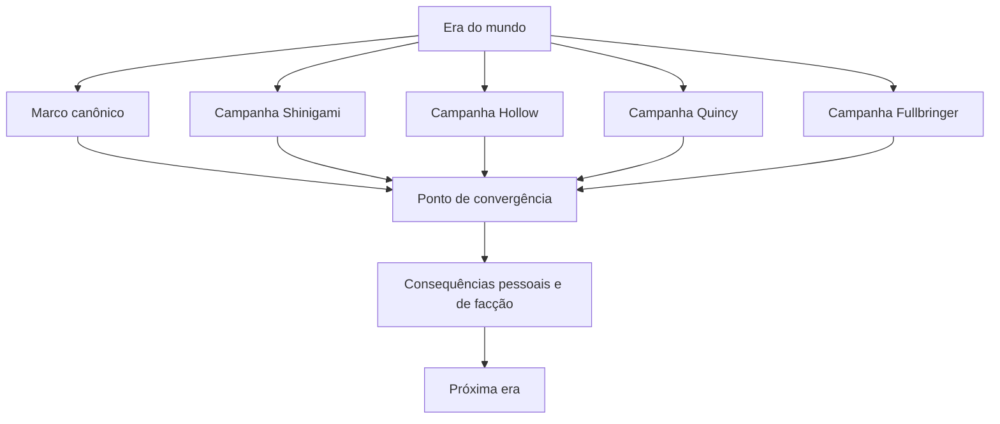

# Storyline macro

## Estado do módulo

| Campo | Valor |
|---|---|
| Estado | `DECIDIDO` |
| Responsável pela decisão | Equipe do Bleach Mod |
| Última revisão | 11/09/2026 |
| Decisões herdadas | D01–D06 de `01-visao-e-pilares.md` e PRG-01–PRG-08 de `02-trilhas-de-progressao.md` |
| Decisões deste módulo | STR-01–STR-07 `DECIDIDAS`; ramificações complexas registradas em backlog |
| Próximo estado possível | `ESPECIFICADO`, após os módulos dependentes detalharem campanhas, sistemas e conteúdo |

Este documento define a estrutura narrativa do **mod completo**: eras, grandes crises, relação entre campanhas raciais, acontecimentos canônicos protegidos e espaço para consequências pessoais. Ele não define quests individuais, diálogos completos, quantidade de inimigos ou recompensas.

### Registro parcial das decisões

| Decisão | Estado | Direção atual |
|---|---|---|
| STR-01 | `DECIDIDO` | `Docs/game-design/` descreve o jogo completo; a fatia inicial apenas valida essa visão. |
| STR-02 | `DECIDIDO` | A campanha principal inclui missões centrais, complementares e secundárias; campanhas raciais aparecem separadas, mas trocam dependências com ela nos marcos de cada era. |
| STR-03 | `DECIDIDO` | O jogador ou sua party enfrenta e derrota bosses canônicos sem aliados canônicos em combate, preservando os marcos necessários à continuidade. |
| STR-04 | `DECIDIDO` | Cada raça possui origem própria desde a era inicial do horizonte completo. |
| STR-05 | `DECIDIDO` | A campanha não dependerá de ramificações complexas; variações persistentes avançadas ficam em backlog. |
| STR-06 | `DECIDIDO` | Era do mundo compartilhada e jornadas principal e racial registradas por personagem. |
| STR-07 | `DECIDIDO` | Existirá pós-guerra persistente; seu conteúdo detalhado fica deliberadamente adiado. |

## Objetivo

Transformar a história extensa de *Bleach* em uma estrutura jogável que:

- preserve acontecimentos e lugares reconhecíveis;
- dê ao personagem original problemas e conquistas próprias;
- ofereça campanhas completas para Shinigami, Hollow, Quincy e Fullbringer;
- permita escolhas com consequências sem produzir incontáveis linhas temporais incompatíveis;
- funcione em um mundo aberto e persistente de Minecraft;
- mantenha singleplayer e multiplayer coerentes;
- possa ser entregue em partes sem confundir a primeira entrega com o horizonte completo.

## Horizonte completo e fatia inicial

### O que `Docs/game-design/` representa

Os documentos de game design descrevem a experiência desejada para o **produto completo**. Eles podem registrar sistemas, mundos, campanhas e caminhos raciais que ainda levarão várias entregas para existir.

Isso não significa tentar implementar tudo simultaneamente. O horizonte completo responde “o que este mod pretende se tornar”; o roadmap posterior responderá “qual parte coerente construiremos e validaremos primeiro”.

### O papel da fatia inicial

A fatia inicial é uma prova pequena do projeto completo. Ela deve validar fundamentos como descoberta espiritual, narrativa dentro do mundo aberto, uma relação relevante e progressão com significado.

Ela não redefine o produto como um mod apenas de prólogo ou apenas de Shinigami. Também não autoriza apresentar sistemas ausentes como implementados.

```text
visão completa
    -> módulos de game design
    -> especificações
    -> fatias jogáveis progressivas
    -> implementação
    -> teste
    -> aceitação
```

## Fantasia do jogador

O jogador deve sentir que atravessou uma vida espiritual completa:

- começou pequeno e conheceu o sobrenatural por uma perspectiva própria;
- encontrou pessoas e organizações que já possuíam história antes de sua chegada;
- escolheu deveres, alianças e formas de agir;
- participou de crises reconhecíveis sem tomar para si a biografia de Ichigo;
- viu o mundo mudar entre uma era e outra;
- encontrou papéis diferentes para sua raça durante os mesmos acontecimentos;
- continuou tendo responsabilidades e objetivos depois da última batalha canônica.

Cada grande arco deve mudar ao menos uma destas dimensões: compreensão do mundo, relações, posição, acesso territorial, ameaça dominante ou identidade do personagem.

## Base canônica

### Espinha dorsal principal

A política D05 permanece vigente: mangá principal como base; anime oficial e novels licenciadas como complemento; material exclusivo do anime como conteúdo opcional identificado.

Para a macroestrutura, a divisão oficial recente da VIZ destaca cinco grandes períodos reconhecíveis: início como Shinigami Substituto, Soul Society, Arrancar, Agente Perdido e Guerra Sangrenta dos Mil Anos. Essa divisão é ampla o suficiente para orientar eras, mas o mod poderá separar conflitos extensos em capítulos menores para obter ritmo jogável. Fonte oficial: [VIZ — BLEACH THE STORIES](https://www.viz.com/blog/posts/watch-bleach-episodes-free-for-a-limited-time).

A apresentação oficial de Ichigo resume a passagem pelo Mundo Humano, Soul Society, Hueco Mundo e invasão do Wandenreich, além da descoberta de sua herança. Isso confirma uma escalada que começa local, atravessa sociedades espirituais e termina envolvendo a estabilidade dos mundos. Fonte oficial: [BLEACH TYBW — Characters](https://bleach-anime.com/en/character/).

A Guerra Sangrenta amplia a crise para Soul Society, Wandenreich, Palácio Real e os Três Mundos. O conflito revela verdades históricas e transforma uma guerra entre facções em ameaça à própria estrutura do universo. Fontes oficiais: [BLEACH TYBW — Story](https://bleach-anime.com/en/story/story.html) e [The Calamity](https://bleach-anime.com/en/story/story-4th.html).

### Conteúdo posterior e complementar

*Can’t Fear Your Own World* ocorre após a Guerra Sangrenta e apresenta reconstrução, segredos institucionais e risco de um novo conflito entre mundos. Ele é uma referência adequada para expansão pós-guerra, mas continua complemento licenciado e não substituirá o desfecho do mangá principal. Fonte oficial de publicação: [VIZ — New Bleach Novels](https://www.viz.com/blog/posts/new-bleach-novels).

O especial de 2021 é oficialmente publicado como um **one-shot**. Enquanto não existir uma continuação completa publicada, seus elementos não devem ser prometidos como uma campanha principal fechada; podem permanecer como semente de expansão futura. Fonte oficial: [VIZ — Bleach: Special One-Shot](https://www.viz.com/shonenjump/chapters/bleach-special-one-shot).

Em 11/09/2026, a parte final do anime da Guerra Sangrenta ainda constitui material recente em publicação. Antes de especificar quests e cenas desse arco, a equipe deverá revisar as expansões oficiais efetivamente lançadas, sem antecipar conteúdo por trailers ou rumores. Fonte oficial: [VIZ — Bleach](https://www.viz.com/bleach).

### Interpretação de game design

Os nomes de capítulos do mod, as missões complementares, as frentes raciais, os personagens originais e as consequências pessoais serão adaptações. A função deles é criar espaço real para o jogador sem afirmar que esses acontecimentos fazem parte do cânone original. Os confrontos canônicos também serão adaptados: seus inimigos e resultados permanecem reconhecíveis, mas a vitória jogável pertence ao jogador ou à party.

## Adaptação para Minecraft

### Uma cronologia, várias jornadas

O mundo precisa possuir uma ordem reconhecível de eras. Entretanto, cada raça deve observar e atravessar essas eras por uma campanha própria.

O arco da Soul Society pode oferecer motivações diferentes:

- para um Shinigami, conflito entre dever institucional e consciência;
- para um Hollow, mudança na vigilância das fronteiras e oportunidade ou perigo em Hueco Mundo;
- para um Quincy, contato com a história de perseguição e com a política de equilíbrio das almas;
- para um Fullbringer, percepção de que disputas espirituais distantes afetam humanos e espíritos no Mundo Humano.

Essas motivações não devem reduzir campanhas raciais a investigação, apoio ou tarefas secundárias. Cada caminho precisa de ação, confrontos, riscos, rivais e clímax próprios. Os exemplos deste módulo demonstram estrutura e não constituem o conteúdo aprovado das quests.

Nem todas as raças precisam cumprir o mesmo número de capítulos em cada era. O compromisso é que nenhuma delas desapareça da narrativa por longos períodos, exista apenas como espectadora ou receba somente trabalhos de bastidor.

### O jogador participa dos acontecimentos canônicos e possui frentes próprias

Restringir o jogador a frentes paralelas enquanto o elenco vive todas as batalhas marcantes produziria afastamento. A adaptação combinará dois tipos de participação:

- **participação canônica direta:** o jogador ou sua party entra em invasões, resgates, confrontos e batalhas contra bosses conhecidos;
- **frentes próprias:** a campanha acrescenta conflitos raciais, rivais e ameaças que dão protagonismo original e aumentam o conteúdo.

Nas batalhas canônicas adaptadas, o jogador ou sua party assume o combate e conquista a vitória sem personagens canônicos spawnados como aliados. A quest apresenta o inimigo no estado correspondente àquele ponto da história, como Dragon Mine Z fazia com formas sucessivas de um personagem. O elenco canônico ainda pode contextualizar acontecimentos, aparecer em diálogos ou cenas antes e depois do encontro e manter sua importância no mundo, mas a luta jogável pertence ao jogador.

As frentes próprias continuam úteis para:

- proteger pessoas enquanto a batalha canônica ocorre em outro ponto;
- investigar a causa que permitirá uma operação maior;
- impedir reforços, romper uma barreira ou manter uma rota aberta;
- decidir o destino de um personagem original afetado pela crise;
- enfrentar um subordinado, experimento, unidade ou ameaça criada para aquela campanha;
- sofrer as consequências locais da vitória ou derrota canônica;
- oferecer bosses, set pieces e conflitos exclusivos de cada campanha racial.

Participação direta não significa copiar a trajetória de Ichigo. A rota até o confronto, a motivação, os poderes usados e as consequências podem variar conforme a raça do jogador. A adaptação preserva a sequência geral, os inimigos, seus estados reconhecíveis e o resultado necessário para a era seguinte, mas transfere a autoria jogável da vitória ao jogador ou à party.

### Mundo aberto entre capítulos

Uma era não deve bloquear todo o mundo até que sua campanha termine. A progressão narrativa pode abrir novos riscos, estruturas, rotas, patrulhas e conversas, enquanto construção, exploração e treinamento continuam disponíveis.

Exceções temporárias são aceitáveis para invasões, prisões, perseguições e travessias perigosas, desde que tenham propósito e duração claros.

### Passagens de tempo

Intervalos canônicos, como o período entre a derrota de Aizen e o arco do Agente Perdido, não serão reproduzidos por meses reais de servidor. Uma transição de era comunica a passagem de tempo e atualiza personagens, relações e mundo. Construções do jogador permanecem, salvo mudança explicitamente justificada e tecnicamente segura.

## Escopo

### Pertence a este módulo

- horizonte narrativo do mod completo;
- ordem das eras e crises principais;
- relação macro entre cânone e personagem original;
- estrutura de campanhas raciais dentro da mesma cronologia;
- categorias de acontecimentos fixos e variáveis;
- escala permitida para ramificações;
- posição geral sobre conteúdo pós-guerra e universo expandido;
- contrato conceitual de estado narrativo em multiplayer.

### Não pertence a este módulo

- origem detalhada ou regras jogáveis de cada raça;
- lista final de NPCs, bosses, estruturas ou dimensões;
- objetivos, diálogos, recompensas e pré-requisitos de quests;
- quantidade de capítulos ou quests por arco;
- transformações obtidas em cada missão;
- layout da árvore de campanha;
- implementação de instâncias, sincronização ou migração de saves;
- ordem de desenvolvimento e datas de lançamento.

## Modelo conceitual

### Elementos narrativos

| Elemento | Função |
|---|---|
| Era do mundo | Situação ampla compartilhada: paz relativa, invasão, reconstrução ou colapso. |
| Marco canônico | Acontecimento reconhecível cuja existência ou resultado é protegido. |
| Campanha racial | Perspectiva e sequência de responsabilidades próprias de um caminho. |
| Frente | Problema original, complementar ou racial que amplia a crise além dos confrontos canônicos. |
| Fio pessoal | Identidade, vínculo, mentor, relação ou conflito particular do personagem. |
| Consequência | Mudança persistente em relação, acesso, posição, diálogo ou condição local. |
| Expansão opcional | Campanha fora da espinha principal, identificada por sua origem editorial. |



O ponto de convergência não precisa reunir fisicamente todos os jogadores ou campanhas. Ele representa o momento em que o resultado amplo da crise atualiza o mundo e permite a próxima era.

## Camadas da storyline

| Camada | Conteúdo | Variabilidade |
|---|---|---|
| 1. Espinha canônica | grandes crises e resultados necessários para a continuidade | baixa |
| 2. Campanha racial | motivos, aliados, frentes e dilemas de cada caminho | média |
| 3. Fio pessoal | vínculo, poder, mentor e relações | moderada; ramificações avançadas ficam em backlog |
| 4. Mundo aberto | patrulhas, investigações, eventos, exploração e sidequests | alta e repetível quando apropriado |
| 5. Universo expandido | novels, anime original, filmes, história passada e especiais | opcional e identificado |

Uma camada inferior não pode contradizer silenciosamente a superior. Se uma expansão opcional usar uma premissa incompatível com a campanha principal, deverá existir como cenário separado, memória, crônica ou linha de conteúdo explicitamente adaptada.

## Cronologia macro proposta

Os títulos abaixo são nomes de trabalho. Eles descrevem eras completas, não sagas JSON prontas.

| Código | Era ou macrocapítulo | Marco reconhecível | Espaço para o jogador original |
|---|---|---|---|
| M00 | O Limiar Espiritual | antes da grande escalada, o sobrenatural começa local e compreensível | perceber anomalias, sobreviver, formar o primeiro vínculo e entrar em um caminho racial |
| M01 | Deveres no Mundo Humano | atuação de Ichigo e Rukia como Shinigami Substituto e aumento de incidentes Hollow | assumir uma área, grupo ou problema próprio; conhecer regras de almas e equilíbrio |
| M02 | A Crise da Soul Society | prisão de Rukia, execução, invasão e revelação da conspiração de Aizen | invadir ou defender o Seireitei, enfrentar oficiais conhecidos e viver o resgate por uma motivação racial própria |
| M03 | A Máscara Rompida | ascensão da ameaça Arrancar, Visored e preparação de Aizen | combater incursões Arrancar, enfrentar rivais e preparar a travessia ou grande defesa seguinte |
| M04 | Guerra em Hueco Mundo | expedição, Las Noches, Espada e conflito entre os mundos | atravessar Las Noches, enfrentar inimigos canônicos e próprios, libertar, servir, desertar ou disputar poder |
| M05 | A Batalha por Karakura | confronto contra os Espada e derrota de Aizen | combater na guerra, enfrentar Espada e participar diretamente da batalha adaptada contra Aizen |
| M06 | O Agente Perdido | perda e restauração dos poderes de Ichigo, Xcution e verdade sobre o Shinigami Substituto | conhecer e enfrentar a Xcution, com Fullbringers no centro sem excluir as demais raças |
| M07 | A Guerra de Sangue | desaparecimentos, declaração de guerra e primeira invasão do Wandenreich | investigar, invadir, defender, recrutar ou sobreviver conforme raça e lealdade |
| M08 | A Separação | consequências da derrota, treinamento, Segunda Invasão e conflitos internos Quincy | reconstruir capacidade, escolher lado, recuperar territórios e enfrentar decisões de identidade |
| M09 | A Queda dos Três Mundos | Palácio Real, Wahr Welt e risco de colapso da ordem | invadir o campo final, enfrentar a elite inimiga e participar diretamente do confronto pelo destino dos mundos |
| M10 | Cicatrizes da Guerra | reconstrução, tensões entre facções e verdades ocultas | consolidar posição, resolver consequências, explorar pós-guerra e enfrentar campanhas originais ou complementares |

### Por que separar Arrancar e Guerra Sangrenta em várias eras

Esses conflitos mudam de território, antagonista imediato, escala e objetivo. Colocá-los em uma única saga extensa produziria uma árvore difícil de ler e deixaria grandes períodos sem consequências perceptíveis. A divisão macro não obriga uma quantidade específica de quests.

## Perspectivas raciais propostas

### Shinigami

- começa por formação, dever local, substituição ou descoberta equivalente definida no módulo racial;
- conhece Soul Society por dentro ou por seus agentes;
- enfrenta tensões entre ordens, justiça, esquadrão e relações pessoais;
- ganha novas responsabilidades nas crises Arrancar e Quincy;
- pode terminar como membro formal, aliado externo, dissidente ou autoridade compatível com suas escolhas.

### Hollow e Arrancar

- começa por sobrevivência, fome, identidade e pressão de outros Hollows;
- percebe a ascensão de Aizen como ameaça, oportunidade ou força dominadora;
- atravessa Hueco Mundo como habitante, não apenas como invasor;
- decide servir, resistir, fugir, disputar território ou buscar Arrancarização quando compatível;
- durante a invasão Quincy, enfrenta o risco de extermínio e alianças improváveis;
- participa da reconstrução de Hueco Mundo segundo relações e posição conquistadas.

### Quincy

- começa entre tradição familiar, ocultação, caça a Hollows e conflito com a política Shinigami;
- conhece gradualmente a história entre Quincy e Soul Society sem receber toda a verdade no prólogo;
- pode manter independência, aproximar-se do Wandenreich, infiltrar-se ou resistir;
- tem papel central durante a Guerra Sangrenta, com dilemas de lealdade que não se resumem a herói ou vilão;
- após a guerra, enfrenta as consequências da derrota do império e do futuro das comunidades Quincy.

### Fullbringer

- começa como humano espiritualmente afetado, com objeto de afinidade e ameaças próximas;
- observa os danos colaterais das disputas espirituais no Mundo Humano;
- encontra outros Fullbringers, Xcution ou grupos originais sem filiação obrigatória;
- ocupa o centro de M06, mas mantém funções próprias antes e depois desse arco;
- pode proteger pessoas, explorar rotas materiais e espirituais e mediar interesses entre humanos e facções;
- no pós-guerra, ajuda a lidar com cicatrizes que organizações espirituais tradicionais não compreendem sozinhas.

### Regra de completude

Uma campanha racial completa precisa possuir começo, crescimento, crise própria, participação nas grandes eras e consequência de endgame. “Aparecer no arco em que a raça virou antagonista” não satisfaz essa regra.

## Acontecimentos protegidos e frentes variáveis

### Categorias propostas

| Categoria | Exemplo de função | Pode variar? |
|---|---|---|
| Existência protegida | a conspiração de Aizen ocorre; o Wandenreich invade | não na campanha principal |
| Resultado protegido | Aizen é derrotado; a guerra chega ao desfecho necessário à continuidade | não na campanha principal |
| Participação canônica direta | o jogador invade, resgata e enfrenta personagens ou bosses conhecidos | sim na forma de adaptação jogável |
| Frente do jogador | missão paralela criada para sua raça, facção ou relação | sim |
| Reação social básica | reputação, posição, diálogo ou serviço coerente com ações claras | sim, sem exigir uma campanha alternativa completa |
| Ramificação avançada | sobrevivência variável, rotas longas exclusivas ou mundo persistentemente alterado | backlog |

### Regra do protagonista original em uma adaptação jogável

Para cada clímax canônico usado, o conteúdo detalhado deverá responder:

1. qual acontecimento precisa permanecer reconhecível;
2. como o jogador participa diretamente do acontecimento ou boss;
3. qual estado, forma e conjunto de capacidades representam o inimigo naquele encontro;
4. qual contexto canônico aparece antes ou depois do combate sem retirar a vitória do jogador;
5. como cada raça recebe motivação e ação compatíveis.

Se a única função do jogador for observar um NPC vencer, a missão não está pronta. O jogador pode substituir o elenco na execução e na vitória de uma luta adaptada, utilizando seu conjunto canônico escolhido, mas não assume por isso a identidade, a história pessoal, as relações ou o posto do personagem que originalmente possui esse poder.

## Escolhas e ramificações

Ramificações narrativas persistentes de grande alcance não são requisito da campanha principal nesta fase do projeto. A storyline poderá ser predominantemente linear, mantendo as reputações e posições já decididas em PRG-08. Diálogos e serviços podem reagir a ações claras sem criar outra sequência de quests para cada resultado.

### Modelo possível para o backlog

Se a equipe retomar ramificações avançadas no futuro, o modelo mais controlável abre caminhos pessoais e depois retorna a um marco compartilhado:

```text
marco comum
    -> escolha de abordagem, facção ou relação
    -> missões, aliados e consequências diferentes
    -> resultado amplo protegido
    -> estado pessoal persistente na próxima era
```

Isso controlaria o escopo sem produzir linhas históricas ilimitadas. Não constitui compromisso da primeira especificação de campanhas.

### Possibilidades futuras

- mentor e treinamento disponíveis;
- reputação e posição;
- aliado que acompanha uma frente;
- inimigo, abordagem ou ordem de objetivos;
- acesso a abrigo, rota, informação ou serviço;
- sobrevivência de personagem original;
- forma como a facção recebe o jogador na próxima era;
- epílogo pessoal.

### Limites que continuam válidos

- apagar permanentemente uma dimensão central;
- permitir que toda facção vença a cronologia principal;
- matar livremente personagens canônicos necessários a arcos posteriores;
- produzir uma campanha inteiramente nova para cada combinação de respostas;
- converter lealdade social diretamente em técnica ou transformação.

## Estado narrativo em singleplayer e multiplayer

### Três camadas necessárias

| Estado | Exemplos | Propriedade proposta |
|---|---|---|
| Era do mundo | antes da invasão, guerra ativa, reconstrução | mundo ou servidor |
| Campanha principal | eras vividas e participação nos acontecimentos canônicos | personagem |
| Campanha racial | capítulos e marcos próprios do caminho Shinigami, Hollow, Quincy ou Fullbringer | personagem |

Essa divisão permite que uma invasão seja percebida como acontecimento coletivo sem declarar que todos os jogadores viveram as mesmas missões raciais ou já concluíram sua participação pessoal.

### Problema ainda não resolvido

Jogadores podem entrar em um servidor em eras diferentes. O módulo `15-multiplayer-e-balanceamento.md` decidirá catch-up, liderança de party, repetição de cenas, instâncias e mudanças permanentes do mapa. Este módulo apenas proíbe duas soluções extremas:

- um jogador novo não pode reverter silenciosamente o mundo inteiro ao prólogo;
- um jogador novo também não pode perder toda a campanha porque entrou depois.

## Conteúdo histórico, complementar e opcional

### Histórias passadas

Eventos como a origem dos Visored, conflitos antigos entre Quincy e Shinigami e memórias de personagens podem aparecer como crônicas, investigações ou capítulos históricos. O jogador atual não deve ser inserido fisicamente no passado sem uma justificativa explícita de cenário ou memória.

### Anime original e filmes

Arcos exclusivos do anime e filmes podem virar campanhas opcionais identificadas como universo expandido ou adaptação. Eles não serão pré-requisitos entre M00 e M10.

### Novels

Novels licenciadas podem fornecer campanhas complementares, especialmente no pós-guerra. Quando o protagonista da novel for canônico, o personagem do jogador atuará em outra frente ou em conteúdo inspirado nas consequências, respeitando a política já aplicada aos grandes arcos.

### Burn the Witch e outras regiões

A existência de outra filial da Soul Society amplia o universo, mas não obriga integração ao núcleo do Bleach Mod. Uma eventual expansão deverá avaliar escala, regras próprias e identidade antes de entrar no roadmap.

## Pós-guerra e continuidade

Concluir M09 não deve encerrar o mundo. M10 transforma o fim da campanha canônica em um novo estado persistente:

- reconstrução de territórios e serviços;
- reorganização de esquadrões e facções;
- sobreviventes Hollow e Quincy buscando novos lugares;
- investigações sobre verdades ocultas;
- ameaças originais liberadas pelas guerras;
- atividades de alto nível, mentorias e responsabilidades institucionais;
- campanhas complementares e eventos de servidor;
- possíveis epílogos pessoais, caso esse conteúdo seja retomado após os sistemas centrais.

Repetir a história poderá existir como recurso de New Game+ ou configuração, mas não deve ser a única atividade de endgame.

## Regras principais

1. O documento representa o mod completo; a fatia inicial é validação, não teto de escopo.
2. O jogador permanece um personagem original, mas assume o protagonismo jogável dos confrontos canônicos adaptados.
3. Cada raça recebe campanha completa e função própria nas eras compartilhadas.
4. O jogador participa diretamente dos acontecimentos canônicos, enquanto marcos indispensáveis preservam a continuidade.
5. Nenhum grande arco será apenas uma sequência de lutas canônicas repetidas.
6. Reações sociais básicas precisam ser coerentes; ramificações narrativas persistentes e complexas permanecem em backlog.
7. O mundo aberto permanece útil entre capítulos.
8. Passagem de tempo narrativa não exige espera real.
9. Conteúdo complementar será identificado e não bloqueará a espinha principal.
10. O pós-guerra será um estado jogável, não apenas créditos ou reset obrigatório.
11. Storyline registra acontecimentos e autorizações; sistemas de poder aplicam desbloqueios.
12. A macroestrutura não determina quantidade ou tipo final de quests.

## Integrações com outros módulos

| Módulo | Contrato recebido da storyline macro |
|---|---|
| Raças e origens | Define em quais eras cada caminho precisa de entrada, motivação e convergência. |
| Atributos e recursos | Informa mudanças de escala sem determinar fórmulas. |
| Habilidades e combate | Indica contextos narrativos de aprendizado, sem conceder técnicas diretamente. |
| Transformações e domínio | Informa momentos de autorização e prova, sem decidir requisitos completos. |
| NPCs, mentores e facções | Lista funções narrativas, relações e autoridades necessárias em cada era. |
| Mobs e encontros | Informa ameaças e frentes, não estatísticas ou IA. |
| Dimensões e locais | Define quando territórios entram na cronologia e por que são visitados. |
| Sistema de quests | Exige suporte a campanhas raciais, marcos, reações sociais básicas e retomada. |
| Campanhas e sidequests | Recebe os macrocapítulos para transformá-los em conteúdo detalhado. |
| Interface e feedback | Precisa comunicar era, jornada pessoal, escolhas e próxima responsabilidade. |
| Multiplayer e balanceamento | Decide sincronização entre era do mundo e progresso pessoal. |

## Conteúdo inicial para validar a storyline

A primeira fatia narrativa não precisa reproduzir M00 inteiro para quatro raças. Ela deve provar a estrutura em escala pequena:

1. uma anomalia espiritual surge em um local do Mundo Humano;
2. o jogador possui motivação pessoal para investigá-la;
3. um personagem canônico ou original oferece contexto sem resolver o problema;
4. exploração e preparação em Minecraft ajudam na resposta;
5. o jogador enfrenta uma frente própria ligada a um acontecimento maior;
6. uma escolha altera relação, abordagem ou consequência local;
7. o diário registra o resultado e indica a próxima possibilidade;
8. o fim apresenta um caminho espiritual sem entregar uma transformação avançada.

Essa fatia valida narrativa, mundo aberto e consequência. Ela não valida ainda completude racial, grandes guerras ou endgame.

## Visão completa

No horizonte completo, o jogador poderá:

- iniciar uma jornada coerente como Shinigami, Hollow, Quincy ou Fullbringer;
- atravessar os principais períodos do mangá por uma perspectiva original;
- formar alianças e rivalidades que sobrevivem às transições de era;
- conhecer Mundo Humano, Soul Society, Hueco Mundo, Wandenreich e territórios avançados;
- participar de campanhas históricas ou complementares sem confundi-las com a cronologia principal;
- concluir a Guerra Sangrenta e continuar em um mundo reconstruído;
- jogar em party com personagens de origens diferentes nas frentes em que seus interesses convergem;
- revisitar conteúdo por modos apropriados sem apagar automaticamente sua trajetória principal.

“Mod completo” não significa colocar nominalmente todo episódio, personagem ou luta. Significa oferecer profundidade, continuidade e função jogável aos pilares centrais do universo.

## Decisões do módulo

### STR-01 — O game design descreve o mod completo ou somente a primeira entrega?

| Alternativa | Benefício | Custo ou risco |
|---|---|---|
| **A. Mod completo, com fatias iniciais de validação** | Mantém direção de longo prazo e permite entregas honestas e coerentes. | Exige distinguir visão, especificação e roadmap. |
| B. Somente o escopo inicial | Documentação menor e imediatamente implementável. | Decisões locais podem bloquear raças, mundos e campanhas futuras. |
| C. Misturar visão completa e primeira entrega sem rótulos | Menos documentos. | Faz ideias parecerem implementadas ou prometidas para a próxima versão. |

**Decisão aprovada:** alternativa A. Seções chamadas “conteúdo inicial” descrevem testes de visão, não o limite do produto.

### STR-02 — Como organizar as campanhas raciais na cronologia?

| Alternativa | Benefício | Custo ou risco |
|---|---|---|
| **A. Cronologia comum com campanhas raciais trançadas** | Preserva um mundo compartilhado e dá perspectiva própria a cada raça. | Exige escrever várias frentes dentro das mesmas eras. |
| B. Uma campanha totalmente separada para cada raça | Máxima liberdade por caminho. | Duplica cronologia, dificulta party e pode criar quatro mundos incompatíveis. |
| C. Uma única campanha com pequenas trocas de diálogo | Produção inicial simples. | As raças viram skins e o pilar de completude é violado. |

**Decisão aprovada:** alternativa A. Cada era possui entradas, frentes e consequências raciais, com convergência no resultado amplo.

#### Como a campanha principal e a campanha racial se relacionam

A campanha principal e a campanha racial serão apresentadas em lugares diferentes, mas não representarão histórias isoladas:

| Camada | O que mostra | Exemplo |
|---|---|---|
| Campanha principal | cronologia, crise comum, acontecimentos canônicos, missões originais de ligação e missões secundárias do capítulo | a crise da Soul Society, seus confrontos centrais e problemas adicionais causados pela invasão |
| Campanha racial | motivo, confrontos, rivais, clímax e contribuição daquele caminho | um Shinigami lidera uma ruptura no Seireitei; um Quincy combate a força responsável por uma purga espiritual |
| Fio pessoal | vínculo com poder, mentor e consequências individuais | confiança de um aliado, prova interior ou decisão de lealdade |

A campanha principal não será apenas uma lista das batalhas centrais de *Bleach*. Cada capítulo poderá conter quatro funções de missão:

| Função | Papel na campanha | Obrigatoriedade possível |
|---|---|---|
| Missão canônica central | coloca o jogador dentro de um acontecimento, confronto ou boss reconhecível | normalmente obrigatória para avançar a era |
| Missão principal complementar | conteúdo original que prepara, conecta ou mostra consequências entre marcos canônicos | pode ser obrigatória quando sustenta o ritmo e a compreensão do capítulo |
| Missão secundária da campanha principal | história opcional vinculada diretamente à crise, aos locais ou ao elenco daquele capítulo | opcional, mas permanece listada dentro da campanha principal |
| Missão racial | desenvolve o caminho, os conflitos e o clímax próprios da raça naquela mesma era | pertence à campanha racial e pode fornecer um marco exigido pela jornada daquele personagem |

Uma missão ser original ou secundária não a transforma automaticamente em campanha racial. Da mesma forma, nem toda sidequest do mundo pertence à campanha principal: mentorias avulsas, trabalhos locais, atividades repetíveis e histórias independentes continuarão em sua categoria própria. A seleção concreta de objetivos, quantidade e obrigatoriedade ficará para o módulo de campanhas e sidequests.

A dependência recomendada funciona nos dois sentidos:

```text
campanha principal apresenta uma nova era
    -> desbloqueia o capítulo correspondente da campanha racial
    -> jogador resolve sua frente racial
    -> marco racial registra sua contribuição
    -> campanha principal conclui a participação pessoal naquela crise
    -> próxima era se torna elegível
```

Portanto, a campanha racial depende da principal para saber **quando e por que** acontece. Em determinados pontos, a progressão pessoal da campanha principal também depende de um marco racial para saber **como aquele personagem participou**.

Isso não obriga o jogador a completar campanhas das outras raças. Um Hollow joga a espinha principal e a trilha Hollow; ele não precisa concluir a trilha Shinigami. Campanhas raciais adicionais e opcionais poderão existir depois, mas o caminho racial central faz parte da jornada principal daquele personagem.

Na interface futura, a separação pode ser apresentada como:

- **História principal:** eras e crises compartilhadas;
- **Caminho racial:** capítulos exclusivos da natureza atual do personagem;
- **Histórias pessoais e de facção:** conteúdo lateral ou ramificado.

### STR-03 — Quanto os acontecimentos canônicos podem mudar?

| Alternativa | Benefício | Custo ou risco |
|---|---|---|
| **A. Marcos essenciais protegidos, com vitória jogável do jogador** | Permite viver e vencer batalhas conhecidas sem herdar a identidade do protagonista. | Adapta quem executa a vitória em relação à obra e exige declarar essa convenção com clareza. |
| B. Reencenar o cânone assumindo as ações do protagonista | Reconhecimento máximo e escrita linear. | Faz o personagem original herdar a biografia de Ichigo. |
| C. Permitir alterar qualquer resultado | Agência máxima. | Multiplica linhas temporais e quebra arcos posteriores. |

**Decisão aprovada:** alternativa A revisada. O jogador ou sua party enfrenta e derrota diretamente os bosses canônicos, inclusive Aizen, sem personagens canônicos spawnados como aliados. Os acontecimentos e resultados indispensáveis ao encadeamento da obra continuam protegidos, mas a autoria da vitória em combate é adaptada para o jogador.

#### Exemplos de acontecimentos protegidos

Não se trata de colocar o jogador fora da história nem de obrigá-lo a representar Ichigo. Trata-se de uma adaptação jogável: a campanha preserva a ordem geral, os conflitos, as formas dos inimigos e os resultados necessários, enquanto entrega ao personagem original a execução das batalhas. Essa convenção altera deliberadamente quem vence o confronto em relação à obra e permite ao jogador usar um conjunto de poder canônico, mas não transfere a identidade, a biografia, os vínculos ou todas as decisões do dono original daquele poder.

| Era | O que permanece canônico | Participação direta adaptada |
|---|---|---|
| Crise da Soul Society | Rukia é presa; a execução desencadeia a crise; a conspiração de Aizen é revelada; Aizen deixa a Soul Society | invadir ou defender o Seireitei, enfrentar oficiais conhecidos, participar do resgate e agir durante a revelação da conspiração |
| Guerra em Hueco Mundo | Ichigo e seus aliados entram em Hueco Mundo; os Espada e Las Noches fazem parte do conflito | atravessar Las Noches, enfrentar Arrancar e Espada compatíveis com a rota e participar das operações de resgate ou defesa |
| Batalha por Karakura | ocorre o confronto contra as forças de Aizen e Aizen termina derrotado e selado | combater os Espada e derrotar os estados de Aizen previstos para a campanha, sem aliados canônicos dentro dos encontros |
| Agente Perdido | Xcution, Ginjō e a restauração dos poderes de Ichigo permanecem reconhecíveis | conhecer a Xcution, enfrentar membros canônicos e participar diretamente do conflito de confiança e traição |
| Guerra Sangrenta | o Wandenreich invade, a ordem dos mundos entra em risco e o conflito chega ao desfecho necessário à continuidade | lutar nas invasões, enfrentar Sternritter e participar do confronto final conforme a motivação racial e a lealdade do personagem |

Exemplo concreto contra Aizen:

```text
acontecimento protegido: Aizen alcança sua evolução e termina derrotado e selado
início da missão: a quest cria a versão de Aizen correspondente àquele encontro
gameplay: o jogador ou sua party enfrenta Aizen sem NPCs canônicos aliados
vitória: a derrota do boss é conquista efetiva do jogador, não dano preparatório para uma cutscene
continuidade: o resultado necessário é registrado e a campanha libera o próximo estado ou era
contexto canônico: personagens conhecidos podem aparecer antes ou depois, sem tomar o combate
```

O jogador não fica assistindo e não trabalha ao lado do elenco para que ele finalize o boss: seu desempenho é a condição da vitória. Ao mesmo tempo, o mod não afirma que ele viveu as relações, treinamentos e revelações pessoais que pertencem a Ichigo.

O detalhamento posterior deverá respeitar dois limites:

- nenhum NPC canônico entra como aliado de combate ou resolve o encontro em uma cutscene;
- a substituição vale para a autoria jogável da batalha, não para toda a existência e trajetória dos personagens canônicos.

#### Estados e formas dos bosses canônicos

Um personagem canônico poderá possuir várias representações de combate conforme evolui na storyline. Cada estado deve corresponder ao momento em que apareceu, com visual, capacidades e escala apropriados. A campanha pode usar esses estados em quests sucessivas ou em fases de um encontro, assim como Dragon Mine Z apresentava versões distintas de Cell ao longo da progressão.

```text
quest de um marco anterior
    -> cria o boss no estado correspondente àquela aparição
    -> jogador ou party vence o encontro
    -> progresso narrativo é registrado
    -> uma quest posterior pode criar o próximo estado do personagem
```

Isso não significa que o NPC permanente do mundo morreu nem que uma forma posterior já está disponível. A instância de combate pertence à quest e representa aquele recorte da narrativa. O catálogo exato de estados, a escolha entre quests separadas ou boss multifase, as habilidades de cada versão, repetição e escalonamento pertencem aos módulos de mobs e encontros, campanhas e sidequests e multiplayer.

### STR-04 — Quando as diferentes raças entram na história completa?

| Alternativa | Benefício | Custo ou risco |
|---|---|---|
| **A. Todas possuem origem própria na era inicial e crescem ao longo da cronologia** | Entrega campanhas realmente completas e favorece party desde cedo. | É o maior compromisso de conteúdo do horizonte completo. |
| B. Cada raça começa somente no arco em que ganha destaque canônico | Entrada temática simples. | Hollow, Quincy e Fullbringer perdem parte substancial da jornada. |
| C. Todas começam pelo mesmo prólogo e apenas depois escolhem a raça | Tutorial único. | Força origens incompatíveis e reduz identidade. |

**Decisão aprovada:** alternativa A para o mod completo. O roadmap pode implementar as origens em entregas diferentes sem mudar o destino final.

### STR-05 — Qual é o alcance das escolhas do jogador?

| Alternativa | Benefício | Custo ou risco |
|---|---|---|
| A. Consequências persistentes com variações de missões e mundo | Escolhas produzem trajetórias diferentes. | Precisa persistir, escrever e testar muitas combinações. |
| **B. Campanha principal estável e reações sociais limitadas** | Mantém reputação e reconhecimento sem multiplicar campanhas agora. | Menor ramificação narrativa na primeira especificação. |
| C. Cada escolha pode gerar uma linha histórica completa | Liberdade extrema. | Conteúdo e testes crescem de forma inviável. |

**Decisão:** alternativa B. A campanha não dependerá de ramificações persistentes complexas. Reputação, posição, falas e serviços ainda podem reagir a ações objetivas conforme PRG-08, mas rotas longas exclusivas, sobrevivências variáveis e grandes alterações do mundo ficam em backlog.

#### Exemplos preservados para o backlog

Os exemplos abaixo não são compromisso da campanha inicial nem requisito para especificar o sistema de quests. Eles registram possibilidades para uma revisão futura.

**Shinigami — ordem contra consciência**

- obedecer a uma autoridade pode aumentar reputação institucional e liberar missões formais;
- desobedecer para salvar uma testemunha pode criar um aliado, bloquear temporariamente serviços e abrir investigação clandestina;
- Aizen ainda escapa conforme a espinha principal, mas a era seguinte começa com relações diferentes.

**Hollow ou Arrancar — servir ou resistir a Aizen**

- servir pode conceder abrigo, acesso e posição temporária em Las Noches;
- resistir pode aproximar o jogador de comunidades independentes e torná-lo alvo do regime;
- Aizen ainda é derrotado, mas o jogador chega ao pós-regime como colaborador desconfiável, desertor, libertador ou rival.

**Quincy — Wandenreich, infiltração ou independência**

- aceitar recrutamento abre autoridade, recursos e missões militares, mas cobra obediência;
- infiltrar-se pode preservar aliados externos e produzir desconfiança interna;
- permanecer independente limita recursos imperiais, mas cria outra rede de relações;
- o resultado amplo da guerra é preservado, enquanto julgamento, aliados e lugar do jogador no pós-guerra mudam.

**Fullbringer — relação com Xcution**

- confiar no grupo pode acelerar acesso a treino e informações, aumentando o impacto de uma traição;
- manter distância pode preservar autonomia, mas tornar o desenvolvimento mais difícil;
- proteger ou perder um Fullbringer original modifica mentorias e missões posteriores sem substituir o papel de Ginjō.

**Consequência local persistente**

- um posto defendido continua oferecendo descanso, comércio e patrulhas;
- o mesmo posto perdido pode permanecer em ruínas, gerar uma missão de reconstrução e deslocar seus NPCs;
- a mudança precisa ser limitada para não destruir construções do jogador sem consentimento ou regra clara.

Caso esse backlog seja retomado, a equipe deverá escolher uma pequena quantidade de consequências autoradas e testáveis, sem transformar cada decisão em uma nova campanha.

### STR-06 — Como combinar história pessoal e mundo compartilhado?

| Alternativa | Benefício | Custo ou risco |
|---|---|---|
| **A. Era do mundo compartilhada e jornada pessoal por personagem** | Guerras parecem coletivas sem apagar decisões individuais. | Exige política posterior de catch-up e repetição. |
| B. Toda a história pertence ao mundo | Simples para eventos globais. | Quem entra depois perde conteúdo ou herda escolhas alheias. |
| C. Tudo é instanciado por jogador | Progresso pessoal previsível. | Enfraquece mundo persistente e cooperação. |

**Decisão aprovada:** alternativa A. O módulo de multiplayer resolverá os casos de jogadores em capítulos diferentes.

#### As três camadas de estado na prática

Para evitar confusão, a proposta separa:

| Estado | Exemplo | Dono |
|---|---|---|
| Era do mundo | a ameaça Arrancar já começou e determinadas incursões podem ocorrer | mundo ou servidor |
| Progresso da campanha principal | o personagem já concluiu sua participação na crise da Soul Society | personagem |
| Progresso da campanha racial | o personagem concluiu a frente Shinigami, Hollow, Quincy ou Fullbringer daquela era | personagem |

Exemplo de servidor:

- o mundo está em M03, a era da ameaça Arrancar;
- o Jogador A viveu M00–M02 e possui suas escolhas registradas;
- o Jogador B entrou agora e ainda precisa conhecer os acontecimentos anteriores;
- o Jogador C concluiu M02 por uma campanha racial diferente da do Jogador A.

O mundo não volta coletivamente para M00 quando o Jogador B entra. Ao mesmo tempo, B não deve receber todas as decisões e recompensas como se tivesse participado. Uma futura política de catch-up poderá usar missões de retrospectiva, versões pessoais de capítulos anteriores, relatos, arquivos ou sessões conduzidas por party.

O que fica decidido neste módulo é apenas a separação dos estados. Ainda não fica decidido:

- quem possui autoridade para avançar a era do servidor;
- se encontros passados serão instanciados ou reconstruídos;
- como uma party vota ou confirma escolhas;
- como evitar que um jogador adiante o mundo contra a vontade dos demais;
- quais recompensas um jogador em catch-up recebe.

Essas regras pertencem ao módulo `15-multiplayer-e-balanceamento.md`. Em singleplayer, mundo e personagem pertencem ao mesmo jogador, mas continuam conceitualmente separados para permitir retomada, New Game+ e consistência de saves.

### STR-07 — O que acontece depois da espinha principal?

| Alternativa | Benefício | Custo ou risco |
|---|---|---|
| **A. Pós-guerra persistente, campanhas originais e expansões opcionais identificadas** | Sustenta endgame e permite incorporar material complementar com controle. | Exige conteúdo de mundo que não dependa de repetir bosses. |
| B. Reset obrigatório da campanha | Reutiliza conteúdo existente. | Apaga consequências e torna o fim artificial. |
| C. O mundo encerra após a última batalha | Desfecho simples. | Incompatível com Minecraft persistente e progressão longa. |

**Decisão aprovada:** alternativa A. New Game+ pode coexistir, mas não substituir o pós-guerra. O conteúdo de M10, as expansões e o funcionamento de New Game+ ficam deliberadamente adiados; nesta etapa decide-se somente que o mundo continuará jogável depois da espinha principal.

## Resumo das decisões e propostas

| Decisão | Direção | Estado |
|---|---|---|
| STR-01 | Game design do mod completo, validado por fatias menores. | `DECIDIDO` |
| STR-02 | Campanha principal com missões centrais, complementares e secundárias; campanhas raciais separadas na apresentação, mas interdependentes nos marcos de cada era. | `DECIDIDO` |
| STR-03 | Jogador ou party derrota bosses canônicos sem aliados canônicos em combate; a campanha preserva os marcos essenciais. | `DECIDIDO` |
| STR-04 | Todas as raças com origens próprias desde a era inicial do jogo completo. | `DECIDIDO` |
| STR-05 | Campanha estável e reações sociais limitadas; ramificações complexas em backlog. | `DECIDIDO` |
| STR-06 | Era compartilhada e jornadas principal e racial por personagem. | `DECIDIDO` |
| STR-07 | Pós-guerra persistente e conteúdo complementar opcional, com detalhamento adiado. | `DECIDIDO` |

## Questões registradas para módulos posteriores

- origem exata e momento da escolha racial;
- quantidade de capítulos ou quests em cada era;
- quais missões complementares da campanha principal são obrigatórias e quais são secundárias;
- quais personagens canônicos aparecem diretamente;
- NPCs originais necessários para cada frente;
- ramificações persistentes, sobrevivências variáveis e alterações locais registradas em backlog;
- transformações e técnicas associadas a cada capítulo;
- mapas, dimensões, estruturas e travessias;
- bosses e inimigos específicos;
- catálogo de estados e formas de cada boss canônico, incluindo quais serão quests separadas ou fases do mesmo encontro;
- regras de criação, repetição e propriedade dos bosses gerados por quests;
- consequências destrutivas permitidas em construções do jogador;
- catch-up, instanciamento e liderança narrativa em party;
- formato da árvore, diário e retomada;
- ordem real de implementação das campanhas raciais;
- catálogo de novels, fillers, filmes e especiais opcionais.

## Critérios de aceitação

O módulo poderá ser considerado `ACEITO` quando a equipe validar que:

- existe diferença clara entre horizonte completo e primeira fatia;
- a ordem das eras é compreensível mesmo para quem não conhece todos os capítulos;
- cada raça possui motivo para existir antes, durante e depois de seu arco de maior destaque;
- o jogador vence diretamente os confrontos canônicos, sem depender de aliados canônicos em combate, e também resolve problemas próprios;
- acontecimentos fixos e consequências variáveis estão separados;
- reações sociais básicas são coerentes sem exigir ramificações complexas;
- o modelo comporta singleplayer e multiplayer sem exigir que alguém assuma a identidade de um protagonista único;
- a campanha pode ser pausada sem perder clareza;
- o pós-guerra oferece continuidade coerente;
- conteúdo opcional não contamina os pré-requisitos da espinha principal.

Critérios futuros, dependentes de campanhas jogáveis:

- jogadores entendem por que sua raça participa de cada crise;
- fãs reconhecem os arcos e entendem claramente a convenção que transfere as vitórias jogáveis ao personagem original sem transferir a ele toda a biografia do elenco;
- não fãs compreendem a escalada e as facções por meio do jogo;
- se o backlog de ramificações for retomado, uma escolha anterior produz consequência identificável numa era posterior;
- jogadores em party conseguem cooperar mesmo com lealdades e progresso pessoal diferentes.

## Impacto técnico conhecido

### Base atual aproveitável

- o registro de quests suporta sagas ordenadas e sidequests;
- requisitos já observam quest anterior, saga, skill e raça;
- o progresso de quest e o desbloqueio de saga são persistidos por jogador;
- a árvore atual já diferencia sagas e conteúdo lateral;
- a arquitetura herdada possui party e avanço de história documentados.

### Limites atuais diante da proposta

- o conteúdo padrão possui somente uma saga provisória chamada `soul_society`;
- as três quests atuais usam mobs vanilla e liberam Shikai e Bankai cedo, servindo como validação técnica, não narrativa final;
- o requisito de raça aceita apenas Shinigami no protótipo atual;
- não existe estado explícito de era compartilhada do mundo;
- não existem campanhas raciais paralelas, participação adaptada em marcos canônicos ou reações narrativas persistentes;
- não existe política implementada para catch-up de jogadores em eras diferentes;
- `previousSaga` expressa uma corrente linear, mas a proposta completa exigirá distinguir cronologia, campanha racial e convergência;
- o reset de história existente é uma capacidade técnica herdada, não uma decisão de New Game+ aprovada.

Esses pontos não autorizam alteração de código neste módulo.

### Estado de verificação

- Nenhum código foi alterado para produzir este documento.
- Nenhuma quest, saga, tradução ou recompensa atual foi modificada.
- Nenhum teste do jogo foi executado nesta etapa documental.
- O diagnóstico técnico foi conferido na documentação e no código atuais.
- O módulo está `DECIDIDO` no nível arquitetural; campanhas, encontros, conteúdo racial e regras de multiplayer ainda precisam de especificação própria.

## Próximos passos

1. Preservar STR-01–STR-07 como decisões arquiteturais fechadas.
2. Criar `04-racas-e-origens.md` usando as funções narrativas exigidas por cada era.
3. Levar ramificações persistentes para o backlog, sem torná-las dependência dos próximos módulos.
4. Não transformar os macrocapítulos em quests antes de definir raças, habilidades, transformações, NPCs, mobs, dimensões e o sistema de quests.
5. Revisar a adaptação final da Guerra Sangrenta com base no material oficial publicado antes da especificação de campanhas.
