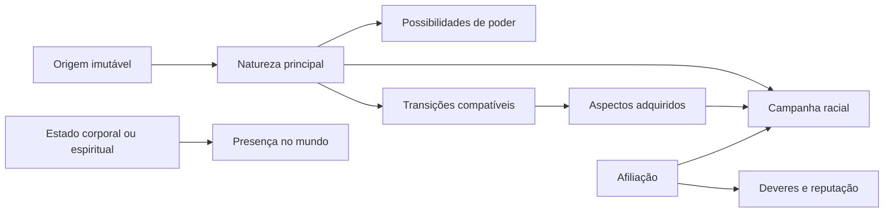

# Raças e origens

## Estado do módulo

| Campo | Valor |
|---|---|
| Estado | `IDEALIZADO` |
| Responsável pela decisão | Equipe do Bleach Mod |
| Última revisão | 11/09/2026 |
| Decisões herdadas | D01–D06, complemento de poderes canônicos, PRG-01–PRG-08 e STR-01–STR-07 |
| Decisões deste módulo | RAC-01–RAC-12 `DECIDIDAS` |
| Próximo passo | Iniciar o terceiro bloco: diferenças, vantagens, limitações e convivência racial |

Este documento trata da natureza espiritual e do começo jogável do personagem no **mod completo**. Ele ainda não autoriza implementação e não transforma possibilidades futuras em funcionalidades já prometidas.

O módulo será decidido em partes:

1. **Identidade e transições:** significado de raça, origem, estado atual, aspectos adquiridos, híbridos e morte.
2. **Origens por caminho:** abertura Shinigami, Hollow, Quincy e Fullbringer.
3. **Regras de convivência:** diferenças raciais, vantagens, limitações, hostilidade e cooperação.
4. **Criação e continuidade:** confirmação da escolha, troca de personagem, reinício e migração de saves.

Os dois primeiros blocos estão concluídos. O módulo continua `IDEALIZADO` porque diferenças raciais, convivência, criação e continuidade ainda não foram discutidas.

### Registro parcial das decisões

| Decisão | Estado | Direção atual |
|---|---|---|
| RAC-01 | `DECIDIDO` | Identidade representada em camadas: origem, natureza, estado, aspectos adquiridos e afiliação. |
| RAC-02 | `DECIDIDO` | Escolha informada da origem, seguida por prólogo exclusivo que confirma e ensina aquela identidade. |
| RAC-03 | `DECIDIDO` | Cada caminho começa em estado próprio e anterior ao domínio do elemento que define seu combate. |
| RAC-04 | `DECIDIDO` | A origem é permanente; estados e aspectos compatíveis só mudam por transições narrativas controladas. |
| RAC-05 | `DECIDIDO` | Nenhum híbrido jogável nas entregas iniciais; híbridos entram no produto completo após estabilização das raças puras. |
| RAC-06 | `DECIDIDO` | Morte comum é derrota de gameplay; somente eventos narrativos alteram a condição espiritual. |
| RAC-07 | `DECIDIDO` | Todos surgem no Mundo Humano; a introdução racial encaminha o Shinigami à Academia, onde começa o treino com shinai. |
| RAC-08 | `DECIDIDO` | A rota Hollow apresenta brevemente o passado como Plus e começa o combate como Hollow recém-formado, com vantagem corporal inicial em vez de arma. |
| RAC-09 | `DECIDIDO` | Humano de herança Quincy fragmentada ou oculta, inicialmente independente do Wandenreich. |
| RAC-10 | `DECIDIDO` | Humano independente com objeto e Fullbring de personagem canônico; não haverá criação de poderes originais. |
| RAC-11 | `DECIDIDO` | Prólogos diferentes convergem funcionalmente para a mesma era e campanha compartilhada. |
| RAC-12 | `DECIDIDO` | Guia apropriado ao caminho; uma alma-guia vinculada ao jogador poderá abrir diálogos ao ser usada como item. |

## Objetivo

Definir um modelo no qual cada jogador:

- possua uma origem compreensível e coerente com *Bleach*;
- viva uma abertura própria para seu caminho, conforme STR-04;
- não receba uma raça apenas como pacote de bônus escolhido sem contexto;
- preserve sua identidade quando atingir estados como Arrancar ou uma condição semelhante à Hollowficação;
- possa participar das mesmas eras que outras raças sem se tornar uma variação cosmética delas;
- mantenha uma história legível para quests, NPCs, transformações, reputação e multiplayer.

## Fantasia do jogador

O jogador não deve sentir que escolheu apenas uma classe. Ele deve sentir que descobriu **o que é**, **como chegou a essa condição**, **a que mundo pertence** e **o que pode se tornar**.

Cada caminho precisa responder perguntas diferentes:

- **Shinigami:** por que essa alma assumiu o dever de conduzir e proteger outras almas?
- **Hollow:** o que restou de sua identidade diante da fome, do instinto e da transformação?
- **Quincy:** qual relação o personagem possui com sua herança, seus ensinamentos e o conflito histórico com os Shinigami?
- **Fullbringer:** que experiência, objeto e vínculo pessoal deram forma ao seu poder?

Essas perguntas orientam a origem. Elas não definem ainda Zanpakutō, Resurrección, Schrift, Vollständig ou Fullbring individual.

## Problema central: “raça” não explica o personagem inteiro

No código atual, `race` é um identificador permanente usado para escolher árvores de formas, custos e requisitos. Esse modelo é suficiente para o MVP Shinigami, mas uma única string não representa bem todas as situações previstas para o produto completo.

Em *Bleach*, conceitos diferentes podem coexistir:

- um humano vivo pode atuar como Shinigami Substituto;
- um Shinigami pode adquirir uma condição Hollow sem deixar de possuir Zanpakutō e cargo;
- um Hollow pode tornar-se Arrancar e ainda carregar sua origem e classe evolutiva anterior;
- um Quincy pode ser independente ou integrar o Wandenreich;
- um Fullbringer continua sendo humano e não precisa pertencer à Xcution;
- personagens excepcionais podem reunir mais de uma herança espiritual.

Por isso, o termo “raça” continuará útil para o jogador, mas não deve obrigar todo o sistema a guardar identidade, corpo, facção e transformação no mesmo campo.

## Base canônica

### Fatos que orientam o modelo

- Ichigo começa como humano capaz de ver espíritos, recebe poderes de Rukia e atua como Shinigami Substituto. A história posterior revela que ele nasceu de um Shinigami e de uma Quincy. O caso demonstra que origem, herança, função e estado de poder não são sinônimos. Fontes oficiais: [BLEACH TYBW — Characters](https://bleach-anime.com/en/character/) e [episódio 13 — The Blade Is Me](https://bleach-anime.com/en/story/?id=13).
- A página oficial apresenta antigos capitães como Shinji, Rose e Kensei como Shinigami que foram Hollowficados e depois puderam voltar a ocupar cargos na Gotei 13. Logo, a condição Hollow adquirida não apaga automaticamente a natureza, a história ou a posição Shinigami. Fonte oficial: [BLEACH TYBW — Characters](https://bleach-anime.com/en/character/).
- Uryū é apresentado como descendente Quincy e, mais tarde, integrante dos Sternritter. Masaki é apresentada como Quincy e mãe de Ichigo; Kanae é identificada como Quincy de linhagem mista. Esses casos distinguem herança Quincy de afiliação ao Wandenreich e confirmam a existência de heranças mistas. Fonte oficial: [BLEACH TYBW — Characters](https://bleach-anime.com/en/character/).
- O Wandenreich também emprega Arrancars, como Ebern e Lüdaas. Portanto, pertencer a uma organização não determina sozinho a natureza do personagem. Fonte oficial: [BLEACH TYBW — Characters](https://bleach-anime.com/en/character/).
- Ginjō manifesta seu Fullbring por meio de um pingente e Chad descobre que seu poder pertence à mesma categoria. Isso sustenta uma origem Fullbringer baseada em experiência pessoal, afinidade e foco material, não em uma organização obrigatória. Fontes oficiais licenciadas: [Kūgo Ginjō](https://www.bleach-bravesouls.com/en/character/ginjo.html) e [Yasutora Sado](https://www.bleach-bravesouls.com/en/character/sado.html).
- Aaroniero é apresentado como o único Gillian a tornar-se Espada. O exemplo reforça que classe Menos de origem, condição Arrancar e posto Espada são informações distintas. Fonte oficial licenciada: [Aaroniero Arruruerie](https://www.bleach-bravesouls.com/en/character/aaroniero.html).

### Limites da evidência

A obra possui exceções importantes e não oferece quatro processos simétricos de criação de personagem. Transformar Shinigami, Hollow, Quincy e Fullbringer em caminhos igualmente completos é uma **adaptação de game design**.

Também não será presumido que qualquer combinação de heranças observada em um personagem excepcional possa ser reproduzida livremente por todos os jogadores. Compatibilidades, riscos e acessos precisam ser definidos pelo jogo.

## Adaptação para Minecraft

### A escolha deve ter agência sem perder contexto

Uma raça completamente aleatória pode obrigar o jogador a abandonar um mundo para jogar a fantasia desejada. Uma escolha puramente mecânica, feita por ícones e bônus antes de qualquer contexto, enfraquece a promessa de descoberta.

A direção recomendada é combinar as duas necessidades:

1. o jogador escolhe conscientemente uma **origem jogável**, com descrição clara da fantasia e de sua permanência;
2. essa escolha não entrega o kit completo imediatamente;
3. o prólogo exclusivo faz o personagem viver o despertar, a perda ou o recrutamento correspondente;
4. somente então a interface passa a apresentar a identidade usando os termos do universo.

Essa direção foi aprovada em RAC-02. A forma e o texto da seleção serão definidos no bloco de criação e continuidade.

### Derrota de Minecraft não deve reescrever a origem

Se toda morte comum transformasse um humano em Plus, um Plus em Hollow ou removesse uma identidade, lava, queda, PvP e comandos administrativos passariam a reescrever a campanha. O jogador também poderia explorar a morte para pular requisitos narrativos.

A recomendação é interpretar a morte comum como **derrota de gameplay**. Mudanças espirituais permanentes acontecem apenas em eventos narrativos explicitamente preparados para isso. O respawn continua existindo sem negar que a morte possui significado no universo; ele apenas separa falha mecânica de acontecimento canônico.

## Escopo

### Pertence a este módulo

- caminhos jogáveis Shinigami, Hollow, Quincy e Fullbringer;
- origem narrativa de cada caminho;
- distinção entre origem, natureza, estado espiritual, aspecto adquirido e afiliação;
- permanência e transições raciais;
- lugar conceitual de Arrancar, Shinigami Substituto, Hollowficação e híbridos;
- relação entre morte de gameplay e mudança espiritual narrativa;
- regras de criação, confirmação e eventual reinício de personagem;
- vantagens, limitações e responsabilidades raciais em nível conceitual.

### Não pertence a este módulo

- catálogo, distribuição e combinação dos conjuntos de poderes canônicos;
- técnicas compartilhadas e exclusivas de combate;
- requisitos completos de Shikai, Bankai, Resurrección, Schrift, Vollständig ou Fullbring completo;
- fórmulas de atributos, reiatsu, dano ou Battle Power;
- cargos, reputações e serviços detalhados de facções;
- quests e diálogos completos dos prólogos;
- modelos, animações e efeitos visuais finais;
- balanceamento numérico e implementação de multiplayer.

## Modelo conceitual candidato

A alternativa recomendada em RAC-01 separa o personagem em camadas. Os nomes internos ainda são provisórios.

| Camada | Pergunta respondida | Exemplos conceituais |
|---|---|---|
| Origem | Como a jornada começou? | alma do Rukongai; alma perdida; herdeiro Quincy; humano espiritualmente sensível |
| Natureza principal | Qual caminho fornece as regras fundamentais atuais? | Shinigami; Hollow; Quincy; Fullbringer |
| Estado espiritual ou corporal | Em que condição o personagem está presente no mundo? | corpo humano; alma separada; gigai; corpo Hollow |
| Aspectos adquiridos | O que foi acrescentado ou alterado sem apagar a história anterior? | Arrancarização; Hollowficação; poder de Shinigami Substituto |
| Afiliação | A quem o personagem serve ou com quem coopera? | independente; Gotei 13; Wandenreich; Xcution; grupo original |
| Conjunto de poder canônico | Qual repertório de personagem real dá coerência às manifestações? | Zanpakutō; perfil Hollow/Arrancar; especialização Quincy ou Schrift; objeto e Fullbring |
| Manifestação atual | Que forma ou liberação está ativa? | será definida em `07-transformacoes-e-dominio.md` |

Essas camadas não precisam aparecer simultaneamente na HUD. Elas existem para evitar contradições e permitir que cada sistema consulte somente a informação de que necessita.



## Regras decididas do primeiro bloco

RAC-01–RAC-06 estão decididas com as seguintes regras:

1. Origem, natureza, afiliação, manifestação e classificação de combate não são o mesmo dado.
2. O jogador escolhe sua fantasia de origem com informação suficiente, mas vive o despertar dentro do mundo.
3. Cada raça possui prólogo próprio; não haverá um prólogo humano idêntico que apenas troca o poder no final.
4. A origem permanece no histórico do personagem mesmo quando sua natureza ganha uma ramificação.
5. Arrancar é uma ramificação do caminho Hollow, não um posto posterior a Vasto Lorde.
6. Shinigami Substituto descreve uma condição e função do caminho Shinigami, não uma quinta raça obrigatória.
7. Híbridos não estarão disponíveis nas entregas iniciais e, quando forem adicionados, não funcionarão como seleção livre de vantagens.
8. Morte comum e respawn não alteram raça ou campanha; transições permanentes são acontecimentos controlados.
9. Afiliação não é imposta apenas pela raça: Quincy não significa automaticamente Wandenreich e Fullbringer não significa automaticamente Xcution.
10. O sistema pode compartilhar contratos técnicos entre raças, mas as experiências de origem não serão cópias com textos diferentes.

## Primeiro bloco de decisões — identidade e transições

### RAC-01 — Como o jogo representa a identidade racial?

| Alternativa | Benefício | Custo ou risco |
|---|---|---|
| **A. Modelo em camadas: origem, natureza, estado, aspectos e afiliação** | Representa Arrancar, Visored, Substituto e híbridos sem confundir cargo com raça. | Exige evolução da estrutura atual e regras claras de compatibilidade. |
| B. Uma única raça permanente com todas as variações tratadas como formas | Mais próximo do código atual. | Mistura transformação, herança e estado; tende a produzir exceções difíceis de manter. |
| C. Classes livremente combináveis sem natureza principal | Grande liberdade de build. | Afasta-se de Bleach e permite combinações sem coerência narrativa. |

**Decisão aprovada:** alternativa A. O jogador ainda pode ver uma raça principal na interface, mas o jogo preserva as demais camadas para decisões narrativas e mecânicas.

### RAC-02 — Como o jogador escolhe o caminho inicial?

| Alternativa | Benefício | Custo ou risco |
|---|---|---|
| **A. Escolha informada de origem seguida por prólogo exclusivo de confirmação** | Garante agência, permite organizar parties e transforma a escolha em experiência vivida. | O jogador conhece a direção geral antes da revelação narrativa. |
| B. Ações durante uma abertura comum determinam a raça sem confirmação explícita | Pode produzir surpresa e descoberta orgânica. | É difícil prever o resultado, favorece guias externos e entra em tensão com origens próprias desde o início. |
| C. Sorteio completo da origem | Incentiva adaptação e replay. | Pode frustrar quem entrou para jogar uma fantasia específica e estimular recriação de mundos. |

**Decisão aprovada:** alternativa A. A tela descreve fantasia, condição inicial e permanência, não todos os poderes futuros. O prólogo entrega o significado da escolha e o primeiro despertar.

### RAC-03 — Em que ponto de desenvolvimento cada personagem começa?

| Alternativa | Benefício | Custo ou risco |
|---|---|---|
| **A. Estado inicial próprio, anterior ao domínio de combate** | Permite viver recrutamento, despertar, fome ou primeiro controle sem tornar todas as origens iguais. | Exige quatro aberturas e ritmos diferentes. |
| B. Todos começam como membros já treinados de sua raça | Ação imediata e tutorial curto. | Remove parte importante da jornada e exige exposição para explicar o passado. |
| C. Todos começam como humanos comuns e convergem para uma escolha posterior | Uma abertura reutilizável. | Contradiz a origem própria aprovada em STR-04 e não serve naturalmente ao caminho Hollow ou a almas da Soul Society. |

**Decisão aprovada:** alternativa A. “Anterior ao domínio” não significa o mesmo estado para todos. O segundo bloco decidirá o ponto exato de cada raça.

#### O que “estado inicial próprio, anterior ao domínio” significa

Esta decisão não obriga todos a começarem humanos, indefesos ou no mesmo nível narrativo. Ela estabelece apenas que o jogador começa **antes de dominar aquilo que define o combate de sua raça**, para que o primeiro poder seja vivido e aprendido em vez de já existir sem contexto.

Os exemplos abaixo são ilustrações para esclarecer RAC-03; não fecham ainda as quests nem a origem exata de cada raça:

| Caminho | Exemplo de estado inicial | Primeiro limiar jogável | O que não estaria disponível no começo |
|---|---|---|---|
| Shinigami | alma com potencial espiritual, ainda aspirante ou recém-recrutada | ser orientado, receber uma Asauchi e aprender deveres e combate elementar | Zanpakutō plenamente formada, Shikai, Bankai ou patente relevante |
| Hollow | Hollow recém-formado, fraco, desorientado e com memória fragmentada | sobreviver, perceber presas e ameaças e começar a afirmar a própria identidade | classe Menos, Arrancarização, Resurrección ou técnicas avançadas |
| Quincy | humano vivo com herança conhecida ou recém-revelada, mas controle insuficiente | perceber, reunir e moldar reishi até formar sua primeira arma funcional | repertório militar, Schrift, Vollständig ou posição no Wandenreich |
| Fullbringer | humano espiritualmente sensível cujo objeto reage de forma pequena ou instável | reconhecer a afinidade e produzir a primeira manifestação controlada | Fullbring completo, refinamentos avançados ou vínculo obrigatório com a Xcution |

No caminho Hollow, o trecho como Plus e a perda que antecedeu a Hollowficação podem aparecer como prólogo curto, memória ou cena jogável. RAC-03 não exige manter o jogador por horas em um estado sem capacidade de combate.

No caminho Shinigami, também não fica decidido ainda se a abertura principal será uma alma do Rukongai entrando na Academia ou um humano tornando-se Shinigami Substituto. RAC-03 decide somente que nenhuma das duas opções começaria com a jornada já pronta.

Em termos de ritmo, a estrutura seria:

```text
condição inicial própria
    -> primeiro problema racial
    -> aprendizado ou sobrevivência guiada
    -> primeira capacidade confiável
    -> começo da campanha racial
```

**O que RAC-03 não significa:**

- um prólogo comum para as quatro raças;
- sorteio oculto da raça;
- várias horas sem poder jogar ou lutar;
- começar todas as raças com a mesma força ou o mesmo conjunto de objetivos;
- decidir agora quem será o mentor, quais mobs aparecerão ou qual será a duração do tutorial.

**Minha avaliação:** a alternativa A continua sendo a melhor. Ela dá valor ao primeiro arco de progressão sem obrigar a equipe a transformar todo começo em uma longa fase de impotência. O ponto inicial exato de cada raça será a próxima discussão.

### RAC-04 — A natureza do personagem pode mudar?

| Alternativa | Benefício | Custo ou risco |
|---|---|---|
| **A. Origem permanente; transições narrativas controladas alteram ou acrescentam estados compatíveis** | Preserva a biografia e permite Arrancarização ou condições adquiridas sem troca livre. | Requer histórico de transições e matriz de compatibilidade. |
| B. Raça absolutamente imutável e sem aspectos cruzados | Regra simples e identidade forte. | Impede partes importantes do universo e torna casos híbridos impossíveis. |
| C. Troca de raça por item, comando comum ou custo em pontos | Facilita experimentar todo o conteúdo. | Destrói consequências, campanhas e balanceamento de identidades. |

**Decisão aprovada:** alternativa A. Uma transição nunca apaga silenciosamente a origem; ela registra um novo estado autorizado pela narrativa. Reiniciar um personagem é uma operação separada, não uma transformação do lore.

#### O que permanece e o que pode mudar

RAC-01 aprovou que o personagem possui várias camadas. RAC-04 decide como essas camadas se comportam com o tempo:

| Informação | Comportamento recomendado | Exemplo |
|---|---|---|
| Origem | permanece como histórico imutável | “começou como alma perdida” ou “nasceu humano com herança Quincy” |
| Natureza ou caminho principal | permanece como raiz, mas pode desenvolver uma ramificação prevista | Hollow continua pertencendo à raiz Hollow ao tornar-se Arrancar |
| Estado atual | pode mudar com corpo, mundo e situação | humano em seu corpo, alma separada ou ocupando um gigai |
| Aspectos adquiridos | podem ser acrescentados somente por acontecimentos compatíveis | Shinigami recebe uma condição Hollowficação |
| Afiliação | pode mudar por escolhas sociais e narrativas | Quincy independente entra ou rompe com o Wandenreich |
| Forma ativa | muda durante o combate | liberação e retorno ao estado-base, conforme o módulo de transformações |

##### Exemplo 1 — Hollow que se torna Arrancar

Antes da transição:

```text
origem: alma perdida
raiz: Hollow
estado evolutivo: Hollow ou classe Menos alcançada
aspecto: nenhum
afiliação: independente
```

Depois de uma Arrancarização autorizada:

```text
origem: alma perdida              <- não muda
raiz: Hollow                      <- não muda
estado/ramificação: Arrancar      <- acrescentado
histórico evolutivo: preservado   <- Gillian, Adjuchas etc., quando aplicável
afiliação: independente           <- não vira Espada automaticamente
```

Isso permite ao jogo saber que o personagem é Arrancar para Resurrección, que veio da raiz Hollow para sua campanha racial e que não ganhou um posto social com a transformação.

##### Exemplo 2 — Shinigami Hollowficado

O personagem continua com origem e caminho Shinigami, sua Zanpakutō e seu histórico institucional. Um acontecimento específico acrescenta um aspecto Hollow, que pode abrir riscos, reações de NPCs e possibilidades futuras. Ele não apaga a campanha Shinigami nem se transforma livremente em um Hollow comum. Os antigos capitães Hollowficados e depois reintegrados demonstram por que essas informações precisam coexistir no modelo canônico. Fonte oficial: [BLEACH TYBW — Characters](https://bleach-anime.com/en/character/).

##### Exemplo 3 — Quincy entra no Wandenreich

Nada muda na herança Quincy. O que muda é a afiliação, os deveres, o acesso a mentores e talvez a possibilidade narrativa de receber determinados poderes. Sair do Wandenreich também não remove automaticamente a natureza Quincy.

##### Exemplo 4 — Shinigami Substituto

Um personagem pode ter origem humana e atuar no caminho Shinigami como Substituto. A classificação exata desse caso será decidida no bloco das origens, mas o histórico humano não precisa ser apagado para o jogo permitir poderes e deveres Shinigami. O material oficial descreve Ichigo como humano que recebe poderes e passa a ocupar a função de Shinigami Substituto. Fonte oficial: [BLEACH TYBW — Characters](https://bleach-anime.com/en/character/).

“Transição narrativa controlada” significa que a mudança exige uma situação criada para ela: autorização da campanha, compatibilidade, prova e consequências. Não significa comprar “trocar raça” com pontos, usar um item comum ou morrer de propósito.

**Minha avaliação:** recomendo a alternativa A. A alternativa B deixaria o sistema simples agora, mas representaria Arrancars, Visored e Substitutos de maneira incompleta ou por exceções. A alternativa C faria origem e campanha perderem importância.

### RAC-05 — Como híbridos entram no produto completo?

| Alternativa | Benefício | Custo ou risco |
|---|---|---|
| **A. Aspectos excepcionais, compatíveis e conquistados; arquitetura preparada, conteúdo gradual** | Permite explorar o tema sem transformar todos em cópias de Ichigo. | Balanceamento e narrativa são complexos; nem toda combinação poderá existir. |
| B. Criador livre de híbridos desde o início | Máxima personalização imediata. | A combinação ótima tende a apagar raças puras e multiplica poderes, visuais e testes. |
| C. Nenhum híbrido jogável | Escopo e balanceamento menores. | Exclui um tema central da obra e limita expansões futuras. |

**Decisão aprovada — alternativa A com ordem de entrega:**

1. as entregas iniciais não terão nenhum híbrido jogável;
2. Shinigami, Hollow, Quincy e Fullbringer puros devem existir como caminhos completos e valiosos primeiro;
3. o modelo de dados não deve impedir híbridos futuros;
4. híbridos entram no produto completo somente após os caminhos puros estarem estabilizados e balanceados;
5. quais combinações existirão e como serão conquistadas continuam abertas.

Antes de liberar o primeiro híbrido, a equipe deverá demonstrar que ele possui custo, risco, narrativa e limitações próprias e que não transforma uma raça pura em escolha objetivamente inferior. “Produto completo” garante que haverá conteúdo híbrido jogável; não garante que toda combinação imaginável será permitida.

### RAC-06 — O que uma morte comum de Minecraft representa?

| Alternativa | Benefício | Custo ou risco |
|---|---|---|
| **A. Derrota de gameplay; mudanças espirituais apenas em eventos narrativos** | Mantém respawn jogável e impede morte acidental ou explorável de reescrever a campanha. | Exige comunicar por que certas mortes narrativas são diferentes. |
| B. Toda morte é literal e muda o estado espiritual | Forte integração com o lore. | Quebra mundos, PvP, inventário, quests e identidade por acidentes comuns. |
| C. Corpo e alma nunca são representados | Implementação simples. | Remove uma parte essencial da fantasia de Bleach e dificulta gigai, Plus e Shinigami Substituto. |

**Decisão aprovada:** alternativa A. Eventos especiais podem encenar separação da alma, Hollowficação ou outra mudança, mas nunca como efeito automático de qualquer tela de morte.

#### Dois tipos diferentes de derrota

Minecraft utiliza morte e respawn como parte normal do ciclo de jogo. *Bleach* trata morte, separação da alma, Hollowficação e purificação como acontecimentos capazes de redefinir uma existência. Fazer os dois sistemas significarem exatamente a mesma coisa criaria mudanças raciais acidentais e exploráveis.

A alternativa A separa:

| Situação | Significado | Consequência possível |
|---|---|---|
| Morte comum de gameplay | o jogador perdeu aquele combate ou perigo do mundo | respawn, perda configurada de itens, retorno do encontro ou outra penalidade futura |
| Derrota roteirizada de quest | a história precisava de captura, retirada, perda temporária ou mudança de cena | consequência definida por aquela missão |
| Transição espiritual narrativa | um acontecimento raro foi criado especificamente para mudar o personagem | separação da alma, Hollowficação ou outra transição autorizada |

##### Exemplo 1 — queda, lava ou Creeper

O jogador reaparece com a mesma origem, raça, campanha e poderes desbloqueados. As regras de inventário ou penalidade continuam sendo decididas em economia e balanceamento. Cair na lava não pode transformar alguém em Hollow nem apagar sua posição na Gotei 13.

##### Exemplo 2 — derrota para um boss de campanha

Se a missão exige vencer, a morte reinicia ou falha aquele encontro segundo o futuro sistema de quests. Se a história prevê captura ou retirada, essa consequência é configurada naquela missão. O boss não ganha autoridade genérica para trocar a raça do jogador.

##### Exemplo 3 — origem Hollow

O prólogo pode mostrar ou reconstruir a morte passada e a transformação da alma em Hollow. Essa mudança pertence à origem roteirizada, não ao botão de respawn. Depois que a campanha começa, morrer para um mob não reinicia esse ciclo nem cria outra raça.

##### Exemplo 4 — corpo e forma espiritual

Um Shinigami Substituto pode futuramente separar alma e corpo para atuar. Ser derrotado na forma espiritual pode forçar retorno, respawn ou falha de missão, mas não deve apagar o corpo ou o personagem permanentemente. As regras exatas de corpo, gigai e recuperação ficam para sistemas posteriores.

##### Exemplo 5 — PvP

Outro jogador pode derrotar o personagem, mas não escolher sua nova raça por meio dessa morte. Isso impede griefing no qual alguém força Hollowficação, perda de campanha ou mudança de afiliação em outro jogador.

**O que RAC-06 não decide:**

- se itens são mantidos ou derrubados;
- quanto custa voltar a um encontro;
- como funciona modo Hardcore;
- onde o jogador reaparece em cada dimensão;
- como corpo, alma separada e gigai serão representados tecnicamente.

**Minha avaliação:** a alternativa A é praticamente necessária para um mod de Minecraft com campanha persistente. A morte ainda pode ter peso, mas esse peso não deve reescrever automaticamente dezenas de horas de progressão.

## Segundo bloco de decisões — origens por caminho

### Fundamentos canônicos relevantes

- A página oficial apresenta diversos Shinigami ligados ao Rukongai e à Academia: Rangiku e Zaraki são descritos como nativos de distritos do Rukongai; Kira estudou com Renji e Momo; Shino ingressou na Academia antes de receber uma atribuição no Mundo Humano. Isso sustenta uma origem institucional distinta da trajetória de Ichigo. Fonte oficial: [BLEACH TYBW — Characters](https://bleach-anime.com/en/character/).
- Ichigo é apresentado como humano que recebeu poderes de Rukia e passou a atuar como Shinigami Substituto. Essa é uma origem canônica possível, mas está fortemente ligada à trajetória particular do protagonista e não precisa ser a origem padrão do jogador. Fonte oficial: [BLEACH TYBW — Characters](https://bleach-anime.com/en/character/).
- A transformação de uma alma Plus em Hollow por corrupção e erosão de seu vínculo é uma base adequada para o passado da origem Hollow. Como os resumos oficiais consultados não detalham esse processo, ele permanece apoiado aqui por uma referência secundária aos capítulos iniciais: [Hollow](https://bleach.neoseeker.com/wiki/Hollow).
- Uryū é apresentado como descendente Quincy que só se une aos Sternritter muito depois de já possuir identidade e capacidades Quincy. Assim, herança e Wandenreich não devem ser fundidos na origem. Fonte oficial: [BLEACH TYBW — Characters](https://bleach-anime.com/en/character/).
- Fullbringers manipulam almas da matéria e desenvolvem afinidade com objetos pessoais. Ginjō manifesta seu poder através do próprio pingente, enquanto Chad posteriormente reconhece seu poder como Fullbring. Fontes oficiais licenciadas: [Kūgo Ginjō](https://www.bleach-bravesouls.com/en/character/ginjo.html) e [Yasutora Sado](https://www.bleach-bravesouls.com/en/character/sado.html); síntese secundária da mecânica: [Fullbringer](https://bleach.fandom.com/wiki/Fullbringer).

O mod não reproduzirá as biografias desses personagens. Os exemplos servem para extrair estruturas compatíveis com personagens originais.

### Estrutura compartilhada sem prólogo compartilhado

As quatro origens podem usar o mesmo contrato narrativo sem repetir a mesma história:

```text
passado próprio
    -> primeiro desequilíbrio
    -> resposta característica da raça
    -> primeira capacidade confiável
    -> responsabilidade ou necessidade imediata
    -> entrada na cronologia compartilhada
```

O contrato existe para quests, salvamento e interface entenderem quando o prólogo terminou. O conteúdo de cada etapa precisa ser diferente:

| Caminho | Tensão de origem | Primeiro aprendizado | Responsabilidade ou necessidade |
|---|---|---|---|
| Shinigami | potencial espiritual diante de uma instituição e de seus deveres | shinai, fundamentos da Academia e, depois, contato com uma Asauchi | receber treinamento e tornar-se apto a uma primeira atribuição |
| Hollow | identidade fragmentada diante de fome, instinto e predadores | sobreviver e usar capacidades naturais sem perder completamente o próprio eu | encontrar território, alimento e uma razão para continuar existindo |
| Quincy | herança familiar diante de perigo, silêncio e conflito histórico | perceber, reunir e moldar reishi de forma confiável | proteger-se e decidir o que fazer com um legado perseguido |
| Fullbringer | trauma, vínculo e um objeto de catálogo fixo reagindo ao mundo espiritual | manipular almas da matéria e estabilizar uma manifestação inicial | compreender o poder antes que ele coloque o personagem ou outros em risco |

Essa tabela descreve fantasias. Objetivos, diálogos, NPCs, mobs e duração ficam para os módulos correspondentes.

### Contrato dos perfis iniciais

Cada raça terá um **perfil inicial próprio**, composto por capacidades de base, ferramenta ou manifestação disponível e limitações. Isso está decidido em nível conceitual; não significa que este documento definirá valores de atributos.

| Origem | Ponto de partida funcional | Estado da decisão |
|---|---|---|
| Shinigami | fundamentos equilibrados e acesso progressivo a equipamento institucional, começando pela shinai | direção de origem decidida; bônus exatos abertos |
| Hollow | corpo e combate desarmado inicialmente superiores para compensar a ausência de arma | vantagem inicial decidida em RAC-08; números abertos |
| Quincy | corpo humano e acesso progressivo a combate moldado por reishi | direção de origem decidida; bônus exatos abertos |
| Fullbringer | corpo humano e primeira manifestação ligada ao objeto de afinidade | direção de origem decidida; catálogo e bônus ainda pendentes |

O arquivo de roadmap anexado não contém uma tabela numérica de atributos ou buffs; ele organiza NPCs, tiers e desbloqueios. Portanto, nenhum valor será inferido dele. O terceiro bloco deste módulo decidirá vantagens e limitações raciais; o módulo 05 converterá essas decisões em atributos, recursos, curvas e testes de balanceamento.

### RAC-07 — Qual é a origem Shinigami principal?

| Alternativa | Benefício | Custo ou risco |
|---|---|---|
| **A. Entrada no Mundo Humano, transição à Soul Society e ingresso na Academia; Shinigami Substituto fica como suborigem futura** | Mantém o nascimento técnico compartilhado no Overworld, diferencia o jogador de Ichigo e apresenta a formação institucional por dentro. | Exige uma transição curta e compreensível entre Mundo Humano, Rukongai e Academia. |
| B. Humano vivo recebe poderes e começa como Shinigami Substituto | Reconhecimento imediato e início natural no Mundo Humano. | Aproxima demais a origem da trajetória de Ichigo e exige corpo, alma separada e substituição desde o começo. |
| C. Academia e Substituto disponíveis como duas origens equivalentes desde a primeira entrega | Mais liberdade e replay. | Duplica prólogos, tutoriais, estados corporais, diálogos e testes antes de uma rota estar madura. |

**Decisão aprovada:** alternativa A, modificada pelo nascimento compartilhado no Mundo Humano. Todos os personagens surgem fisicamente no Overworld, mas isso não cria um prólogo comum: cada raça entra imediatamente em seu acontecimento de origem. Na rota Shinigami, a introdução encaminha o jogador à Soul Society e à Academia. No produto completo, Shinigami Substituto pode tornar-se uma suborigem jogável própria.

O estado narrativo exato do Shinigami durante os primeiros minutos — Plus recebendo Konsō, alma já em trânsito ou outra passagem roteirizada — não foi decidido e ficará para o prólogo. Não é necessário inventá-lo agora para fechar que o spawn técnico ocorre no Mundo Humano e que a formação jogável começa na Academia.

#### Exemplo de fluxo, não lista de quests

```text
spawn técnico no Mundo Humano
    -> acontecimento racial e passagem narrativa para a Soul Society
    -> chegada ao Rukongai e manifestação de potencial espiritual
    -> avaliação ou recrutamento
    -> ingresso na Academia
    -> treino de fundamentos com uma shinai
    -> primeira prova e recebimento posterior de uma Asauchi
    -> atribuição ligada ao Mundo Humano
```

O prólogo não precisa simular anos escolares. A Academia pode condensar momentos decisivos e deixar treinamentos opcionais, exames e relações para sidequests e progressão social. A shinai funciona como ferramenta de treino anterior à arma espiritual; ela não substitui a Asauchi nem se transforma nela.

**Dependências de itens para o módulo 11:** shinai, Asauchi, vestimenta institucional e ferramentas de comunicação ou trabalho que a origem aprovada realmente utilizar. Forma de entrega, propriedade, perda e recuperação não serão decididas aqui.

### RAC-08 — Qual é a origem Hollow principal?

| Alternativa | Benefício | Custo ou risco |
|---|---|---|
| **A. Passado como Plus apresentado brevemente; gameplay livre começa como Hollow recém-formado** | Preserva a tragédia da transformação e entrega combate cedo, sem obrigar uma longa fase impotente. | Exige representar memórias e perda de identidade com cuidado. |
| B. Jogador começa como Plus e precisa viver toda a corrupção até tornar-se Hollow | Maior peso dramático e compreensão direta da transformação. | Obriga o jogador a cumprir uma falha predeterminada e pode atrasar demais a fantasia escolhida. |
| C. Jogador começa como Hollow comum já estabelecido e sem passado relevante | Entrada imediata e implementação simples. | Enfraquece identidade, vínculo e campanha racial; o personagem vira apenas um monstro inicial. |

**Decisão aprovada:** alternativa A. Como o jogador já escolheu conscientemente a origem Hollow em RAC-02, o prólogo não deve fingir que ele pode evitar um resultado obrigatório. Todos surgem no Mundo Humano, e a rota Hollow usa essa dimensão para apresentar a perda do passado e a transformação antes de liberar o gameplay como Hollow recém-formado.

#### Exemplo de fluxo, não lista de quests

```text
fragmento da vida ou morte passada
    -> transformação inevitável já escolhida como origem
    -> despertar como Hollow fraco
    -> fome, desorientação e primeira ameaça
    -> uso de capacidades naturais
    -> preservação de um traço de identidade
    -> percepção de Hueco Mundo e dos conflitos maiores
```

Não fica decidido que o jogador será obrigado a devorar NPCs humanos específicos. Fome, alimentação, corrupção, purificação e derrota serão tratados com cuidado nos módulos de atributos, mobs, quests e balanceamento.

**Direção mecânica aprovada, sem números:** o Hollow começa com capacidade corporal e eficiência de combate desarmado superiores às das outras origens, compensando a ausência de arma inicial. Isso não significa receber uma vantagem permanente em todos os atributos. O módulo 05 deverá transformar essa intenção em um pacote inicial balanceável — por exemplo, dano natural, resistência ou recuperação — e criar contrapesos em alcance, variedade técnica, equipamento e crescimento. Se o bônus bruto continuar inteiro após o Hollow adquirir formas e técnicas avançadas, a compensação inicial se tornará superioridade permanente.

**Dependências de itens para o módulo 11:** nenhuma arma convencional precisa ser obrigatória no começo. Máscara, buraco e anatomia Hollow são partes do personagem, não itens comuns a serem equipados ou derrubados. Materiais e fragmentos obtidos de inimigos ficam para mobs e economia.

### RAC-09 — Qual é a origem Quincy principal?

| Alternativa | Benefício | Custo ou risco |
|---|---|---|
| **A. Humano descendente de uma tradição Quincy fragmentada ou oculta; começa independente** | Separa herança de Wandenreich, cria descoberta gradual e permite escolha posterior de lealdade. | Exige escrever família, registros ou mentor original sem copiar os Ishida. |
| B. Soldat do Wandenreich desde o início | Identidade militar clara e acesso direto à organização. | Revela cedo demais a guerra e reduz drasticamente a liberdade política do personagem. |
| C. Humano completamente alheio recrutado pelo Wandenreich no prólogo | Mistério e entrada dramática. | Faz a organização definir a identidade Quincy e repete uma única motivação para todos. |

**Decisão aprovada:** alternativa A. O personagem conhece ou descobre a própria herança em escala local. Como humano vivo, ele já começa no Mundo Humano. O Wandenreich entra depois como promessa, ameaça, herança política ou escolha, não como criador da raça.

#### Exemplo de fluxo, não lista de quests

```text
sinais de uma tradição familiar interrompida
    -> primeiro contato consciente com reishi
    -> registro, objeto ou guia confirma a herança
    -> treino para formar uma arma espiritual estável
    -> confronto com uma ameaça Hollow
    -> descoberta parcial do conflito com os Shinigami
    -> decisão de ocultar, investigar ou assumir o legado
```

Echt e Gemischt não devem funcionar como seleção inicial de “linhagem superior” com bônus gratuitos. A relevância narrativa dessas categorias poderá ser discutida posteriormente sem transformar nascimento em build obrigatoriamente melhor.

**Dependências de itens para o módulo 11:** foco ou símbolo Quincy, ferramentas de treino e futuros consumíveis ou armas materiais. A arma espiritual em si pode pertencer principalmente ao módulo de habilidades, mesmo que utilize um item como foco.

### RAC-10 — Qual é a origem Fullbringer principal?

| Alternativa | Benefício | Custo ou risco |
|---|---|---|
| **A. Humano independente com objeto significativo e manifestação pequena ou instável** | Coloca vínculo pessoal no centro e permite descobrir Xcution posteriormente. | Exige selecionar um foco coerente sem gerar poderes infinitos proceduralmente. |
| B. Novo integrante da Xcution já treinando um Fullbring conhecido | Mentor e direção imediatos. | Faz a organização definir todos os Fullbringers e reduz descoberta, desconfiança e escolhas futuras. |
| C. Humano recebe poder de um artefato espiritual genérico encontrado no mundo | Loop simples de item e exploração. | Contradiz a natureza pessoal do Fullbring e transforma identidade em loot aleatório. |

**Decisão aprovada:** alternativa A com catálogo canônico. O jogador começa como humano independente no Mundo Humano, sem integrar automaticamente a Xcution. Seu objeto e seu Fullbring serão escolhidos ou obtidos entre conjuntos de personagens reais da obra; não haverá criação livre de objetos geradores de poderes inéditos.

Um pingente e Cross of Scaffold de Ginjō, o console e Invaders Must Die de Yukio, o marcador e Book of the End de Tsukishima ou as botas e Dirty Boots de Jackie são conjuntos completos, não apenas aparências de item. As referências licenciadas confirmam o [pingente em forma de cruz de Ginjō](https://www.bleach-bravesouls.com/en/character/ginjo.html), o [console portátil de Yukio](https://www.bleach-bravesouls.com/en/character/yukio.html), o [marcador de livro de Tsukishima](https://www.bleach-bravesouls.com/en/character/tsukishima.html) e as [botas herdadas por Jackie](https://www.bleach-bravesouls.com/character/jackie.html).

Essa regra vale para todas as raças: o personagem e sua trajetória continuam originais, mas o repertório de poder vem de personagens canônicos. A eventual repetição do mesmo poder entre o NPC original e jogadores, ou entre vários jogadores, é aceita como adaptação de gameplay. O módulo 06 decidirá o catálogo e a forma de escolha; o módulo 07 decidirá estágios e requisitos.

#### Exemplo de fluxo, não lista de quests

```text
objeto de catálogo fechado e memória pessoal associada
    -> pequena manipulação inconsciente da matéria
    -> incidente espiritual força uma reação maior
    -> manifestação incompleta ou perigosa
    -> investigação e primeiro controle
    -> contato com outro Fullbringer ou observador espiritual
    -> decisão de esconder, treinar ou buscar respostas
```

A explicação profunda da origem dos Fullbringers não precisa ser entregue no prólogo. O jogador pode primeiro compreender o funcionamento de seu poder e descobrir mais tarde as relações com Hollows, Xcution e material complementar licenciado.

**Dependência de item para o módulo 11:** o objeto de afinidade precisa de regras especiais de propriedade, perda e recuperação. Mesmo que dois jogadores possam selecionar o mesmo conjunto canônico, cada cópia deve permanecer vinculada ao respectivo personagem e não funcionar como loot transferível. O módulo 11 receberá do módulo 06 o catálogo canônico aprovado.

### RAC-11 — Como as quatro origens entram na cronologia compartilhada?

| Alternativa | Benefício | Custo ou risco |
|---|---|---|
| **A. Convergência funcional: prólogos diferentes liberam pontos de entrada raciais na mesma era** | Preserva identidade e permite party sem obrigar todos à mesma cena ou localização. | Exige equivalências narrativas claras para saber quando cada personagem está pronto. |
| B. Todos terminam fisicamente no mesmo lugar e no mesmo incidente | Facilita uma missão comum imediata. | Pode parecer artificial para Hollow, aluno da Academia e humano do Mundo Humano. |
| C. Campanhas permanecem isoladas até o arco em que cada raça ganha destaque | Reduz encontros iniciais entre rotas. | Contradiz STR-04, enfraquece party e faz algumas raças desaparecerem da campanha principal. |

**Decisão aprovada:** alternativa A. “Convergir” significa compartilhar a era e a crise, não necessariamente ocupar a mesma sala. O nascimento técnico no mesmo Mundo Humano também não obriga os quatro caminhos a presenciarem a mesma cena.

Exemplo conceitual: um Shinigami recebe uma atribuição, um Hollow percebe a mesma ruptura como ameaça territorial, um Quincy detecta desequilíbrio no desaparecimento de almas e um Fullbringer é atingido por suas consequências no Mundo Humano. Cada um recebe uma entrada diferente para a mesma etapa da campanha principal.

O desbloqueio comum pode exigir apenas estados equivalentes:

- origem concluída;
- primeira capacidade confiável;
- ameaça espiritual compreendida;
- motivo racial para agir estabelecido;
- personagem apto a entrar em encontros e parties da era atual.

### RAC-12 — Quem ensina os fundamentos de cada origem?

| Alternativa | Benefício | Custo ou risco |
|---|---|---|
| **A. Guia apropriado ao caminho; personagens originais ou instituições ensinam a base, canônicos entram onde têm papel especial** | O mundo parece habitado, evita que todo jogador seja pessoalmente escolhido pela mesma celebridade e preserva mentores canônicos para marcos relevantes. | Exige criar alguns NPCs ou funções originais convincentes. |
| B. Um personagem canônico famoso inicia cada raça | Reconhecimento e apelo imediato. | Repete relações únicas da obra e transforma o jogador em dependente do elenco canônico desde o primeiro minuto. |
| C. Interface e textos ensinam tudo sem guia no mundo | Produção de NPC menor. | Enfraquece os pilares de mentoria, sociedade e aprendizado jogável. |

**Decisão aprovada:** alternativa A. “Guia” não precisa ser sempre um professor amistoso:

- Shinigami pode aprender com instrutor, veterano e instituição;
- Hollow pode aprender por instinto, ambiente hostil, rival ou sobrevivente mais antigo;
- Quincy pode aprender com familiar, registro, comunidade oculta ou mentor independente;
- Fullbringer pode começar pela reação do próprio objeto e depois encontrar outro usuário.

Rukia, Urahara, Uryū, Ryūken, Ginjō, Nel e outros personagens canônicos continuam disponíveis para ensinar, confrontar ou avaliar em momentos apropriados. Este módulo decide somente que eles não monopolizam toda origem. O catálogo e as funções individuais pertencem a `08-npcs-mentores-e-faccoes.md`.

#### Papel exato do guia

O guia é a presença **dentro do mundo** que transforma o tutorial da origem em uma experiência de *Bleach*. Sua função termina quando o jogador entende sua condição e consegue agir por conta própria. Ele deve:

1. contextualizar o que acabou de acontecer sem explicar antecipadamente todo o universo;
2. ensinar a primeira ação característica da raça por meio de uma situação jogável;
3. propor um objetivo curto que comprove o aprendizado;
4. observar ou reconhecer o resultado e corrigir falhas compreensíveis;
5. encaminhar o personagem ao próximo sistema, instituição ou conflito;
6. oferecer um ponto de retorno caso o jogador esqueça o fundamento.

O guia **não** precisa:

- acompanhar toda a campanha racial;
- conceder pessoalmente o poder único do jogador;
- substituir os mentores especializados dos tiers posteriores;
- ser um personagem canônico famoso;
- ser amistoso ou sequer humano.

Aplicação por origem:

| Origem | Possível guia inicial | O que ensina | Para onde encaminha |
|---|---|---|---|
| Shinigami | condutor de almas e, depois, instrutor da Academia | passagem para a Soul Society, deveres básicos e treino com shinai | Academia, Asauchi e primeira atribuição |
| Hollow | instinto guiado pela interface diegética, ambiente hostil ou Hollow veterano | fome, percepção, ataque natural e sobrevivência | território, Hueco Mundo e evolução racial |
| Quincy | registro familiar, parente ou mentor independente | absorção de reishi e formação inicial da arma | investigação da herança e conflito com Hollows |
| Fullbringer | reação do objeto e, depois, outro Fullbringer ou observador espiritual | manipulação da alma da matéria e controle da primeira manifestação | domínio do objeto e futuro contato com a Xcution |

RAC-12 A preserva duas escalas de relação: um guia funcional ensina o básico e personagens canônicos importantes ficam reservados para momentos que realmente justificam conhecê-los.

#### Alma-guia como item de diálogo

A primeira representação proposta para esse guia é uma **pequena alma vinculada ao jogador**. Ela aparece como item utilizável; ao clicar com o botão apropriado, abre uma tela na qual a própria alma fala com o personagem.

Esse formato combina três funções:

- mantém a orientação dentro do universo, em vez de usar somente mensagens técnicas;
- permite consultar novamente explicações e o próximo objetivo sem procurar um NPC distante;
- oferece uma interface comum às quatro raças, com fala e comportamento adaptados à origem.

A alma-guia não deve funcionar como um livro estático disfarçado. O diálogo precisa reagir ao estado da origem, à missão atual e ao fundamento que o jogador ainda não concluiu. Ela também não substitui instrutores da Academia, mentores canônicos, facções ou NPCs de quests.

**Dependências encaminhadas:** o módulo 11 decidirá vínculo, inventário, perda e recuperação do item; o módulo 14 decidirá a tela e o histórico de diálogo; os módulos 08 e 13 decidirão identidade, falas e gatilhos narrativos. A direção recomendada é que o item não possa ser consumido, negociado ou perdido permanentemente e que cada jogador possua seu próprio estado de conversa no multiplayer.

### Como o roadmap de NPCs será utilizado

O roadmap anexado foi lido integralmente e será tratado como **entrada de conteúdo** para os módulos 08 (NPCs) e 13 (quests), não como regra já aprovada. A estrutura de tiers e mentores é uma boa referência de legibilidade semelhante a *Dragon Mine Z*, mas precisa das seguintes correções antes de virar design do mod:

- não forçar quatro raças assimétricas a possuírem exatamente cinco mentores e cinco degraus equivalentes;
- separar a alma-guia do prólogo, os mentores de técnicas transferíveis e as provas de desbloqueio dos conjuntos canônicos;
- não tratar Shikai como desbloqueio da forma selada: a forma selada e a Asauchi precedem a liberação;
- não tratar “objeto com alma presa” como regra do Fullbring; a base adotada é a manipulação das almas da matéria e a afinidade com um foco significativo;
- separar Quincy: Letzt Stil de Vollständig; a segunda é apresentada como sucessora da técnica antiga, não como outro nome para a mesma forma ([síntese baseada no anime](https://www.oneesports.gg/anime/what-is-the-quincy-vollstandig-in-bleach/));
- não transformar Segunda Etapa em último degrau universal de todo Arrancar: a obra a demonstra com Ulquiorra, descrito oficialmente como o único Espada com uma segunda liberação ([site oficial de *Rebirth of Souls*](https://bleach-ros.bn-ent.net/character/?chara=ulquiorra-cifer));
- não fazer um NPC “entregar” automaticamente Bankai, Resurrección, Vollständig ou Fullbring completo; mentoria, pré-requisitos, prova e domínio precisam trabalhar juntos.

Essas correções não descartam Urahara, Yoruichi, Ryūken, Nel, Ginjō ou outros nomes sugeridos. Elas apenas impedem que a presença do personagem canônico substitua a lógica de progressão que ainda será decidida em seus módulos próprios.

### Itens identificados neste bloco

Esta lista é um encaminhamento, não um catálogo aprovado:

| Origem | Necessidade de item identificada | Módulo que fecha a regra |
|---|---|---|
| Shinigami | shinai, Asauchi e possíveis itens institucionais ou de trabalho | itens, habilidades e transformações |
| Hollow | ausência inicial de arma convencional; anatomia não deve ser tratada como equipamento descartável | raças, mobs e itens |
| Quincy | foco, símbolo e ferramentas de treino; distinção entre manifestação espiritual e item físico | itens e habilidades |
| Fullbringer | objeto canônico de afinidade, vinculado ao personagem e recuperável | itens, habilidades e persistência |
| Todas | alma-guia consultável, vinculada ao jogador e integrada ao progresso da origem | itens, NPCs, quests e interface |

O módulo 11 decidirá quais desses elementos ocupam inventário, podem ser fabricados, possuem durabilidade, caem no chão, são vinculados ao personagem ou exigem recuperação especial.

## Decisões deliberadamente adiadas

Permanecem para os blocos posteriores:

- vantagens, limitações e responsabilidades mecânicas de cada raça;
- hostilidade, neutralidade e cooperação entre caminhos;
- momento e requisitos conceituais da ramificação Arrancar;
- Shinigami Substituto e outras suborigens do produto completo;
- detalhes políticos entre Quincy independente e Wandenreich;
- catálogo inicial de objetos e conjuntos canônicos por raça;
- reinício, múltiplos personagens e migração de saves;
- implementação de híbridos após a estabilização dos caminhos puros.

Nenhum desses pontos precisa ser decidido junto com as origens principais.

## Integrações

| Módulo | Entrada ou saída deste módulo |
|---|---|
| Trilhas de progressão | Recebe classificação, manifestação, vínculo e posição já separados; fornece compatibilidades raciais. |
| Storyline macro | Recebe quatro origens na era inicial e informa em qual campanha racial o personagem progride. |
| Atributos e recursos | Receberá capacidades iniciais e diferenças raciais sem definir a origem por números. |
| Habilidades e combate | Receberá repertórios compartilhados e conjuntos canônicos compatíveis com cada raça. |
| Transformações e domínio | Receberá natureza, aspectos adquiridos e transições permitidas. |
| NPCs e facções | Receberá afiliações possíveis, preconceitos, deveres e autoridades. |
| Itens e economia | Receberá os itens associados a cada origem, suas formas de obtenção, propriedade, perda, recuperação, crafting e função econômica. |
| Sistema de quests | Consultará origem, natureza atual e aspectos sem modificar esses dados diretamente. |
| Multiplayer | Precisará representar parties de origens diferentes e impedir exploração de transições. |

Itens identificados enquanto uma raça estiver sendo discutida serão registrados como dependências, sem antecipar o catálogo do módulo 11. Por exemplo, este módulo pode decidir que uma origem Shinigami precisa receber uma Asauchi; `11-itens-e-economia.md` decidirá como esse item é entregue, protegido, perdido, recuperado e integrado ao inventário.

## Conteúdo inicial para validar o sistema

A menor validação futura continua sendo uma origem jogável, não as quatro simultaneamente. A primeira fatia pode usar o caminho Shinigami já existente para provar:

1. uma escolha de origem compreensível;
2. um estado inicial anterior à Zanpakutō dominada;
3. um acontecimento de confirmação dentro do mundo;
4. persistência separada entre raça, forma e progresso narrativo;
5. morte e respawn sem perda ou troca acidental de identidade;
6. mensagens claras quando uma habilidade ou transformação é incompatível.

Isso valida o contrato. Não permite declarar Hollow, Quincy, Fullbringer ou híbridos como implementados.

## Critérios de aceitação conceituais

O módulo poderá avançar para `DECIDIDO` quando:

- for possível descrever Ichigo, um Visored, um Arrancar e um Quincy independente sem usar “raça” como resposta para tudo;
- o jogador souber o que está escolhendo sem receber todos os segredos e poderes em um menu;
- cada caminho tiver espaço para uma origem própria e não apenas um texto alternativo;
- Arrancarização não depender de alcançar Vasto Lorde nem equivaler a promoção social;
- híbridos não tornarem caminhos puros escolhas inferiores por definição;
- morte comum não permitir pular ou destruir a campanha;
- afiliação e raça puderem divergir de forma controlada;
- o modelo continuar compreensível para quem nunca assistiu *Bleach*.

## Impacto técnico conhecido

O protótipo atual possui:

- `CharacterData.race` como string persistente;
- somente `shinigami` aceito na confirmação de personagem;
- formas registradas por `race -> group -> form`;
- requisitos de quest capazes de consultar raça;
- defaults, skills de transformação, UI e sincronização ligados à raça atual.

A alternativa em camadas provavelmente exigirá, no futuro, preservar `race` como natureza principal compatível com o código existente e acrescentar dados versionados para origem, estado corporal, aspectos e histórico de transições. Isso é apenas impacto conhecido, não uma ordem de implementação.

Nenhuma mudança no código deve começar enquanto o módulo estiver `IDEALIZADO`.

## Próximos passos

1. Continuar o terceiro bloco detalhando Hollow, Quincy e Fullbringer;
2. Comparar as quatro raças e fechar eventuais ajustes;
3. Depois iniciar o quarto bloco sobre criação e continuidade.

## Terceiro bloco de decisões — diferenças, vantagens, limitações e convivência racial

Este bloco define como Shinigami, Hollow, Quincy e Fullbringer permanecem diferentes durante a experiência de jogo sem transformar as quatro origens em jogos completamente separados.

A direção aprovada combina **assimetria qualitativa** com uma **espinha dorsal compartilhada de gameplay**. As quatro raças utilizam os principais sistemas e loops do mod, mas chegam aos mesmos tipos gerais de atividade por motivações, ferramentas, relações, poderes e contextos próprios.

A intenção não é equilibrar as raças por meio de uma tabela simples de bônus e penalidades. Nenhuma raça deve ser definida apenas como "mais forte", "mais rápida", "ranged" ou "tank". A diferença precisa ser perceptível na maneira de progredir, lutar, relacionar-se com o mundo e conquistar seus poderes.

### Registro das decisões do terceiro bloco

| Decisão | Estado | Direção aprovada |
|---|---|---|
| RAC-13 | `DECIDIDO` | As quatro raças possuem assimetria qualitativa, mas compartilham a espinha dorsal principal de gameplay. Cada caminho possui identidade própria sem exigir quatro jogos completamente diferentes. |
| RAC-14 | `DECIDIDO` | Raça poderá determinar propriedades e tendências iniciais qualitativas, mas não grandes bônus permanentes que definam toda a build. O crescimento posterior pertence às escolhas e à progressão do personagem. |
| RAC-15 | `DECIDIDO` | Cada raça possuirá limitações temáticas reais, mas não será criada uma tabela artificial e simétrica de fraquezas apenas por balanceamento. |
| RAC-16 | `DECIDIDO` | Reações de NPCs e organizações considerarão raça, afiliação, reputação, era e contexto. Raça sozinha não determina permanentemente amizade ou hostilidade. |
| RAC-17 | `DECIDIDO` | Raças diferentes não são obrigadas a entrar em PvP. Cooperação entre jogadores de raças diferentes permanece válida e desejada. |
| RAC-18 | `DECIDIDO` | Acesso a territórios e instituições será contextual. Raça influencia o acesso, mas afiliação, confiança, acontecimentos e relações podem modificar essa condição. |
| RAC-19 | `BACKLOG` | A diferença canônica entre purificação Shinigami e destruição Quincy de Hollows não produzirá diferença sistêmica nesta etapa. O tema poderá ser revisitado futuramente caso possa ser implementado sem gerar desequilíbrio ou punição excessiva ao jogador Quincy. |
| RAC-20 | `DECIDIDO` | O jogador conquista poderes reais de personagens canônicos da obra por meio de questlines relacionadas aos respectivos personagens. Esses poderes são adquiridos pelo personagem do jogador como adaptação deliberada de gameplay. |

---

### RAC-13 — Assimetria qualitativa com estrutura compartilhada

As quatro raças não terão loops fundamentais completamente separados.

A estrutura geral do jogo poderá reutilizar um ciclo semelhante:

```text
problema, oportunidade ou ameaça
    -> atividade, quest ou encontro
    -> combate, exploração ou prova
    -> progresso
    -> treinamento ou preparação
    -> nova possibilidade
```

O significado dessa estrutura muda conforme a raça.

Um Shinigami pode enfrentar uma ameaça por dever.

Um Hollow pode enfrentar a mesma categoria de ameaça por sobrevivência, competição ou evolução.

Um Quincy pode agir em função de sua tradição, conhecimento ou necessidade de eliminar uma ameaça espiritual.

Um Fullbringer pode agir por interesses humanos, proteção, relações pessoais ou desenvolvimento do próprio poder.

A reutilização estrutural possui dois objetivos:

1. manter o mod compreensível quando o jogador experimentar outra raça;
2. tornar viável produzir quatro caminhos completos sem multiplicar desnecessariamente todos os sistemas do jogo.

Isso não transforma as raças em reskins. Ferramentas, técnicas, poderes, progressões raciais, relações, apresentações narrativas e determinadas atividades continuam diferentes.

#### Identidades qualitativas aprovadas

**Shinigami — formação e amplitude**

O caminho Shinigami possui forte relação com formação, disciplinas espirituais, Zanpakutō e instituições.

Sua vantagem qualitativa é possuir diversas direções válidas de desenvolvimento.

Amplitude não significa domínio universal. Um Shinigami não domina automaticamente espada, Kidō, Hakuda, mobilidade e Zanpakutō apenas por pertencer à raça. O jogador escolhe onde investir e desenvolver seu personagem.

---

**Hollow — corpo, sobrevivência e evolução**

O Hollow inicia sua trajetória tendo o próprio corpo como principal ferramenta de combate e sobrevivência.

Seu caminho enfatiza autossuficiência corporal inicial, sobrevivência e evolução.

Essa característica não significa superioridade permanente em força, vida ou dano. A vantagem inicial aprovada compensa principalmente a ausência de ferramentas e instituições equivalentes às disponíveis a outros caminhos.

---

**Quincy — controle, precisão e conhecimento**

O caminho Quincy gira em torno do controle espiritual e do conhecimento necessário para utilizar corretamente sua herança.

Ele não deve ser reduzido à função de "raça de ataque à distância".

Sua identidade qualitativa está na manipulação deliberada de recursos espirituais, precisão, aprendizado técnico e desenvolvimento da tradição Quincy.

---

**Fullbringer — vínculo, objeto e Mundo Humano**

O Fullbringer mantém vínculo particularmente forte com sua condição humana, com o mundo material e com o objeto associado ao seu Fullbring canônico.

Sua progressão deve fazer esse vínculo possuir importância real, em vez de transformar o objeto apenas em um equipamento comum que fornece habilidades.

O conceito também oferece uma relação natural com o ambiente e com atividades do próprio Minecraft, sem autorizar a criação livre de poderes que não existem na obra.

---

### RAC-14 — Tendências raciais não determinam a build final

Diferenças raciais poderão produzir condições iniciais próprias e propriedades qualitativas.

Isso não significa criar multiplicadores raciais permanentes que tornem uma raça obrigatoriamente superior em determinado atributo durante todo o jogo.

Por exemplo, a vantagem corporal inicial do Hollow permanece válida, mas não significa que todo Hollow deverá superar permanentemente todo Shinigami, Quincy ou Fullbringer em força física.

A build, o treinamento, as técnicas, o domínio e o poder canônico escolhido continuam tendo papel central no desenvolvimento final do personagem.

---

### RAC-15 — Limitações temáticas em vez de fraquezas artificiais

As quatro raças não precisam possuir fraquezas numericamente equivalentes.

As limitações devem surgir de suas próprias condições e contextos.

Exemplos conceituais:

- Shinigami possui relação com treinamento, deveres e instituições;
- Hollow encontra maior dificuldade de integração em determinadas sociedades e começa sem a mesma estrutura institucional;
- Quincy depende de conhecimento e desenvolvimento de sua tradição;
- Fullbringer possui relação especialmente importante com seu objeto e manifestação.

Esses exemplos descrevem direção de design. Penalidades, fórmulas e interações específicas pertencem aos módulos posteriores.

Não será criado um sistema artificial de "pedra, papel e tesoura" entre raças apenas para produzir simetria.

---

### RAC-16 — Relações não são determinadas somente pela raça

A raça influencia como o mundo percebe o personagem, mas não define sozinha todas as relações.

As reações futuras poderão considerar:

```text
raça
+ afiliação
+ reputação
+ relação com o NPC ou grupo
+ era da campanha
+ acontecimentos anteriores
+ contexto atual
```

Um Hollow ou Arrancar não precisa permanecer inimigo automático de todo Shinigami durante todo o jogo.

Um Quincy não pertence automaticamente ao Wandenreich.

Um Fullbringer não pertence automaticamente à Xcution.

Da mesma maneira, pertencer à mesma raça não garante amizade.

Esse contrato preserva o valor futuro das trilhas de reputação, posição e afinidade.

---

### RAC-17 — Raça não obriga PvP

Jogadores de raças diferentes podem cooperar.

O mod não obrigará um Shinigami e um Hollow, ou um Shinigami e um Quincy, a entrarem em PvP simplesmente por suas naturezas.

Guerras, rivalidades e conflitos raciais continuam podendo existir na narrativa, em facções, eventos ou atividades específicas.

PvP racial obrigatório não será fundamento da experiência.

Modos de servidor, áreas de conflito ou atividades PvP poderão ser discutidos posteriormente no módulo apropriado.

---

### RAC-18 — Acesso territorial é contextual

Territórios, organizações e instituições podem reagir de forma diferente às raças.

Entretanto, o acesso não será definido apenas por uma trava absoluta de raça.

Afiliação, relações, reputação, era e acontecimentos poderão permitir ou restringir acesso.

Exemplos conceituais:

- um Hollow desconhecido poderá ser tratado como ameaça em território Shinigami;
- um Arrancar reconhecido como aliado poderá receber tratamento diferente;
- um Quincy independente não recebe automaticamente acesso às estruturas do Wandenreich;
- um Shinigami não recebe automaticamente proteção ou autoridade em Hueco Mundo.

As regras específicas de cada território serão definidas nos módulos de facções, mundo e campanhas.

---

### RAC-19 — Purificação Shinigami e destruição Quincy

**Estado: `BACKLOG`**

Bleach estabelece uma diferença importante entre a relação dos Shinigami e dos Quincy com Hollows.

Entretanto, transformar essa diferença imediatamente em uma mecânica global pode gerar problemas importantes de balanceamento, principalmente se o jogador Quincy for punido por executar seu loop normal de combate.

Por decisão da equipe, nesta etapa:

**derrotar Hollows não produzirá consequências sistêmicas diferentes apenas porque o jogador é Shinigami ou Quincy.**

O tema permanece registrado para possível revisão futura, caso seja encontrada uma solução que preserve o cânone sem prejudicar a experiência.

---

### RAC-20 — Aquisição de poderes canônicos

A política anterior de poderes canônicos permanece vigente e recebe uma regra adicional de aquisição.

O jogador não cria livremente uma Zanpakutō, Resurrección, Schrift, Fullbring ou outro poder equivalente.

Ele escolhe qual poder existente na obra deseja perseguir e conquista esse poder por meio de uma **questline relacionada ao personagem canônico correspondente**.

O jogador recebe o **poder propriamente dito**, e não uma habilidade apenas inspirada nele.

A duplicação continua sendo uma adaptação assumida de gameplay:

- o personagem canônico continua possuindo seu poder;
- o jogador também pode conquistá-lo;
- vários jogadores poderão possuir o mesmo poder em multiplayer;
- isso não transfere biografia, identidade, patente ou relações do personagem canônico para o jogador.

#### Questline não significa professor amigável

O personagem associado ao poder não precisa funcionar como um professor tradicional.

A natureza da questline deverá respeitar sua personalidade e seu papel na obra.

A relação poderá envolver, conforme o caso:

- treinamento;
- prova;
- rivalidade;
- combate;
- reconhecimento;
- investigação;
- afiliação;
- cooperação;
- conflito;
- outras situações compatíveis com aquele personagem.

O contrato comum é apenas:

```text
jogador deseja um poder canônico
    -> encontra ou alcança o conteúdo associado ao personagem
    -> completa os requisitos e a questline correspondente
    -> conquista aquele poder
```

Os objetivos concretos de cada questline pertencem aos módulos de NPCs, poderes e campanhas.

---

## Aplicação inicial do RAC-13 e RAC-20 ao caminho Shinigami

As seguintes decisões práticas do caminho Shinigami foram aprovadas como parte deste bloco.

### Formação inicial

A Academia possui papel central no começo do caminho Shinigami.

A progressão inicial segue conceitualmente:

```text
prólogo racial
    -> Academia
    -> treino com shinai
    -> fundamentos Shinigami
    -> Asauchi
    -> continuidade da jornada
```

A Academia deve apresentar a identidade e os fundamentos do caminho sem transformar toda a experiência posterior em uma rotina escolar ou burocrática.

### Shinai e Asauchi

O jogador Shinigami começa seu treinamento utilizando uma **shinai**.

Depois de avançar na formação apropriada, recebe uma **Asauchi**.

A Asauchi representa o estágio anterior à obtenção da Zanpakutō canônica escolhida pelo jogador.

### Obtenção da Zanpakutō canônica

Quando o jogador alcançar o momento apropriado da progressão, poderá perseguir a Zanpakutō de um personagem real de Bleach.

A questline correspondente concede ao jogador **a própria Zanpakutō canônica**, com sua identidade e representação próprias.

Exemplo conceitual:

```text
Asauchi
    -> acesso à questline de Byakuya
    -> progressão da questline
    -> conquista de Senbonzakura
```

Senbonzakura não é tratada como uma habilidade inspirada no poder de Byakuya nem como um "conjunto Senbonzakura".

O jogador passa a possuir **Senbonzakura** como sua Zanpakutō jogável.

A Asauchi não precisa transformar-se automaticamente nela. Ao conquistar a Zanpakutō canônica, o jogador recebe a arma correspondente.

Essa regra permite representar corretamente diferenças visuais entre Zanpakutō e fortalece a fantasia de conquistar as armas e poderes reconhecíveis dos personagens da obra.

### Zanpakutō não concede automaticamente suas liberações

Conquistar a Zanpakutō canônica não concede automaticamente todos os estágios associados a ela.

Para o caminho Shinigami:

```text
obter Zanpakutō
    != obter Shikai
    != obter Bankai
```

Shikai e Bankai permanecem conquistas posteriores.

Os requisitos exatos poderão envolver os contratos já aprovados de contexto narrativo, aprendizado, prova, pontos, vínculo e mastery, mas serão definidos nos módulos responsáveis por poderes e transformações.

Exemplo conceitual:

```text
Senbonzakura
    -> desenvolvimento
    -> conquista de Shikai
    -> uso e domínio
    -> requisitos posteriores
    -> conquista de Bankai
```

Esse exemplo representa estrutura de progressão e não especifica ainda quests, custos ou requisitos finais.

### Loop Shinigami

O caminho Shinigami não será transformado em um simulador de obrigações institucionais.

A Soul Society, Academia, divisões e outras instituições fornecem contexto, relações, acesso e oportunidades, mas o loop principal continua compartilhando a estrutura geral do mod.

A identidade Shinigami aparece principalmente por:

- contexto de suas ações;
- formação;
- disciplinas disponíveis;
- Zanpakutō;
- relações institucionais;
- reputação e posição;
- questlines próprias;
- poderes canônicos disponíveis.

Não estão aprovados sistemas de obrigações diárias, perda de reputação por ausência ou atividades burocráticas obrigatórias.

### Amplitude Shinigami

O Shinigami possui várias direções de desenvolvimento, mas não domina automaticamente todas elas.

A existência de múltiplas disciplinas deve produzir escolha de build e especialização.

Esse mesmo princípio de **amplitude sem domínio universal** deverá ser preservado para as demais raças: possuir várias possibilidades não significa que o jogador possa maximizar tudo sem investimento, escolhas ou consequências.

---

## Estado após o terceiro bloco parcial

### DECIDIDO

- RAC-13 — assimetria qualitativa com espinha dorsal compartilhada;
- RAC-14 — propriedades e tendências qualitativas sem determinar toda a build;
- RAC-15 — limitações temáticas sem fraquezas artificiais simétricas;
- RAC-16 — relações condicionadas por raça, afiliação, reputação, era e contexto;
- RAC-17 — nenhuma obrigação geral de PvP entre raças;
- RAC-18 — acesso territorial e institucional contextual;
- RAC-20 — poderes canônicos propriamente ditos conquistados por questlines relacionadas aos personagens correspondentes;
- identidade inicial do Shinigami como caminho de formação e amplitude;
- Academia como elemento central do início Shinigami;
- progressão inicial shinai → Asauchi;
- Zanpakutō canônica recebida como arma/poder real após a questline correspondente;
- Shikai e Bankai conquistados posteriormente;
- amplitude de opções não significa domínio universal.

### BACKLOG

- RAC-19 — consequências diferentes para purificação Shinigami e destruição Quincy de Hollows.

### AINDA ABERTO NESTE BLOCO

- aplicação prática da assimetria ao caminho Hollow;
- aplicação prática da assimetria ao caminho Quincy;
- aplicação prática da assimetria ao caminho Fullbringer;
- refinamentos necessários após comparar os quatro caminhos;
- implicações adicionais de convivência que só se tornem visíveis após essa comparação.

O módulo `04-racas-e-origens.md` permanece `IDEALIZADO` até que este terceiro bloco seja concluído e o quarto bloco — criação e continuidade — seja decidido.